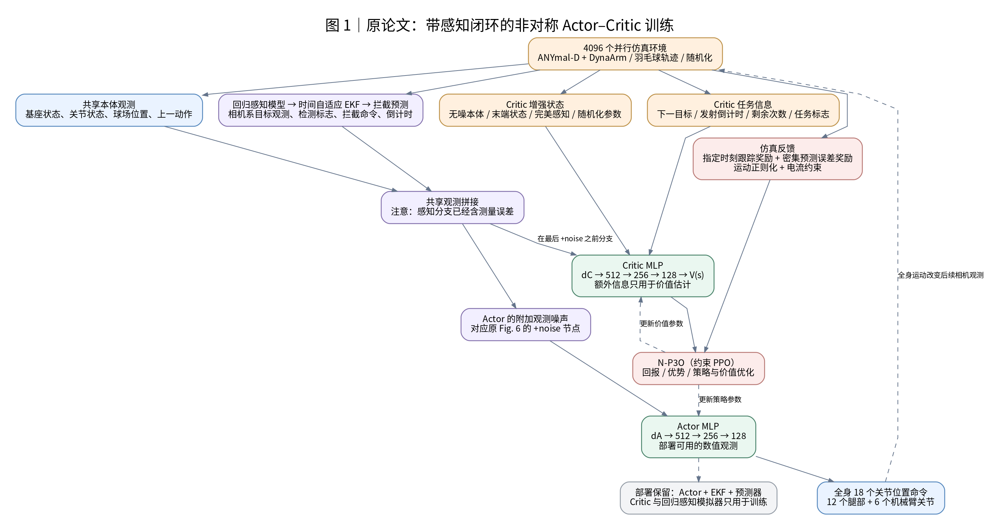
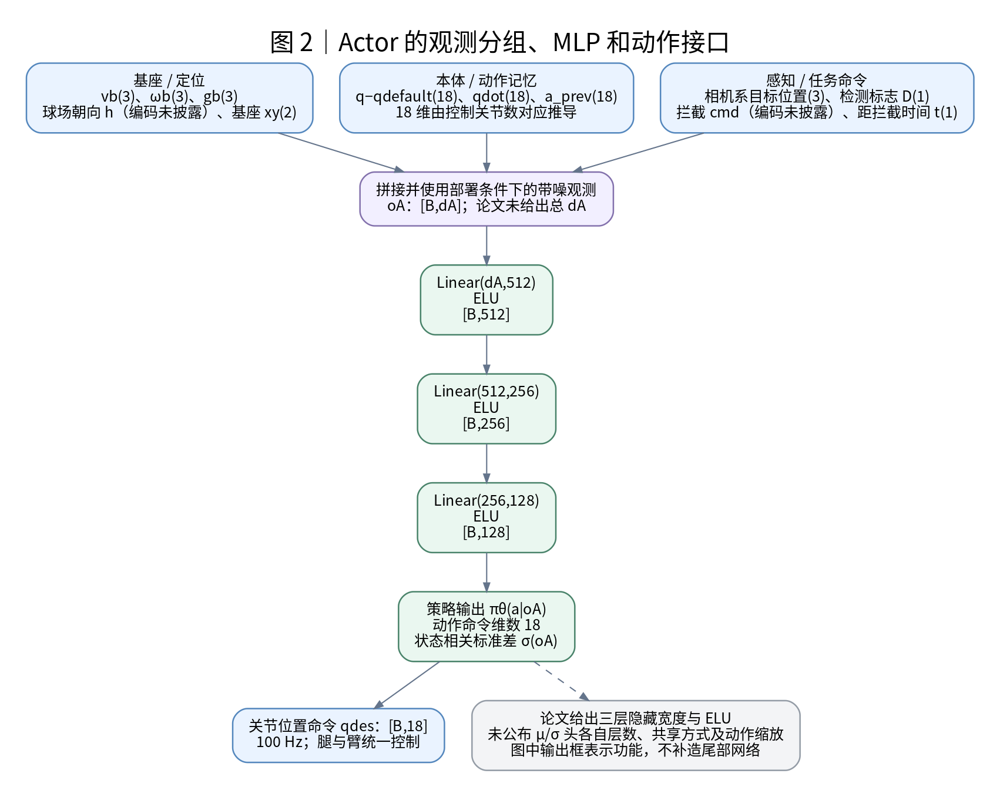
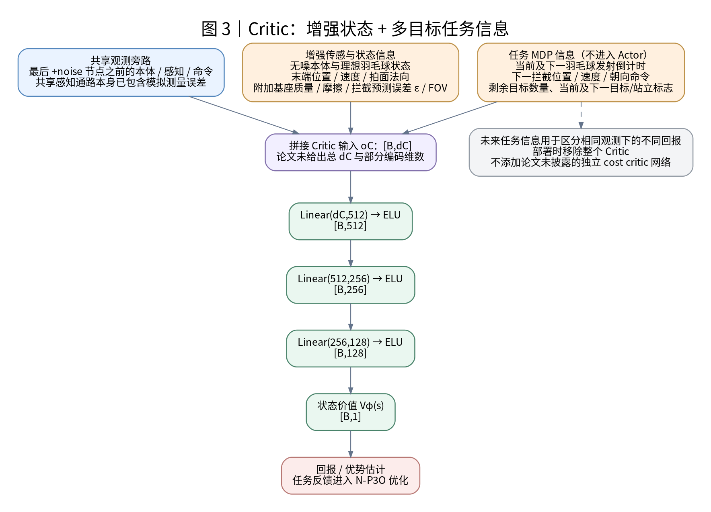
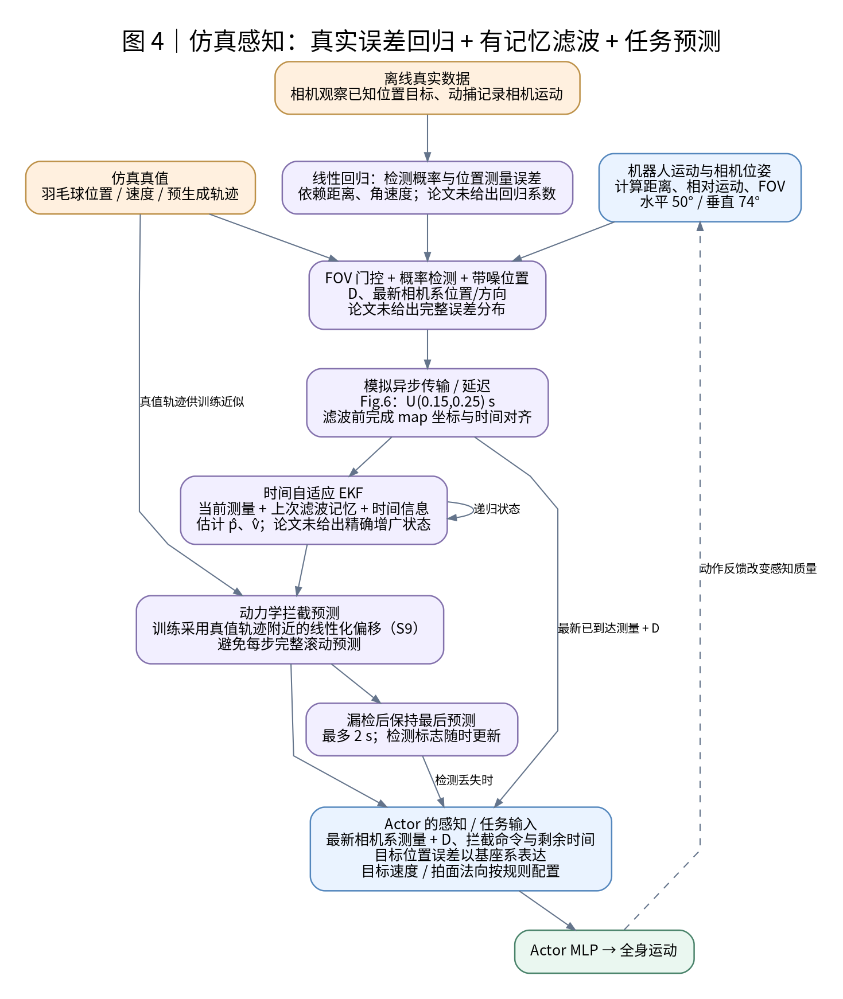
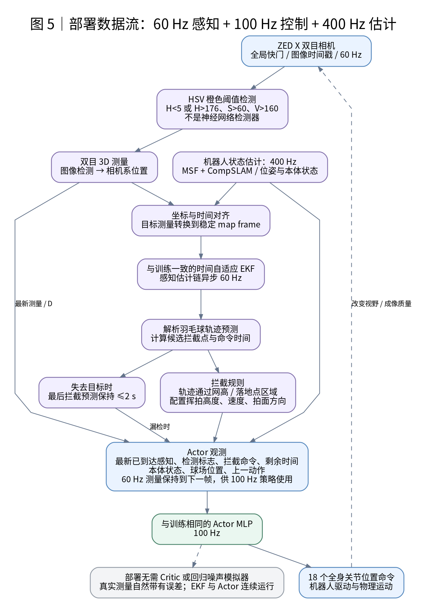
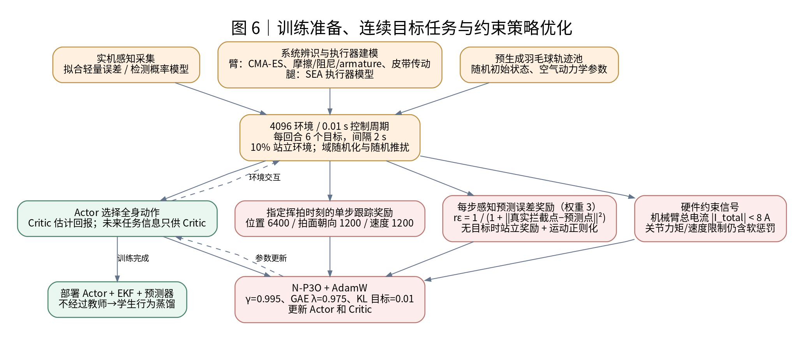
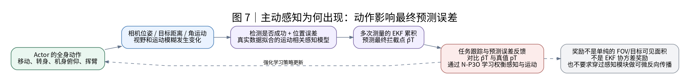
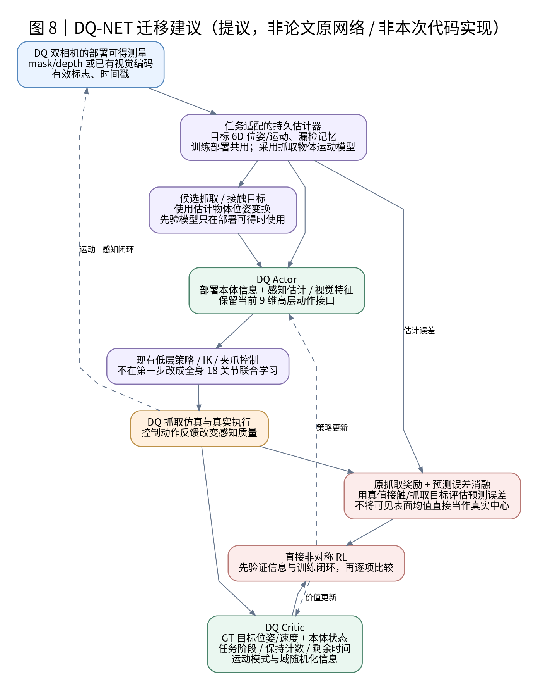

# Learning coordinated badminton skills for legged manipulators：方法与网络架构详解

本文依据仓库中的 [badminton_sr_read.pdf](badminton_sr_read.pdf) 撰写，覆盖正文和补充材料。论文作者为 Yuntao Ma、Andrei Cramariuc、Farbod Farshidian、Marco Hutter；所读 PDF 标注版本为 **arXiv:2505.22974v2，2025-09-23**，在线条目见 [arXiv v2](https://arxiv.org/abs/2505.22974v2)。本文中的“PDF 第 N 页”按文件实际页序计数；补充材料 S1–S6 对应 PDF 第 15–20 页。

**核心结论：这篇论文的控制网络是两个各有三层隐藏层的 MLP。主要借鉴价值在于，它把实机感知误差、漏检、延迟、有记忆的状态估计和任务预测接入强化学习闭环，使 Actor 从训练开始就依赖部署时可获得的信息；Critic 则利用真值状态和更完整的任务信息提高价值估计质量。**

下文前七节说明原论文方法，第八节讨论如何迁移到 DQ-NET。原文未给出精确维度或实现细节的地方会明确标注；DQ-NET 迁移图是设计建议，不代表论文原结构，也不代表本次已实现了这些改动。

## 图示索引与阅读约定

所有结构图均重新绘制，提供可缩放 SVG、PNG 和可编辑 DOT 源文件，保存在 [assets/badminton_sr_networks](assets/badminton_sr_networks)。正文使用 PNG 预览以兼容 Markdown 阅读器；可通过下表的 SVG 链接打开矢量图放大查看。

| 图 | 内容 | PNG | SVG |
|---|---|---|---|
| 1 | 非对称 Actor–Critic 与感知闭环总架构 | [PNG](assets/badminton_sr_networks/01_asymmetric_training.png) | [SVG](assets/badminton_sr_networks/01_asymmetric_training.svg) |
| 2 | Actor 输入、隐藏层与动作接口 | [PNG](assets/badminton_sr_networks/02_actor_network.png) | [SVG](assets/badminton_sr_networks/02_actor_network.svg) |
| 3 | Critic 输入、隐藏层与价值输出 | [PNG](assets/badminton_sr_networks/03_critic_network.png) | [SVG](assets/badminton_sr_networks/03_critic_network.svg) |
| 4 | 仿真感知误差、EKF 与拦截预测 | [PNG](assets/badminton_sr_networks/04_simulation_perception.png) | [SVG](assets/badminton_sr_networks/04_simulation_perception.svg) |
| 5 | 实机部署的多频率数据流 | [PNG](assets/badminton_sr_networks/05_deployment_multirate.png) | [SVG](assets/badminton_sr_networks/05_deployment_multirate.svg) |
| 6 | 训练准备、任务采样与约束优化 | [PNG](assets/badminton_sr_networks/06_training_pipeline.png) | [SVG](assets/badminton_sr_networks/06_training_pipeline.svg) |
| 7 | 主动感知行为形成的因果闭环 | [PNG](assets/badminton_sr_networks/07_active_perception_loop.png) | [SVG](assets/badminton_sr_networks/07_active_perception_loop.svg) |
| 8 | 面向 DQ-NET 的迁移建议 | [PNG](assets/badminton_sr_networks/08_dq_adaptation_proposal.png) | [SVG](assets/badminton_sr_networks/08_dq_adaptation_proposal.svg) |

图中蓝色表示输入或动作接口，绿色表示策略/价值网络，紫色表示感知、滤波或其他固定处理模块，橙色表示训练环境及训练专用信息，红色表示奖励或优化。实线主要表示数据流，虚线表示环境反馈、参数更新或说明关系。`B` 为批大小，`d_A`、`d_C` 为 Actor、Critic 的观测维数。

## 1. 方法要解决什么问题

机器人需要在羽毛球到达指定位置的时刻，让球拍甜区满足目标位置、速度和拍面朝向。机器人在移动、转身和挥臂时，相机也在运动，距离、视野和角运动会改变检测与测量质量。因此，运动控制既影响“能否赶到击球点”，也影响“击球点能否估计准确”。

论文使用 ANYmal-D 四足底盘和 DynaArm 机械臂，由一个策略统一输出 **18 个驱动的关节位置命令**，控制频率为 **100 Hz**。腿部移动、身体姿态和机械臂挥拍都通过该策略协调。18 维对应 12 个腿部与 6 个机械臂控制关节；这一拆分依据机器人构型和论文所述的 18 个驱动推导。见正文 Fig. 2、Methods，以及补充材料 Table S4。

系统中并非所有模块都是神经网络：

| 模块 | 实现性质 | 作用 | 部署使用 |
|---|---|---|---|
| Actor | 强化学习训练的 MLP | 根据本体状态、感知结果和拦截命令输出全身关节位置命令 | 是 |
| Critic | 强化学习训练的 MLP | 使用增强状态及完整任务信息估计期望回报 | 否 |
| 感知误差/检测概率模型 | 从实机数据拟合的线性回归模型 | 在仿真中产生随距离和运动变化的测量误差及漏检 | 否 |
| 实机目标检测 | HSV 颜色阈值与双目三维测量 | 找到橙色羽毛球并生成位置测量 | 是 |
| 时间自适应 EKF | 有递归状态的滤波器 | 融合异步、有误差的测量，估计羽毛球位置和速度 | 是 |
| 羽毛球动力学/拦截预测 | 物理模型与轨迹计算 | 从估计状态得到拦截点和时间 | 是 |
| 执行器模型、系统辨识 | 仿真动力学建模 | 缩小机械臂与腿部执行动态的仿真偏差 | 对训练和部署匹配有作用 |

论文的 Actor 不直接读取 RGB 图像，结构中没有图像 CNN、Transformer、PointNet、LSTM 或 GRU。前端先把图像变为数值测量，再通过滤波与预测形成任务命令。网络输入中的上一动作提供一步动作记忆，感知历史主要由 EKF 的递归状态承载。见正文 PDF 第 9、12 页和 Table S3–S4。

## 2. 非对称训练总架构



*图 1：根据原论文 Fig. 6、Table S3、Table S4 重绘。仿真中的感知分支接收误差和延迟；Actor 的动作又改变后续相机观测。*

整个训练循环可以按以下顺序理解：

1. 仿真生成机器人状态和羽毛球运动；当前相机位姿决定目标距离、相对角运动和是否在视野内。
2. 感知模型生成检测标志与带误差的测量，加入异步传输/延迟后送入 EKF 和拦截预测模块。
3. Actor 使用本体观测、最新已到达的感知结果、拦截命令和距离拦截的剩余时间，输出全身动作。
4. Critic 使用共享观测旁路，以及无噪状态、末端状态、随机化参数和额外任务信息，估计状态价值。
5. 仿真计算指定时刻的击球跟踪奖励、逐步的预测误差奖励、运动正则化和约束信号，使用 N-P3O 更新策略及价值网络。

**原 Fig. 6 中，Critic 的共享输入分支位于最后一个 `+noise` 节点之前，Actor 位于其后。** 这不意味着 Critic 的所有输入都是纯真值：共享感知分支在此之前已经经过测量误差模型和 EKF。更准确的理解是，Critic 在共享估计量之外，还能得到高质量状态和额外任务上下文。

这套流程直接训练部署用的 Actor，没有先训练全真值教师、再进行教师到视觉学生的行为蒸馏。非对称的含义是：**决策所用信息受部署条件约束，而训练价值估计可以获得额外信息。**

## 3. Actor 网络：部署可得的数值观测 → 全身动作

### 3.1 观测内容



*图 2：共享观测进入三层 ELU MLP，输出全身动作分布。输出框表示功能；论文没有披露均值/标准差分支的具体尾部实现。*

Table S3 将以下 12 类量列为共享观测。部署 Actor 使用其部署可得、带误差的版本。

| 观测 | 论文含义 | 维度或编码边界 | 作用 |
|---|---|---|---|
| `v_b` | 基座线速度 | 三维向量 | 反映身体移动状态 |
| `ω_b` | 基座角速度 | 三维向量 | 反映转身、俯仰等角运动 |
| `g_b` | 基座坐标系中的重力向量 | 三维向量 | 反映身体姿态 |
| `h` | 球场坐标系中的机器人朝向向量 | 具体编码维数未给出 | 建立机器人与球场的朝向关系 |
| `cmd` | 球拍拦截命令 | 包含位置、速度、朝向要求；总编码维数未给出 | 告诉策略要完成什么挥拍动作 |
| `t` | 距离拦截的剩余时间 | 标量 | 使策略判断动作紧迫程度 |
| `q` | 相对默认姿态的关节位置偏移 | 按控制关节数对应 18 维，属于构型推导 | 反映当前全身配置 |
| `q̇` | 关节速度 | 同上，对应 18 维 | 反映关节运动状态 |
| `a_prev` | 上一步策略动作 | 对应 18 维动作 | 提供动作连续性与一步历史 |
| `p_B^court` | 基座在球场坐标系中的平面位置 | 二维 `(x,y)` | 提供球场定位 |
| `p_shuttle^cam` | 相机坐标系中的羽毛球位置 | 三维位置向量 | 提供最新目标测量 |
| `D` | 本次感知是否检测到羽毛球 | 检测标志 | 区分新测量与目标丢失 |

正文进一步说明：拦截位置观测使用**球拍甜区/末端与目标之间的相对位置，并在机器人基座坐标系中表达**。在符号上可理解为：

$$
e_p^b=R_{world\to base}\big(\hat p_{target}^{world}-p_{EE}^{world}\big).
$$

这是对正文描述的坐标关系表达，不能据此反推 `cmd` 所有字段的排列和维数。它让策略直接感知“球拍还差多少到目标”，而不是完全依赖绝对位置自行重建该误差。见 PDF 第 12 页 Swing tracking。

Fig. 6 对最新相机观测使用了“latest object direction”的表述，Table S3 则列为相机系位置。这里按 Table S3 列出字段，同时保留这一描述差异；论文不足以支持进一步断定其内部是否做了单位方向归一化。

### 3.2 隐藏层与输出

Table S4 明确给出 Actor 隐藏层宽度为 `(512,256,128)`，激活为 ELU。数值观测经过拼接后，其功能结构是：

$$
o_A\in\mathbb R^{d_A}
\rightarrow \operatorname{Linear}(d_A,512)\rightarrow\operatorname{ELU}
\rightarrow \operatorname{Linear}(512,256)\rightarrow\operatorname{ELU}
\rightarrow \operatorname{Linear}(256,128)\rightarrow\operatorname{ELU}
\rightarrow \pi_\theta(a\mid o_A).
$$

动作对应 18 个关节位置命令。批量推理时，隐藏特征依次为 `[B,512]`、`[B,256]`、`[B,128]`，最终命令对应 `[B,18]`。

补充材料 State-dependent Action Standard Deviation 和 Fig. S4 说明，策略采用**状态相关的动作标准差**。随着挥拍时刻接近，动作分布熵下降，即临近接触时采样趋于集中；作者报告该设计带来小幅训练奖励改善。

这项设计不能等同于在所有状态使用一个固定的可学习 `log_std`，也不能仅凭上述信息画出确定的双输出头结构。论文没有给出 `μ/σ` 头各自层数、正值参数化、动作缩放或裁剪细节，因此图中只标出动作分布和状态相关标准差这一功能事实。

## 4. Critic 网络：提高价值估计所需的状态与任务上下文



*图 3：Critic 接收共享观测旁路，以及增强状态和完整任务信息。未来任务信息不进入 Actor。*

### 4.1 两类额外信息

正文将 Critic 的额外信息分成两类：高质量传感/状态信息，以及用于补全任务 MDP 的预先信息。结合 Fig. 6 与 Table S3，可整理如下。

| 类别 | 额外信息 | 对价值估计的帮助 |
|---|---|---|
| 高质量状态 | 无噪本体状态、理想羽毛球感知/真实状态 | 减少感知噪声造成的价值估计不确定性 |
| 高质量状态 | 球场坐标系中的球拍甜区位置、速度、拍面法向 | 判断当前动作是否具备完成击球的条件 |
| 高质量状态 | 随机附加的基座质量、摩擦系数 | 区分相同外观状态下不同的动力学条件 |
| 高质量状态 | EKF 拦截预测与真值之间的误差 `ε` | 了解当前任务目标估计的准确程度 |
| 高质量状态 | 是否位于相机 FOV 内 | 提供真实可见性信息 |
| 任务 MDP 信息 | 当前羽毛球和下一羽毛球的发射倒计时 | 区分等待、当前目标与后续目标的时间结构 |
| 任务 MDP 信息 | 下一次拦截的位置、速度、朝向命令 `cmd_next` | 预估完成当前击球后还需怎样移动 |
| 任务 MDP 信息 | 本回合剩余目标数量 | 区分剩余回报长度 |
| 任务 MDP 信息 | 当前和下一阶段是拦截还是站立的标志 | 区分不同任务模式下的后续回报 |

Table S3 中，后一类提供完整任务信息的字段用灰底标出。注意表中任务模式标志也使用了 `T`，它与奖励公式里“击球时刻 T”的语义不同，阅读时应根据所在表或公式区分。

### 4.2 为什么这些信息主要放在 Critic

每回合有多个连续击球目标。如果两个状态的当前目标、机器人姿态和感知结果相同，但一个状态后面还剩五个目标，另一个只剩一个，则两者的期望累计回报不同。下一目标距当前位置很远或很近，也会改变后续任务难度。Actor 的当前观测不足以区分这些情况，Critic 获得这些信息后能更准确地计算价值和优势。

同时，这些回合计数和未来命令不一定能在实机上作为可靠的感知输入。正文 Fig. 7 的消融还指出，将这类特权信息同时给 Actor 会产生不必要的时间相关行为，并增加价值估计困难；所提非对称配置取得了更好的学习和末端跟踪表现。

这里应区分两种时间：**Actor 的“距当前拦截还有多久”是执行任务所需、可以由感知预测得到的量；Critic 的隐藏发射倒计时、后续任务和回合剩余目标是训练任务上下文。** 不能把前者一起从 Actor 中删除。

### 4.3 网络与优化关系

Critic 同样使用 `512→256→128` 的 ELU MLP，最后输出标量状态价值：

$$
o_C\in\mathbb R^{d_C}
\rightarrow 512\rightarrow 256\rightarrow 128\rightarrow V_\phi(s)\in\mathbb R.
$$

它的作用是辅助估计回报和优势，训练完后从部署链路中移除。图中未增加独立的 cost critic：虽然训练使用约束强化学习，但本论文没有披露一个额外约束价值网络的具体架构，不能凭算法类别补造第三个网络。

## 5. 感知模块：训练与实机共享的状态估计链

### 5.1 仿真中的感知建模



*图 4：Fig. 6 与 PDF 第 12 页的感知训练过程。图中线性回归在离线真实数据上拟合；EKF 递归状态与漏检时的预测保持提供跨时间记忆。*

作者先采集真实数据：相机围绕固定、已知位置的羽毛球运动，利用动捕记录相机位置，计算目标距离与相对角运动，再对**检测概率和位置测量误差**进行线性回归。训练时，模型依据距离、角速度与 FOV 状态生成漏检及带误差的测量。

因此，原 Fig. 6 中的 `Learned Noise Model` 应理解为从数据拟合的轻量感知模型，不能据该名称认定它是图像神经网络、可微编码器或与 Actor 一起在线训练的分支。论文没有给出完整回归系数、概率截断方式或完整误差分布。

训练流包含以下关键环节：

| 环节 | 原论文设置/功能 | 应如何理解 |
|---|---|---|
| 视野 | Fig. 6 标注水平 **50°**、垂直 **74°** | 超出 FOV 会影响是否有测量；两个角度不可调换 |
| 运动相关误差 | 距离、角运动相关的检测概率和测量噪声 | 相机运动会改变后续信息质量 |
| 延迟 | Fig. 6：`U(0.15,0.25) s` | 应保留测量时间信息，并使用最新已到达的数据 |
| EKF | 与硬件使用相同的滤波过程 | 不仅模拟逐帧噪声，还模拟历史累积后的估计误差 |
| 拦截预测 | 依据估计状态和羽毛球动力学形成任务目标 | 位置估计误差、速度估计误差都会影响最终拦截点 |
| 丢失处理 | 目标离开视野后保持最后拦截预测，最长 **2 s** | 不是每次漏检立即清零，也不等同于 2 s 的 EKF 重置阈值 |

### 5.2 动力学与计算量处理

论文的羽毛球模型包含重力和二次阻力。将正文 Eq. 2 两边质量约去，可写为：

$$
\dot p=v,\qquad
\dot v=g-\frac{\|v\|v}{L},\qquad
L=\frac{2m}{\rho S C_D}.
$$

作者使用实测空气动力学长度 **`L=4.1 m`**；训练轨迹采样还包含空气动力学参数变化。轨迹池预先生成，训练中根据目标挥拍高度与命令时刻对轨迹进行平移和填充。

为降低 4096 个环境反复预测轨迹的成本，训练时没有对每个带误差状态都完整滚动轨迹，而是在真值轨迹附近，依据 EKF 位置和速度估计误差，对最终拦截位置做一阶近似（Eq. S9）。其含义是：

$$
\text{估计拦截点}
\approx \text{真值拦截点}
+\text{当前位置估计偏差的贡献}
+\text{速度估计偏差随剩余飞行时间累积的贡献}.
$$

部署时不能利用真值轨迹，因此仍从估计状态进行实际轨迹预测。论文所说“训练和部署复用相同 EKF 与预测方法”应结合这一训练近似理解：共享的是状态估计和动力学预测思想，并非两边每一步都执行完全相同的预测计算路径。

这一设计对 DQ-NET 有两层启发：用持久状态估计器处理历史测量；在不破坏误差对任务目标的影响关系的前提下，降低大规模并行训练的感知仿真成本。

### 5.3 实机感知与多频率控制



*图 5：根据原 Fig. 2、Perception deployment 和 Table S1 重绘。图像前端和状态估计先生成数值观测，再由 Actor 进行控制。*

实机使用 ZED X 双目相机，前端以 HSV 阈值寻找橙色羽毛球，再生成三维位置测量。Table S1 采用 OpenCV 的 HSV 约定：`H<5 或 H>176`、`S>60`、`V>160`；相机 60 FPS、gain 100，曝光随照明条件调整。

测量先利用图像时间戳和机器人位姿转换到稳定的 map frame。正文说明，该坐标系通过 MSF 与 CompSLAM 的结合获得。如果相机运动的时间对齐不准确，或者全局坐标发生漂移，就会直接污染球状态与拦截命令；因此只给网络加随机白噪声不能复现整个问题。

系统的频率分工如下：

| 通路 | 频率 | 职责 |
|---|---|---|
| 机器人状态估计 | **400 Hz** | 更新本体和机器人位姿估计 |
| 相机测量、EKF、轨迹预测 | 异步 **60 Hz** | 更新目标测量和任务预测；论文在 Jetson AGX Orin 上执行感知链 |
| 控制 Actor | **100 Hz** | 使用最新可用感知与本体观测输出关节命令 |

图中将最新 60 Hz 感知结果保持供 100 Hz 策略读取，用以解释多频率接口；论文没有给出线程调度、缓存和所有时间补偿代码。

正文测得的“相机快门到位置计算完成”延迟为 **60–160 ms**，Fig. 6 的训练通信延迟为 **150–250 ms**。原文分别使用上述两种表述，但未充分解释两组数值范围的差异，因此应分别保留，不能合并成一个统一测量值。

Table S1 给出 EKF process noise std 为 `2e-3`、measurement noise 为 `4e-2`、reset time threshold 为 **0.2 s**。表格没有完整给出状态方程实现、噪声矩阵构造、增广状态、初始化与时间补偿细节，因此这些数字不足以独立复现完整 EKF。尤其不能将 0.2 s 的重置阈值与 2 s 的预测保持时长混为一谈。

## 6. 训练架构、奖励与硬件约束

### 6.1 从准备工作到部署



*图 6：感知误差拟合、执行器建模、轨迹池准备后，直接训练部署用 Actor。没有教师–学生蒸馏阶段。*

训练使用 Isaac Gym 和 legged_gym 框架，采用 **N-P3O（Normalized Penalized Proximal Policy Optimization）** 处理带约束的策略优化。该算法来自论文引用的 [Evaluation of Constrained Reinforcement Learning Algorithms for Legged Locomotion](https://arxiv.org/abs/2309.15430)；本分析只按羽毛球论文披露的使用方式解释，不补充未给出的内部算法超参数。

每次策略迭代由并行环境收集轨迹，记录 Actor/Critic 观测、动作、回报与约束信号，计算回报/优势并更新网络。Actor 的额外信息限制在部署可得范围，Critic 利用增强状态降低价值估计误差。AdamW 用于网络优化。

任务采样包含：

- **4096 个并行环境**；每回合 **6 个拦截目标**，连续目标间隔 **2 s**。
- **10% 的站立环境**，没有羽毛球目标，用来训练目标未出现时保持默认姿态的行为。
- 接近平地但有小幅不平整的地形，最大高度差 **0.06 m**，用于鼓励足端抬升；论文没有使用复杂地形课程。
- 摩擦、附加基座质量、机械臂动力学等随机化，以及偶发外部推扰。

每回合 6 个目标与 2 s 的目标间隔，不足以确定完整回合严格等于 12 s，因为还存在发射等待、轨迹填充等时间安排。

### 6.2 击球奖励：位置、朝向和速度在指定时刻考核

论文把挥拍理解为**有截止时刻的运动任务**。位置、朝向、速度跟踪奖励只在目标击球时刻的一步激活，而不是在整段飞行期间持续要求末端已经贴在目标上。

按 Eq. S3，位置奖励为：

$$
r_p(k)=\mathbf 1_{t_k=T}
\frac{1}{1+\|p^*_{EE}-p_{EE}\|^2/\sigma_p}.
$$

正文和补充材料明确说明“single timestep”，这里用离散指示函数表达原公式中的 `δ(t_k−T)`。它不是需要无限幅值的连续 Dirac 冲激。

速度奖励同样在击球时刻考核命令速度与球拍甜区实际速度的差异：

$$
r_v(k)=\mathbf 1_{t_k=T}
\frac{1}{1+\|v^*_{EE}-v_{EE}\|^2/\sigma_v}.
$$

上式用向量误差平方范数表达 Eq. S5 与文字说明的含义。拍面朝向奖励也只在该时刻激活，使用目标拍面法向与实际法向的余弦距离。Eq. S4 的记号没有完整定义其距离函数实现，因此这里不将其改写成一个未经核对的具体向量公式。

这样的奖励允许策略在击球前主动准备、移动和调整拍姿，到接触时刻再满足位置、速度、法向要求；若全过程都强制末端停在未来击球点，会妨碍挥拍和全身准备动作。

### 6.3 感知奖励：比较真实拦截点与估计拦截点

Eq. S6 的感知误差奖励是时间上密集的：

$$
r_\varepsilon(k)=\frac{1}{1+\|p_i-p_i^*\|^2}.
$$

其中两个位置对应真值拦截位置和依据 EKF 估计状态预测的拦截位置；交换二者顺序不影响平方误差。Table S2 给出的该项权重为 **3**。

**它衡量的是最终任务目标的实际预测误差。** 它不是只检查目标在不在视野中，也不是使用 EKF 协方差、检测置信度或 mask 可见面积作为奖励。误差在仿真中借助真值计算，Actor 不需要直接获得该真值才能学习。

### 6.4 奖励权重与正则化

Table S2 给出的权重如下。它们属于本论文特定的任务时间尺度、状态单位和硬件配置。

| 奖励/惩罚项 | 权重 | 目的 |
|---|---:|---|
| 末端位置跟踪 | 6400 | 在指定击球时刻到达正确位置 |
| 末端朝向跟踪 | 1200 | 在指定时刻保持正确拍面朝向 |
| 末端挥拍速度 | 1200 | 满足击球速度要求 |
| 感知预测误差 | 3 | 持续提高拦截点估计质量 |
| 面向球网 | 0.5 | 保持任务相关朝向 |
| 关节力矩 | −1e−5 | 降低过大力矩 |
| 关节加速度 | −1e−6 | 减少激烈关节运动 |
| 动作变化率 | −0.03 | 抑制相邻动作突变 |
| 碰撞 | −2 | 抑制不期望碰撞 |
| 关节位置越限 | −1 | 抑制关节位置超限 |
| 关节力矩越限 | −1e−3 | 抑制力矩超限 |
| 无目标时保持站立 | 16 | 学习无目标状态下的合理姿态 |

补充材料 Eq. S7 还描述了对连杆竖直加速度平方和的 impact 正则化，用来降低跺脚行为；Table S2 没有为该公式单独列出明确权重，不能补造一个数值。Eq. S8 的站立奖励倾向于默认关节配置。

“6400 比 3 大很多”不能直接推出感知奖励不重要：前三项每个目标只奖励一次，感知奖励则逐步积累。比较影响时还需考虑有效持续步数、误差尺度、折扣以及其他惩罚项。

### 6.5 硬件约束与执行器模型

ANYmal 的机械臂供电有 **8 A** 保险丝限制。论文用 N-P3O 处理机械臂总电流约束：

$$
|I_{total}|<8\ \mathrm A.
$$

正文 Eq. 4 使用各电机力矩、电机常数、转速和电压，将电阻功率与机械功率的贡献合成为总电流估计。关节力矩/速度等限制仍包含软惩罚；不能因此把所有限位项都当成一个精确硬约束，也不能把训练约束理解为任意未见状态下的形式化安全保证。

仿真匹配方面，腿部使用 SEA 执行器模型，机械臂为 QDD，作者用 CMA-ES 辨识关节摩擦、阻尼和 armature，使相同命令下的关节轨迹接近实机。DynaArm 还有皮带传动造成的电机/关节耦合，补充材料 Eq. S1–S2 对此进行动力学转换。上述模型影响动作在环境中的实际效果，不属于 Actor 的额外视觉特征编码层。

### 6.6 公开的网络与训练参数

| 参数 | Table S4 设置 |
|---|---|
| Actor 隐藏层 | `(512,256,128)` |
| Critic 隐藏层 | `(512,256,128)` |
| 激活函数 | ELU |
| 优化器 | AdamW |
| 折扣 `γ` | 0.995 |
| GAE `λ` | 0.975 |
| 学习率 | adaptive；未给出一个固定学习率值 |
| KLD target | 0.01；是目标值，不是每次更新必然等于 0.01 |
| 熵系数 | 0.0016 |
| 熵系数衰减 | 0.99993 |
| 控制周期 | 0.01 s |
| 并行环境数 | 4096 |
| 每回合目标数 | 6 |
| 站立环境比例 | 10% |

正文报告约 7500 次训练迭代时接近最大训练奖励，对应单张 RTX 2080Ti 上 4.81 小时；实机部署策略通常继续训练 1–2 天以获得更好收敛。这是作者任务下的测量结果，不能据此预测 DQ-NET 所需训练时间或效果。

## 7. 主动感知为什么会从这套训练中出现



*图 7：策略动作改变相机的观测条件，观测条件改变估计与预测误差，任务奖励反过来改变策略。*

这里的因果链是：

$$
\text{全身动作}
\rightarrow\text{相机位姿、目标距离和角运动}
\rightarrow\text{检测与测量质量}
\rightarrow\text{EKF 历史估计}
\rightarrow\text{最终拦截点误差}
\rightarrow\text{任务回报}.
$$

策略因此有机会学到兼顾测量质量的身体运动，例如在准备阶段调整方向和姿态、保持目标观测，再在合适时刻快速挥拍。相机对着目标只是其中一个因素：距离、运动模糊、深度误差、漏检与时间对齐都会影响最终预测质量。

论文 Fig. 4 比较了所提方法、FOV 奖励和使用真值目标状态的策略。使用真值状态的策略不需要改善相机测量，因此不具备相同的主动感知动机；单独奖励 FOV 能获得相近的感知误差表现，但所提方法在运动效率等方面更有利。该结论对应作者的实验设置，不意味着任何任务都必须优于 FOV 奖励。

这也解释了它对教师–学生方法的启发：如果教师始终知道精确目标状态，就可能选择视觉学生难以判断或执行的动作。仅靠模仿无法消除由部分可观测性造成的信息差距。让 Actor 从训练开始就承担感知误差，能把“如何获得更好的信息”纳入动作学习。

该过程通过强化学习的回报反馈实现，不要求对 HSV、EKF 或轨迹预测做端到端可微反向传播；论文也没有把 EKF 协方差作为 Actor 的必需输入。

## 8. 哪些设计最值得用于改进 DQ-NET

以下结合 [DQ-NET.pdf](DQ-NET.pdf)、[当前高层网络说明](DQ_high_level_teacher_student_networks.md) 和仓库当前实现讨论。它们属于迁移建议，不能作为本论文原实现引用。

### 8.1 与当前 DQ-NET 的关键差别

| 项目 | 羽毛球论文 | 当前 DQ-NET 教师/高层路径 |
|---|---|---|
| Actor 的目标信息 | 有误差的相机测量与滤波/预测结果 | 原始教师使用仿真物体状态及候选信息 |
| 网络输入形式 | 数值本体状态、目标测量、命令和时间 | 物体特征、状态、候选抓取等；视觉版本另有图像编码 |
| 几何特征来源 | 没有对应的在线点云特征分支 | 原始 `[B,1024]` 来自预计算 `features.npy`，不是每步从最新点云编码 |
| 感知记忆 | EKF 跨时间融合测量 | 是否具有同等部署一致的目标滤波链，需按具体视觉/非对称实现检查 |
| Critic | 高质量状态 + 完整任务 MDP 信息 | 原始教师的 Actor/Critic 核心状态高度重合；已有观测消融与非对称扩展 |
| 控制接口 | 一个 Actor 输出 18 维全身关节位置命令 | 高层输出 9 维命令，下层策略、IK 与夹爪控制负责执行 |
| 核心训练信号 | 指定击球时刻跟踪 + 最终拦截预测误差 | 多阶段抓取奖励；需要按抓取任务定义感知误差 |

当前 `--actor_drop_velocity_obs` 消融只删除 Actor 的机器人局部线速度和物体相对机器人平面速度，共 5 维，Critic 保留完整观测。对于原始 GFM 教师，Actor 有效输入从 1276 变为 1271，动作 MLP 输入从 206 变为 201。**这有助于比较速度信息的作用，但 Actor 仍可获得教师的其他真值物体信息，因此它并不等同于羽毛球论文的感知闭环非对称训练。** 见 [teacher_grasp_training.py](../DQ_high-level/utils/teacher_grasp_training.py) 和已有网络说明。

仓库中的 M0/M1/M2 也是面向 DQ 的工程扩展。图像 Actor、任务状态增强、belief 表示或感知扰动，不应直接冠以“论文同款结构”。特别是双相机 mask/depth 的可见表面均值，不必然等于真实物体中心，也不必然对应适合抓取的接触点。见 [asymmetric_teacher.py](../DQ_high-level/modules/asymmetric_teacher.py)。

### 8.2 建议保留高层接口，先迁移信息与训练闭环



*图 8：迁移建议。先保留 DQ 的 9 维高层动作和现有低层执行器，改进目标估计、Actor/Critic 信息边界及训练感知模型。*

| 优先级 | 值得借鉴的模块 | DQ-NET 中的具体迁移方式 | 为什么值得先做 |
|---|---|---|---|
| 高 | 部署可得 Actor + 增强 Critic | Actor 使用估计物体位姿/运动、视觉编码、本体状态和测量有效性；Critic 额外得到真值物体状态、真实任务阶段与随机化参数 | 消除目标真值依赖，同时改善优势估计 |
| 高 | 训练/部署共用持久估计器 | 用双相机测量更新目标位置、姿态与运动状态；显式处理时间戳、漏检和重置 | 将逐帧噪声转化为可利用的跨时间信息 |
| 高 | 运动相关感知误差模型 | 实测或标定距离、角运动、遮挡对检测/深度/位姿误差的影响，训练时复现漏检和延迟 | 让机器人运动与后续感知质量产生真实关联 |
| 高 | 完整任务上下文供 Critic | 加入抓取阶段、保持计数、剩余时限、运动模式等真正影响后续回报的状态 | 降低当前观测相似而实际回报不同的价值误差 |
| 中 | 任务相关的预测误差奖励 | 用估计目标与真值抓取/接触目标之间的位置和朝向误差设计小权重消融 | 奖励与抓取质量更相关，而非只奖励目标可见 |
| 中 | 状态相关动作标准差 | 比较接近接触/闭合时是否需要更集中的动作分布 | 可以改善关键阶段的动作稳定性，需独立验证 |
| 中 | 系统辨识与域随机化 | 校准命令延迟、低层跟踪误差、机械臂/夹爪响应及接触动力学 | 降低高层命令在仿真和实机产生不同结果的问题 |

DQ 的目标状态估计器应使用适合抓取物体的运动模型，例如位置速度、姿态角速度及接触后的模式切换；羽毛球的空气阻力模型与 `L=4.1 m` 没有直接迁移意义。滤波器可以是 EKF 或其他持久估计方法，关键是训练与部署具有一致的状态、时间和缺失测量处理，而不是必须照搬某个名称。

若保留已知物体的局部抓取候选，应通过**估计物体位姿**转换为 Actor 使用的目标抓取；否则即使 Actor 的物体位置字段换成视觉估计，候选变换仍可能泄漏真值。固定形状特征和候选模型只应在部署时确实可获得该物体先验的实验中使用；未知物体泛化需要另行处理形状感知。

Critic 的未来信息也要按实际 DQ 任务选择。单物体抓取不必虚构“下一个羽毛球/下一个目标”；应先补充真实存在、但当前 Actor 观测未充分表达的阶段和终止条件。

### 8.3 迁移时需要重新定义的量

**时间尺度。** 当前 DQ 高层默认时间尺度约为 `0.005×4×8=0.16 s`，约 6.25 Hz，具体以运行配置为准；论文控制为 100 Hz。延迟应以秒建模，再映射到各模块周期，不能把同样的“延迟两帧”当成相同问题。

**奖励尺度。** 论文 6400/1200/1200 的权重服务于单步击球事件，DQ 的靠近、抓取、抬升与保持是另一套阶段结构。先保留 DQ 原任务奖励，通过消融比较感知误差项；直接覆盖整套奖励会使效果变化难以解释。

**误差真值。** 用 GT 物体 6D 位姿和一致的局部抓取/接触几何定义预测误差。物体不对称时还应考虑朝向；具有对称性的物体需使用适合其对称性的误差度量。只将可见点云的均值当作真实中心，会把遮挡和视角改变混入“目标移动”。

**硬件约束。** 8 A 是该机械臂供电限制，DQ 平台需要自己的电流、力矩或其他执行器限制，不能直接沿用。

**控制层次。** 把 DQ 的高层与底层同时改成全关节联合学习，会显著扩大实验范围。第一轮更适合保留现有 9 维动作和低层控制，先验证感知闭环；全身关节统一学习可以作为后续独立研究方向。

### 8.4 便于定位效果来源的对比实验

建议固定物体、环境数、训练交互预算、初始条件分布和评估协议，逐项比较：

1. 原始教师基线，以及目前去掉两组速度观测的消融。
2. Actor 使用部署可得目标估计，Critic 保留真值；先使用原抓取奖励。
3. 在第 2 项上加入训练/部署共用的持久滤波和漏检处理。
4. 在第 3 项上加入经过标定的运动相关噪声与延迟。
5. 分别加入 Critic 任务上下文、任务相关预测误差奖励，避免一次加入多个模块。

除抓取成功率外，还应记录目标/抓取位姿估计误差、漏检后的恢复表现、末端接触误差、动作波动与 Critic 价值误差，并使用多个随机种子。这样能区分性能问题来自视觉目标定义、估计器、奖励尺度，还是价值学习与执行控制。

## 9. 复现边界与容易误读之处

| 容易误读的地方 | 本文采用的准确解释 |
|---|---|
| 将 Actor 画成图像 CNN/Transformer | 原论文 Actor 为数值观测 MLP；图像由固定感知前端处理 |
| 将两个 MLP 画成教师和学生 | 它们是直接 RL 中的 Actor 与 Critic，没有行为蒸馏阶段 |
| 将 Critic 所有输入都画成 GT | 共享感知路径已含测量误差，另有增强真值输入 |
| 随意给出完整观测维数 | Table S3 未明确 `h`、`cmd` 等编码，保留 `d_A/d_C` |
| 给均值/标准差头补造线性层或激活 | 只确定状态相关标准差，尾部结构未披露 |
| 将感知奖励写成置信度/协方差/FOV | Eq. S6 使用真实与预测拦截点的误差 |
| 将拦截目标当作永久静态位置目标 | 命令有指定时刻、速度与拍面朝向，三项在指定时刻考核 |
| 将 EKF reset 和目标预测保持混同 | Table S1 reset 为 0.2 s；漏检后的预测保持最长 2 s |
| 将训练的预测近似当成部署可用 GT | Eq. S9 借助训练真值轨迹，实机仍需从估计状态预测 |
| 将所有限制画成严格硬约束 | N-P3O 处理电流约束，部分关节限制仍以软惩罚处理 |

正文 Methods 有一处将 observation 表指为 Table S2，但补充材料实际 **Table S2 是奖励，Table S3 才是观测，Table S4 是网络/训练超参数**。本文以实际表格为准。

这份重绘达到论文披露范围内的结构细化程度。完整复现仍需要补齐观测编码、动作缩放、策略输出头、感知回归系数、EKF 实现和优化细节；这里的“未披露”仅指所读 PDF 不足以确定，不能据此断言其他数据、材料或后续代码均不存在。

## 10. 证据位置与图源文件

| 主题 | 本地论文位置 |
|---|---|
| 机器人、部署数据流、频率 | [PDF 第 4 页，Fig. 2](badminton_sr_read.pdf#page=4) |
| 主动感知实验 | [PDF 第 6 页，Fig. 4](badminton_sr_read.pdf#page=6) |
| 非对称观测设计与价值估计原因 | [PDF 第 9 页，Methods](badminton_sr_read.pdf#page=9) |
| 训练与感知总架构 | [PDF 第 10 页，Fig. 6](badminton_sr_read.pdf#page=10) |
| 观测配置、价值与电流约束验证 | [PDF 第 11 页，Fig. 7](badminton_sr_read.pdf#page=11) |
| 目标表达、噪声模型、动力学、训练、部署 | [PDF 第 12 页](badminton_sr_read.pdf#page=12) |
| 系统辨识、电流约束 Eq. 3–4 | [PDF 第 13 页](badminton_sr_read.pdf#page=13) |
| 实机轨迹筛选、机械臂传动 | [PDF 第 15 页，S1](badminton_sr_read.pdf#page=15) |
| 感知参数、奖励权重、轨迹采样 | [PDF 第 16 页，Table S1–S2](badminton_sr_read.pdf#page=16) |
| 奖励公式、线性化预测、状态相关标准差 | [PDF 第 17 页，Eq. S4–S9 / Fig. S4](badminton_sr_read.pdf#page=17) |
| 完整观测列表 | [PDF 第 18 页，Table S3](badminton_sr_read.pdf#page=18) |
| 网络和训练超参数 | [PDF 第 19 页，Table S4](badminton_sr_read.pdf#page=19) |

8 张图的生成脚本为 [render_diagrams.py](assets/badminton_sr_networks/render_diagrams.py)。在仓库根目录运行以下命令可重绘全部 DOT、SVG、PNG；需要系统安装 Graphviz 的 `dot`：

```bash
python doc/assets/badminton_sr_networks/render_diagrams.py
```

本文与图 1–7 为原论文方法分析；图 8 和第八节为针对当前 DQ-NET 的迁移设计建议。本次工作输出分析文档和图示，没有改动训练代码。
