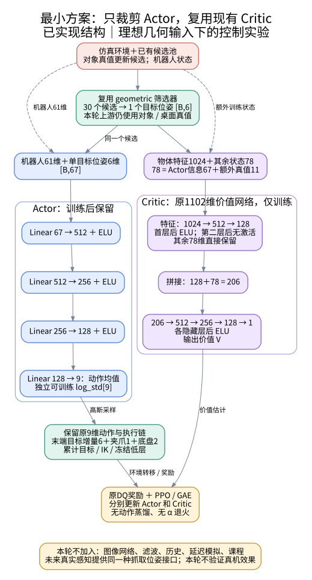

# DQ-NET 借鉴 KARL 的最小非对称 Actor–Critic 方案

**日期：2026-10-10。状态：设计草案，未实现训练代码。**

这一版只回答一个问题：**给策略一个明确的目标抓取位姿，Actor 能否在不额外读取物体特征、物体根状态和速度的情况下，通过 PPO 学会 DQ 的移动抓取？**

最小改动是：**复用现有 geometric 筛选器和教师 Critic，将 Actor 改成“机器人61维＋选中抓取位姿6维”的普通 MLP。** 不先加入视觉网络、滤波、历史或课程。

与[上一版完整方案](DQ_KARL非对称ActorCritic单阶段训练方案.md)相比，本版只做核心控制实验。第一轮使用仿真真值产生理想抓取目标，先检查控制方法是否成立；真实感知接入另做验证。

## 1. 核心只保留三件事

| 模块 | 本轮做法 | 要验证的作用 |
|---|---|---|
| 显式目标抓取 | 复用已实现的 geometric 筛选，30个候选中选1个 | 给控制器一个明确目标，替代GFM隐式融合 |
| 受限输入 Actor | 只读机器人状态和单个目标位姿 | 检查低维几何信息能否支持抓取 |
| 特权 Critic | 复用当前单目标教师的1102维输入和价值网络 | 用训练期更多信息估计价值，辅助同一个Actor学习 |

借鉴 KARL 的重点是**“候选先筛选，策略再依据几何目标控制”**。非对称结构是对 DQ 的新增改法；KARL 本身的控制网络不是非对称结构。

为了减少实验变量，暂时保留 Critic 的1024维静态特征编码器。它只在训练中使用，不进入 Actor。本轮不同时追求 Critic 参数量最小化。

## 2. 最小网络结构

[PNG版本](assets/dq_karl_minimal/architecture.png) · [DOT绘图源码](assets/dq_karl_minimal/architecture.dot)

### Actor：67维输入，9维动作

| 输入 | 维度 |
|---|---:|
| 当前末端位置＋RPY | 6 |
| 全部关节位置，含夹爪 | 19 |
| 腿和臂关节速度，不含夹爪 | 18 |
| 当前底盘命令 | 3 |
| 控制器累计末端目标位置＋RPY | 6 |
| 上一步高层动作 | 9 |
| **机器人状态小计** | **61** |
| 筛选出的抓取位置＋RPY | 6 |
| **Actor输入合计** | **67** |

抓取目标和末端使用现有 geometric 分支的机械臂基座/机身坐标约定。暂时沿用RPY、当前速度缩放和上一动作定义，不增加旋转6D、关键点、速度估计或历史拼接。

~~~text
机器人状态 [B,61] ─┐
                  ├→ 拼接 [B,67]
目标抓取   [B,6] ─┘
  → Linear(67,512) → ELU
  → Linear(512,256) → ELU
  → Linear(256,128) → ELU
  → Linear(128,9) → 动作均值

另有可训练 log_std[9]，训练时按高斯分布采样。
~~~

层宽直接沿用当前教师的512→256→128，便于把差异集中在输入裁剪。Actor不读1024维物体特征、独立物体根位姿6维、机器人真值线速度3维或物体相对速度2维，也没有图像编码器。

### Critic：复用当前1102维教师网络

直接复用 [KarlTeacherValue](../DQ_high-level/modules/karl_teacher.py)，当前 geometric 教师也使用这个价值网络：

~~~text
物体静态特征 [B,1024]
  → Linear(1024,512) → ELU → Linear(512,128) ─┐
                                           ├→ 拼接 [B,206]
其余已有状态 [B,78] ────────────────────────┘
  → Linear(206,512) → ELU
  → Linear(512,256) → ELU
  → Linear(256,128) → ELU
  → Linear(128,1) → V
~~~

78维 = 机器人61维＋目标抓取6维＋物体根位姿6维＋机器人线速度3维＋物体相对平面速度2维。Actor和Critic使用**同一次筛选的同一个候选**，网络参数独立；本轮不追加task5、接触状态或新阶段标签。

非对称性来自**Actor只读67维，而Critic读1102维**。Critic通过价值估计和PPO优势帮助训练，不向Actor输出动作标签或特征。

## 3. 训练与动作：先沿用现有设置

- 高层Actor、Critic从头进行同一轮PPO训练，不要求教师初始权重，不训练学生，不做蒸馏或α退火。
- 九维动作继续表示：末端位置增量3、RPY增量3、夹爪1、底盘前向/偏航2。
- 保留当前动作尺度、限幅、累计末端目标、IK和冻结低层策略；本轮不改控制频率。
- 高斯采样、PPO超参数及观测标准化规则先保持与当前教师一致。导出Actor时同时导出67维输入对应的标准化统计。
- 固定一个对象，例如sugar_box，关闭对象运动，保留底盘移动能力；先验证静态移动抓取，不增加课程。

无需为第一轮启动相机。当前候选由离线数据和仿真对象位姿更新，geometric筛选器直接复用。

**这意味着本轮是“理想几何观测下的非对称控制实验”，不是已经完成真机感知的系统。** 当前筛选器上游仍读取仿真物体和桌面真值。仅给最终目标加一点噪声，不能消除这种依赖。

Actor的输入形式将来可以由真实感知提供，但同一个Actor是否能直接用于真机，必须在接入感知后检验。这里的单阶段只指高层控制不经过教师—学生蒸馏；已有低层模型继续使用预训练权重。

## 4. 奖励先不一起改，避免无法判断效果来源

**第一轮保留当前DQ奖励，作为最小基线。** 先回答“削减Actor输入以后，原任务还能否学会”。

同时明确一个已有问题：当前接近奖励面向物体根位置，朝向奖励主要鼓励末端朝向物体，**没有直接要求完整对齐选中抓取位姿**。因此，第一轮即使成功，也不能证明策略精确利用了候选姿态；失败也不能直接归因于非对称结构。

第一轮跑通后，只做一个独立的小实验：**将接近/朝向项改为同一选中候选的位姿对齐，抬升、保持等任务奖励沿用。** 这是“任务目标与奖励一致性”的改进，不属于sim2real。若要检验“遵循KARL式目标抓取”的完整思路，这一步比加入滤波或历史更优先。

这一小实验需要注意三点：

1. 动作执行后的奖励仍评价动作前选定的候选，不能先换成下一帧的新候选；切换时不累计跨候选的虚假进展。
2. 抓持抬升后停止继续向抓取表面推进的奖励，避免和抬升目标冲突。
3. 候选距离使用独立缓存，保留原任务成功判据；姿态对齐用四元数/旋转角误差，不能直接相减RPY而忽略±π绕回。

关键点表示、复杂阶段奖励、接触估计暂不加入。已有奖励问题详见[原网络文档的奖励补充](DQ_high_level_teacher_student_networks.md)；若修复，所有对照组使用同一版本并单独记录。

## 5. 哪些后加，属于哪一类

| 模块 | 分类 | 本轮 |
|---|---|---|
| 单目标筛选＋低维几何Actor | 核心控制表示 | 保留 |
| 特权Critic＋直接PPO | 核心训练方法 | 保留 |
| 选中位姿与奖励对齐 | 任务目标改进，仿真也可能需要 | 下一项单独对照 |
| 抓取关键点、旋转6D | 输入表示改进，仿真也可能受益 | 暂缓 |
| 目标速度、短历史、滤波 | 动态任务/部分观测处理，也可改善sim2real | 暂缓 |
| 真实分割、位姿估计、坐标标定 | 真机目标输入所需的接口 | 不在本轮实现 |
| 噪声、时延、丢帧随机化 | sim2real鲁棒性训练 | 接入感知并测量误差后再加 |
| 协方差、双相机融合、失视重获 | 感知可靠性增强 | 暂缓 |
| 新课程、新Critic状态、新归一化动作协议 | 额外训练/控制设计 | 暂缓 |

真实感知和标定是最终部署的必要接口；滤波、历史、双相机融合是否必要，应由后续实验决定。不能把它们全部当作核心网络必须带上的模块。

## 6. 最少怎样做对照

| 实验 | Actor输入 | Critic输入 | 奖励 | 回答的问题 |
|---|---:|---:|---|---|
| A：现有geometric教师 | 1102 | 1102 | 原DQ | 参考结果 |
| **B：本轮最小非对称** | **67** | **1102** | **原DQ** | 裁剪Actor后，能否保持抓取能力 |
| C：B跑通后的Critic消融 | 67 | 67 | 原DQ | Critic额外信息是否有帮助 |

**先做A与B。** 对象、初始分布、候选筛选、训练预算和评估方式相同，至少比较3个随机种子。B稳定后再做C，以及第4节的奖励对齐对照，每次只改一个因素。

先看统一评估口径下的抬升与保持成功率、学习曲线和无有效候选比例。已有geometric筛选器在无候选时回退到当前末端位姿；这种回退不是有效抓取目标。若无候选比例很高，先查候选/工具几何，不能用增加网络模块来掩盖。

第一轮不重新定义全套成功指标，但A/B必须使用完全相同的定义；原仓库“首次抬升成功”和“持续保持成功”应分别标明。

## 7. 代码改动可以缩到哪里

本轮最少只需要**一个新Actor类和一个选择该Actor的训练分支**：

1. 新Actor从当前1102维packed观测中取61维机器人状态和6维选中位姿，调用上述67维MLP。
2. 环境继续用GeometricTeacherWrapper；Critic继续用KarlTeacherValue；PPO及原有奖励继续使用。
3. 为新的Actor保存模型类型和67维归一化统计，加载时不与旧1102维Actor混用。

现有1102维packed观测的切片可直接复用：

~~~python
# x是GeometricTeacherWrapper输出的1102维张量，不是原始1276维。
robot61 = torch.cat([x[:, 1030:1082], x[:, 1093:1102]], dim=-1)
grasp6 = x[:, 1087:1093]
actor67 = torch.cat([robot61, grasp6], dim=-1)
~~~

筛选必须在原始物理单位下、标准化之前完成。训练框架可以继续存1102维张量以减少修改，但Actor前向只读取上述切片；导出模块直接只接受67维，不把整个特权张量带到部署端。可以通过改变其余1035维、检查Actor输出不变来验证隔离。

实现依据：

- [单目标包装与切片](../DQ_high-level/utils/karl_teacher_wrapper.py)
- [现有geometric包装器](../DQ_high-level/utils/geometric_teacher_wrapper.py)
- [现有策略与Critic](../DQ_high-level/modules/karl_teacher.py)
- [当前筛选器真值上下文](../DQ_high-level/utils/grasp_geometry.py)
- [原始观测和奖励说明](DQ_high_level_teacher_student_networks.md)
- [KARL方法分析](../../karl-main/doc/KARL_论文方法与网络架构详解.md)
