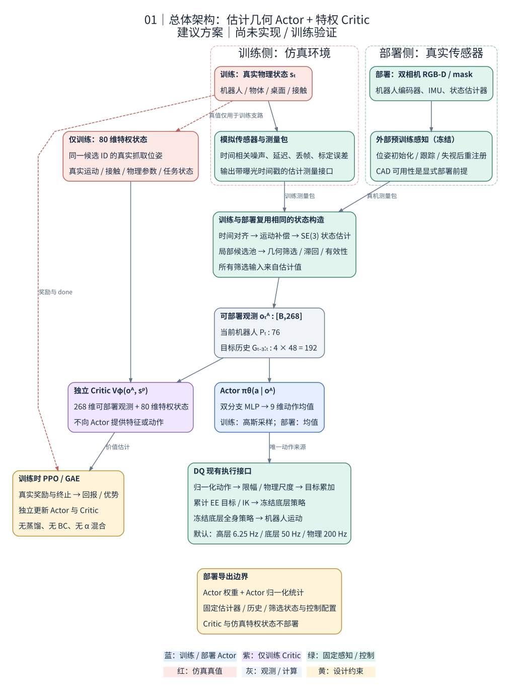
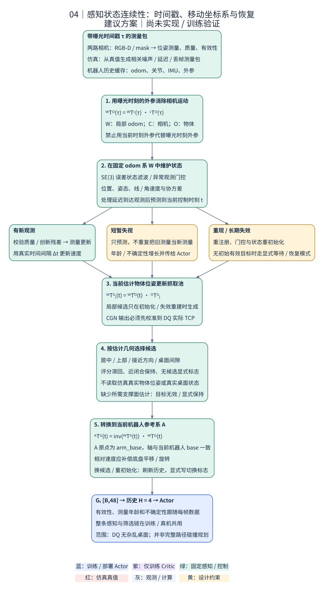
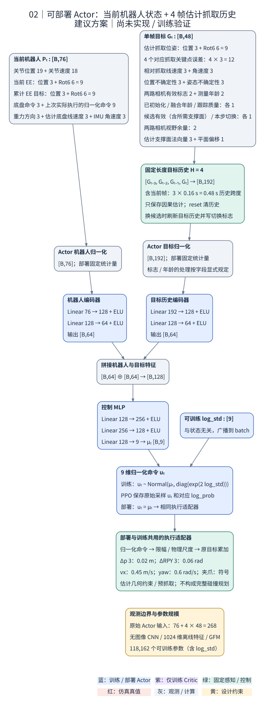
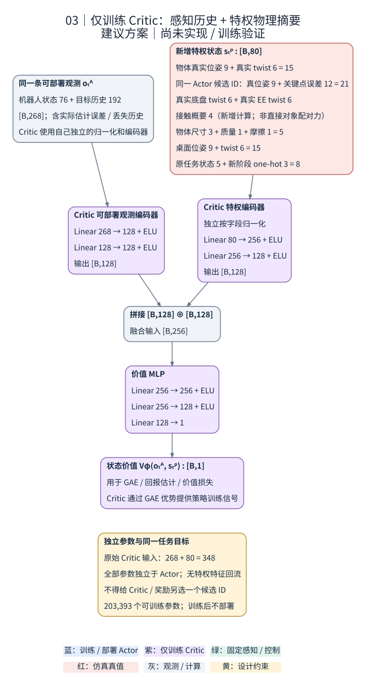
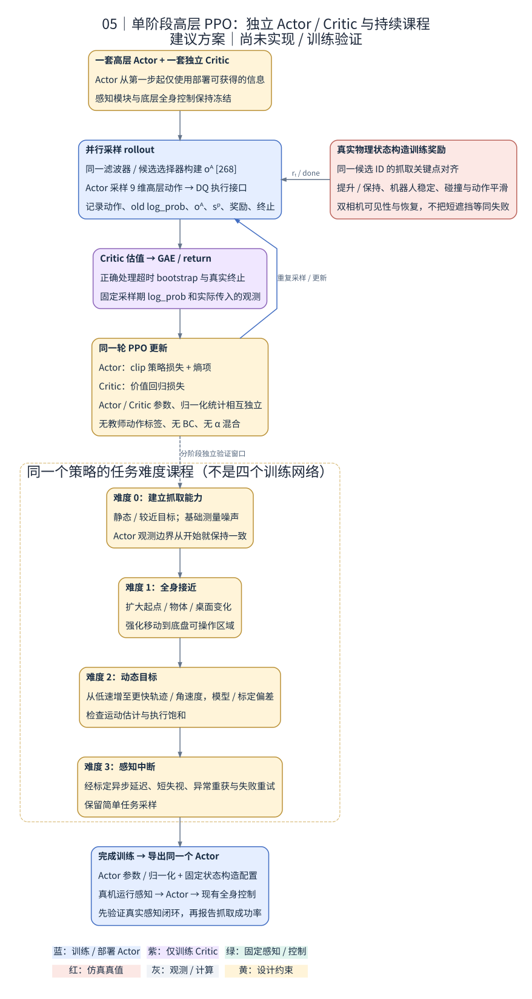

# DQ-NET 借鉴 KARL 的非对称 Actor–Critic 单阶段训练方案

**日期：2026-10-09。状态：设计方案，尚未接入训练代码或验证抓取收益。** 本文依据两份论文、两仓库源码和现有 M0/M1/M2 实现整理。配套脚本只验证建议网络的维度、参数量及前向传播。

**推荐路线：将 DQ 原教师改为“估计抓取几何 Actor＋独立特权 Critic”，从第一步就在同一套可部署观测接口上联合进行 PPO。感知、状态估计和抓取候选管理放在策略外；训练完成后直接导出这个 Actor。**

参考的是 KARL 的系统分工、抓取几何表示、状态连续性和课程。KARL 当前控制器使用相同观测和共享骨干，**不是非对称 Actor–Critic**。已有 DQ M0/M1/M2 已经是非对称结构；本次建议改变的是 Actor 要学习的问题和感知接口，而非再次简单拆开两个网络。[K1]、[D2]

这里“单阶段”指**一次高层控制策略 PPO 训练，没有教师动作监督、学生蒸馏或 α 特权输入退火**。已有低层策略和外部感知模型仍可使用预训练权重；课程可以逐步增加任务难度，但 Actor 的信息边界始终相同。

## 1. 为什么选择这条路线

### 1.1 当前实现与建议方案

| 路径 | Actor 实际依据什么控制 | 主要问题或前提 |
|---|---|---|
| 原 DQ 教师 | 静态物体特征、物体真值、真值携带的抓取池、本体状态 | 物体信息不能按原接口直接从真实传感器取得 |
| 当前 karl/geometric 教师 | 上述特权输入仍在，只将 GFM 换成单个候选 | 筛选器仍读取物体、桌面真值，不是可部署非对称策略 |
| 现有 M0/M1/M2 | 双相机 mask/depth、61维机器人状态，M2再加belief16 | PPO仍需从图像学习抓取相关信息；KF只跟踪可见表面参考点 |
| **本文主方案** | **估计的完整抓取位姿及其运动、质量、历史，加上机器人状态** | 需要外部位姿/抓取前端，并使训练感知误差接近真实情况 |

M2 的 belief16 不能直接变成本文抓取状态：它是 mask 内深度反投影点的均值及其速度估计。可见表面随遮挡和视角变化，均值不一定等于物体中心；它还没有物体姿态，无法可靠地携带对象局部抓取变换。[D2]、[D3]

### 1.2 预期改善来自哪里

1. **降低高层 PPO 的感知学习负担。** 它主要学习底盘移动、夹爪对齐、闭合和抬升；注册、跟踪由外部模块完成。
2. **让奖励与输入抓取目标一致。** 当前 DQ 接近奖励主要指向物体根位置，朝向奖励鼓励 EE 的 +X 指向物体根位置，与一个具体候选的完整位姿不同。只替换筛选器，策略仍可能忽略候选。[D4]
3. **显式提供目标运动和失视信息。** 速度、测量年龄、有效性和不确定度帮助区分“目标运动”和“观测没有更新”。
4. **保留训练期信息优势。** Critic 读取真实几何、接触摘要和任务进度；Actor 始终只读取部署端可构造的输入。

这些是设计动机，不是已经证实的性能归因。原视觉方案训练不好，仍需通过感知误差、动作饱和率、奖励分项和成功阶段统计定位原因。

**效率也要区分。** 原 GFM 约9,926个参数；一个1024→512→128编码器有590,464个参数，现有图像CNN仅一个展平全连接层就约414万参数。移除策略内图像编码、大图像rollout和静态特征编码，比单独删除GFM更能降低控制训练负担。但外部感知仍可能是实机延迟瓶颈。[D1]、[D2]

## 2. KARL 借鉴什么，DQ 保留和替换什么

### 2.1 KARL 模块取舍

| KARL内容 | 建议 | DQ中的具体改法 |
|---|---|---|
| 感知与控制分开，策略输入几何状态 | 核心借鉴 | 外部前端输出估计，Actor使用低维几何向量 |
| 对象局部抓取池，随位姿更新 | 保留思想 | 保存局部候选，在线用估计对象位姿更新 |
| 目标框与EE框对应关键点 | 借鉴并重定义 | 按Z1的TCP、+X接近轴建立统一模板 |
| 姿态代价与切换滞回 | 改造 | 复用geometric评分思路，输入换为感知估计 |
| 失视预测、重获后校正 | 核心借鉴，重写估计器 | 处理移动底盘、时间戳、延迟和SE(3)误差 |
| 六阶段课程 | 借鉴原则 | 同一Actor逐步学习移动接近、动态物体、遮挡 |
| 失败检查与重试 | 借鉴系统机制 | 使用夹爪反馈和视觉/运动学证据 |
| UR5的7维关节速度动作 | 不迁移 | 保留DQ的9维动作和执行链 |
| UR5姿态偏好、奖励倍率、接触阈值 | 不原样迁移 | 按Z1、全身稳定和控制周期重新标定 |
| KARL共享Actor/Critic骨干 | 替换 | 两套独立网络，Actor没有特权入口 |

KARL默认EKF实现存在四元数顺序和姿态—角速度Jacobian问题，默认真机入口部分失视恢复分支也被注释。应迁移机制并建立验证，不能将这些函数复制后视为已完成可靠SE(3)跟踪。见[K1]第9节。

### 2.2 DQ组件取舍

| DQ组件 | 主方案处理 | 理由 |
|---|---|---|
| 高层9维动作的物理语义 | **保留** | EE目标增量、夹爪、底盘前进与偏航 |
| 冻结低层策略、腿部PD、机械臂IK | **保留** | 复用已有全身执行能力 |
| 环境、物体、动力学随机化 | **保留并核对实际生效项** | 支持同条件对照 |
| PPO、多卡同步、checkpoint框架 | **复用基础设施** | 新观测协议不能直接复用旧切片 |
| 两路相机 | **保留，移到策略外感知** | 远距离定位与近距离跟踪互补 |
| 1024维静态物体特征 | **Actor删除；主Critic也先删除** | 多物体价值拟合不足时做Critic-only特征增强消融 |
| Actor/Critic中的GFM | **主方案均删除** | 共享一个显式目标，Critic不再另融合隐含目标 |
| 图像CNN、双Transformer、学生残差纠错网络 | **主方案删除** | 由几何MLP和短历史替代，原实现保留作对照 |
| DAgger、教师动作标签、蒸馏阶段 | **删除** | 同一个部署Actor直接通过PPO学习 |
| M2时间戳、延迟队列、过时测量处理 | **复用工程机制** | 与策略是否直接读图像无关 |
| M2表面点KF和belief16 | **替换** | 改为完整对象/抓取位姿与运动状态 |
| M2表面代理预测奖励 | **主方案关闭** | 首先建立清晰的实际抓取目标 |
| 物体根位置接近/朝向奖励 | **替换** | 对齐实际选中的抓取位姿 |
| 抬升、持续保持、全身稳定目标 | **保留目标，修正判据** | 最终必须抓起并持稳 |

“删除”指新实验主路径不再使用，不要求删除原实验文件。建议新建独立入口和配置，保留已有对照。

## 3. 总体架构与信息边界

[PNG](assets/dq_karl_asymmetric_proposal/01_system.png) · [DOT](assets/dq_karl_asymmetric_proposal/01_system.dot)

~~~text
训练：
仿真真值 → 感知测量模拟器 → 含噪/延迟测量
                              ↓
                 同一估计器 → 估计几何筛选 → Actor
仿真真值 ───────────────────────→ Critic / reward

部署：
真实RGB-D与机器人状态 → 冻结感知前端 → 同一种测量协议
                                         ↓
                        同一估计器 → 同一筛选器 → 同一Actor
~~~

**边界检查必须覆盖整个Actor上游。** 最终目标加了噪声，但选择器仍使用真值对象中心、真值桌面或“GT最佳候选”，仍会造成训练部署差异。真值只能在感知模拟器边界之前、Critic及奖励路径使用。

第一版面向当前DQ的**已知刚体物体、单目标、相对开阔支撑台面**任务。未知物体与复杂杂物场景需要额外建模或场景感知，不能凭这个Actor宣称已解决。

## 4. 感知前端：先建立可运行的几何接口

### 4.1 第一版采用已知模型路线

1. 真实分割/目标指定得到目标区域。
2. 使用CAD/扫描模型和真实RGB-D完成初始6D注册，FoundationPose是可评估的候选工具。
3. 持续跟踪；两相机独立带时间戳输出测量，质量不足时不强行标记有效。
4. 对已知对象，共享已验证的对象局部抓取池；首次可见时运行CGN并转到对象局部坐标，也是可选初始化方式。

CAD是明确的任务先验。若比较未知物体泛化，需单独报告模型是否可用、候选池是否预建，以及建模/初始化耗时。

DQ离线JSON经过相机轴和工具轴转换，**不能直接当作CGN原始工具系位姿送到真机**。应导出并校验对象ID、候选池版本、候选ID、对象到抓取的变换、TCP版本。真实FK、CGN、仿真候选必须指向同一个Z1 TCP。

不必每个控制步重跑CGN。正常情况下只更新局部候选的刚体变换；候选全部失效、跟踪重建或模型变化时才重建候选池。

### 4.2 与当前学生图像接口的区别

位姿前端需要经过验证的RGB-D分辨率、内参、相机位姿、曝光时间和对象模型。现有学生54×96的mask/depth张量主要服务CNN，不能直接假定它足以支撑精确6D注册。

基座相机提供较广视野，腕相机补充近距离信息。感知频率与Actor频率可以不同；每次控制时统一预测到当前时刻。是否每路都运行完整重型位姿网络，应由实测吞吐决定，不要求把KARL所有视觉网络全部复制运行。

### 4.3 测量协议

~~~text
PosePacket {
    object_id, camera_id, sequence_id,
    capture_time, delivery_time,
    T_camera_object, T_odom_camera_at_capture,
    measurement_covariance_6x6,
    detected, quality, calibration_version
}
~~~

协方差和quality是经标定的误差描述或代理量，网络原始分数不能未经验证就叫成功概率。两路视觉共享目标模型、标定和里程计误差，不应无条件视为独立测量。第一版可以择优更新或保守膨胀协方差，再研究相关融合。

## 5. 移动基座、SE(3)估计与失视

[PNG](assets/dq_karl_asymmetric_proposal/04_perception.png) · [DOT](assets/dq_karl_asymmetric_proposal/04_perception.dot)

### 5.1 坐标与时刻

- \(W\)：连续里程计/世界估计坐标系；仿真对应各环境自己的世界系。
- \(A\)：原点位于机械臂安装基座，坐标轴与机身一致，对应DQ的arm_base约定。
- \(O\)：对象模型规范系。
- \(G\)：Z1目标抓取TCP，接近方向为 \(+X_G\)。
- \(C_i\)：相机光学系。

对采集于 \(t_c\)、到达于 \(t_d\) 的图像：

\[
\hat T^W_O(t_c)=\hat T^W_{C_i}(t_c)\hat T^{C_i}_O(t_c).
\]

先在测量对应时刻校正，再预测到控制时刻 \(t\)：

\[
\hat T^A_{G_j}(t)=
\big(\hat T^W_A(t)\big)^{-1}\hat T^W_O(t)T^O_{G_j}.
\]

腕部相机外参必须使用采集时刻的机身状态、机械臂FK和手眼标定，不能用最新相机位姿处理旧图。局部Actor输入也不会自动消除里程计的相关误差。

### 5.2 建议估计器

实现并验证SE(3)误差状态滤波模块：名义状态包含位置、速度、姿态、角速度；位置、速度、旋转切空间误差及角速度组成12维误差状态。基本预测为：

\[
p^+=p+v\Delta t,\qquad
R^+=\operatorname{Exp}([\omega^W]_\times\Delta t)R.
\]

测量更新需要位置/姿态残差、异常值门控及正确Jacobian。迟到测量用有限历史回放或明确的延迟更新；超出窗口则丢弃并计数。

这是新增估计器，不是现有点KF的改名。工程验证可先用位置速度KF加经过测试的SO(3)姿态/角速度滤波，但需说明其协方差近似。

抓取点速度包含对象旋转的杠杆项：

\[
v^W_g=v^W_o+\omega^W_o\times(R^W_O p^O_g).
\]

Actor相对速度定义为基座系位置的时间导数：

\[
\dot p^A_g=(R^W_A)^T(v^W_g-v^W_A)
-\omega^A_A\times p^A_g.
\]

\(v^W_A\) 是机械臂安装原点速度，包含相对机身参考点的旋转杠杆项；相对角速度为 \((R^W_A)^T(\omega^W_g-\omega^W_A)\)。不能把M2的“世界绝对速度转到基座轴”直接改名为该相对速度。

### 5.3 缺测和目标切换

| 情况 | 处理 |
|---|---|
| 正常观测 | 校正、预测到当前时刻，更新年龄和不确定度 |
| 短暂失视 | 仅预测，不重复融合同一旧帧 |
| 超过可靠预测范围 | 降速/保持，重新观测，不无限追逐外推目标 |
| 重新识别 | 门控后校正/重初始化，清理不连续历史 |
| 候选ID、规范系或对称分支变化 | 设置切换标志，刷新历史；速度仍由对象twist推导 |
| 环境重置/更换对象 | 清空本环境滤波、历史、候选、队列及执行目标缓存 |

保持、重试等实际控制逻辑必须仅依赖部署可得量，并同样用于训练。Critic真值阶段不能暗中控制Actor目标或执行器。

四元数q与−q可统一连续表达。对象几何对称性则需保持规范分支连续；Z1夹爪不能未经工具几何验证就按“绕接近轴180°等价”处理。

## 6. 抓取筛选：复用思想，移除真值依赖

现有GeometricGraspSelector可作为评分与状态管理基础，但TeacherGraspGeometry.context不能直接作为部署输入源。[D5]

| 上下文量 | 部署来源 | 训练来源 |
|---|---|---|
| 对象当前位姿/twist | 注册、跟踪与估计器 | 含误差测量经过同一估计器 |
| 物体尺寸 | 已声明CAD/扫描或在线重建 | 相同资产先验，不额外读取未声明参数 |
| 桌面/局部场景几何 | 背景深度或标定场景估计 | 带误差的支撑面/场景测量 |
| 夹爪位置、方向、开合 | FK、关节反馈 | 模拟传感器与同一FK |
| 夹爪包络 | 标定URDF/TCP | 同一工具描述 |

评分保留“有效性检查＋水平居中/上部/向下接近偏好＋末端运动代价＋切换门槛”。盒子适合较强居中偏好，碗口、把手等需要减弱；不能把空腔中心当可夹持点。可沿用当前geometric权重作为实验起点，不声称它对所有物体最优。

首次直接选有效最小代价项；之后用滞回减少切换，接近并闭合时保持编号。候选失效时解除保持；全无效则明确输出valid=0，并进入保持/重获逻辑。

当前单个大包络对小物体较保守。分部件包络或对少量最佳候选精查可作为后续改进。**候选终点不碰桌不等于接近路径不碰桌。** 主方案增加估计台面输入，并要求仿真、实机共用工作空间约束和基于估计场景的动作约束。预抓取点
\(p_{\rm pre}=p_g-d_{\rm pre}R_ge_x\)
可用于接近走廊，初值 \(d_{\rm pre}=0.06\) m需验证；它不改变候选ID。复杂障碍需要更完整的场景输入或规划。

## 7. Actor观测：268维，全部可部署

**以下是新方案接口，不是现有代码已经输出的张量。**

### 7.1 当前机器人状态：76维

| 切片 | 内容 | 维度 | 来源 |
|---|---|---:|---|
| 0:19 | 关节位置，含夹爪 | 19 | 编码器 |
| 19:37 | 腿、臂关节速度，不含夹爪 | 18 | 编码器/速度估计 |
| 37:46 | 当前EE位置3＋旋转6D | 9 | 同时刻FK、机身状态估计 |
| 46:55 | 累计EE目标位置3＋旋转6D | 9 | 执行控制器缓存 |
| 55:58 | 当前底盘命令 | 3 | 控制器缓存，现任务侧向为0 |
| 58:67 | 上一实际执行的归一化高层命令 | 9 | 执行适配器缓存 |
| 67:70 | 机身系重力方向 | 3 | IMU/姿态估计 |
| 70:73 | 机身参考点估计线速度 | 3 | 里程计/状态估计 |
| 73:76 | 机身角速度 | 3 | IMU |
| **总计** |  | **76** |  |

即原61维的两组RPY各换成旋转6D（共增加6），再增加9维机身运动信息。真实端必须来自测量/估计；仿真根节点速度不能当作无需误差建模的真机输入。

旋转6D为旋转矩阵前两列按固定顺序拼接，避免输入端欧拉角包裹跳变；该选择参考[旋转表示研究](https://openaccess.thecvf.com/content_CVPR_2019/html/Zhou_On_the_Continuity_of_Rotation_Representations_in_Neural_Networks_CVPR_2019_paper.html)。输入表示改变不要求改变执行器的RPY增量语义。

### 7.2 单帧抓取与感知状态：48维

| 切片 | 内容 | 维度 | 说明 |
|---|---|---:|---|
| 0:9 | 估计选中抓取位置3＋旋转6D | 9 | 当前A系 |
| 9:21 | 目标四关键点减EE四关键点 | 12 | 不是视觉特征点 |
| 21:24 | 抓取位置在A中的时间导数 | 3 | 补偿自运动 |
| 24:27 | 相对角速度 | 3 | rad/s |
| 27:30 | 抓取位置标准差 | 3 | 包含姿态与候选偏移的误差传播 |
| 30:33 | 抓取姿态切空间标准差 | 3 | rad，不是四元数分量方差 |
| 33:35 | 两相机本次新测量是否被接受 | 2 | 重复旧帧不算新测量 |
| 35:37 | 两相机最近接受测量的采集年龄 | 2 | 秒，缺测增长并裁剪 |
| 37:38 | 估计是否初始化 | 1 | 0/1 |
| 38:39 | 最新融合测量的采集年龄 | 1 | 与处理耗时区分 |
| 39:40 | 跟踪质量代理量 | 1 | 经残差/有效点等校准 |
| 40:41 | 候选及必需场景几何是否有效 | 1 | 无必要台面估计可置0 |
| 41:42 | 候选/规范分支切换标志 | 1 | 0/1 |
| 42:44 | 两相机预测视野余量 | 2 | 估计投影，不是可见性真值 |
| 44:48 | 台面单位法向3＋偏移1 | 4 | A系平面 \(n_A^Tx_A+d_A=0\) |
| **总计** |  | **48** |  |

视野余量可取投影点到图像四边的最小归一化距离；出画为负，镜头后方为无效负值。它表示几何视野，实际遮挡由新测量标志和质量体现。

四个模板点建议从Z1 TCP定义，例如单位为米：

\[
K=\{(0,0,0),\,(-0.06,0,0),\,(0,0.03,0),\,(0,0,0.03)\}.
\]

由目标和实测EE位姿分别变换，形成12维差值。它们表征抓取坐标框，不是接触点。尺度、方向在仿真、部署和奖励中必须一致，最终尺寸需经过工具标定。

### 7.3 短历史与归一化

保存 \([g_{t-3},g_{t-2},g_{t-1},g_t]\)，形状[B,4,48]，展平192维；和当前76维机器人状态组成 **268维输入**。

默认高层周期0.16s，四帧包含当前帧，跨度为 **0.48s**。每个历史包保留构造时的基座系表达；它只提供辅助变化线索，对象速度由第5节估计器给出，不依赖直接差分历史基座坐标。

候选池、候选规范分支改变或重初始化时，清理旧目标历史，可用当前包重复初始化并保留切换标志。短时失视继续填入当前预测以及增长的年龄/不确定度，不能复制旧的有效观测冒充新帧。

连续量按明确单位缩放；旋转6D、单位法向和0/1标志不混入任意在线标准化。标准差可使用log1p(std/scale)再裁剪。若使用运行统计，只处理指定连续字段，Actor/Critic统计分开，并在一轮rollout及对应PPO更新期间保持映射不变；部署导出同一协议与统计。

## 8. Actor详细网络

[PNG](assets/dq_karl_asymmetric_proposal/02_actor.png) · [DOT](assets/dq_karl_asymmetric_proposal/02_actor.dot)

| 分支/层 | 输入→输出 | 激活 | 参数量 |
|---|---|---|---:|
| 本体编码1 | 76→128 | ELU | 9,856 |
| 本体编码2 | 128→64 | ELU | 8,256 |
| 历史展平 | 4×48→192 | 无 | 0 |
| 几何历史编码1 | 192→128 | ELU | 24,704 |
| 几何历史编码2 | 128→64 | ELU | 8,256 |
| 拼接 | 64＋64→128 | 无 | 0 |
| 动作骨干1 | 128→256 | ELU | 33,024 |
| 动作骨干2 | 256→128 | ELU | 32,896 |
| 均值头 | 128→9 | 无 | 1,161 |
| 状态无关log_std | 参数向量9 | exp生成标准差 | 9 |
| **合计** | **268→均值9** |  | **118,162** |

第一版不使用GRU或Transformer。估计器负责运动状态，四帧向量提供短时上下文，MLP可沿用打乱minibatch的PPO。长失视或执行器记忆成为明确瓶颈后，再单独比较更长历史或GRU。

### 8.1 动作采样与DQ执行接口

训练在归一化命令上定义：

\[
u_t\sim\mathcal N(\mu_\theta(p_t,g_{t-3:t}),
\operatorname{diag}(\sigma_\theta^2)).
\]

执行器将命令限幅、映射为原DQ物理量：

| 分量 | 语义 | 建议沿用上限 |
|---|---|---|
| 0:3 | 累计EE目标位置增量 | 每轴±0.02m/高层步 |
| 3:6 | 累计EE目标RPY增量 | 每轴±0.06rad/高层步 |
| 6 | 夹爪 | ≥0开，<0闭 |
| 7 | 底盘前向命令 | 常规非floating路径±0.45m/s |
| 8 | 底盘偏航命令 | ±0.6rad/s |

保留动作语义，归一化采样与尺度适配是新增设计。它避免位置维按1米量级标准差采样再几乎全部裁到2cm。初始标准差按归一化单位设置，并记录饱和率，不盲目继承旧log_std=0的物理意义。[D6]

PPO保存**采样时原始命令及对应log probability**。执行器另存限幅、工作空间约束后的实际命令；不能把被改写的执行动作配上原始动作概率更新。76维本体观测中的上一动作采用实际执行命令的归一化表示。

部署取均值，通过同一执行适配器。若以后采用tanh高斯，需同步处理概率密度Jacobian。EE增量始终加到**控制器累计目标**，不能换成当前实测EE加增量。

默认物理200Hz、低层50Hz、高层6.25Hz。调整高层周期时，同时调整每步增量、历史跨度、滤波和按时间计量的奖励。2cm/0.16s相当于每轴0.125m/s的目标增量上限，更快目标需底盘协同；网络增大不能解决物理不可达。

## 9. 独立Critic：348维输入

[PNG](assets/dq_karl_asymmetric_proposal/03_critic.png) · [DOT](assets/dq_karl_asymmetric_proposal/03_critic.dot)

Critic读取**Actor实际收到的268维观测**和新增80维特权摘要。它既需要真实任务状态，也需要知道Actor当前是否失视、目标是否过时。

| 特权字段 | 维度 | 说明 |
|---|---:|---|
| 对象真值位置3＋旋转6D＋线/角速度6 | 15 | 与A系协议一致 |
| Actor选中同一ID的真值目标位姿9＋关键点误差12 | 21 | 不另选GT最优候选 |
| 真值机身线/角速度 | 6 | 和估计量区分 |
| 真值EE线/角速度 | 6 | 明确参考点与坐标系 |
| 接触摘要 | 4 | 左/右指净接触力模长、禁止部位碰撞强度、物体支持面接触标志 |
| 尺寸3＋实际质量1＋实际摩擦1 | 5 | 实际生效实例参数 |
| 真值支撑台面位姿9＋twist6 | 15 | 支撑物运动影响任务 |
| 原task5＋新阶段one-hot3 | 8 | 见下文 |
| **合计** | **80** | **和实际Actor观测合计348** |

task5为剩余回合比例、历史最近距离、历史最高高度、持握进度、当前举起标志。接近奖励改为候选误差后，历史字段同步改为相应误差；取消某个历史奖励时，后续协议版本可删去对应字段。阶段3建议区分未确认抓持、抓持抬升过程、达到抬升保持条件，仅供Critic/奖励。

接触摘要与阶段标签是**待新增或明确计算的量**。现有每刚体净接触力不能证明“该手指接触的就是目标”。对象级双侧接触、支持面接触需要接触对信息或经过验证的几何组合判据，不能从力模长杜撰对象身份。

| Critic分支/层 | 输入→输出 | 激活 | 参数量 |
|---|---|---|---:|
| 实际观测编码1 | 268→128 | ELU | 34,432 |
| 实际观测编码2 | 128→128 | ELU | 16,512 |
| 特权编码1 | 80→256 | ELU | 20,736 |
| 特权编码2 | 256→128 | ELU | 32,896 |
| 拼接 | 128＋128→256 | 无 | 0 |
| 价值骨干1 | 256→256 | ELU | 65,792 |
| 价值骨干2 | 256→128 | ELU | 32,896 |
| 价值头 | 128→1 | 无 | 129 |
| **合计** | **348→1** |  | **203,393** |

Actor/Critic不共享参数、编码器和归一化统计。Critic使用自己的实际观测分支，不通过Actor隐层反传价值损失。两者共 **321,555** 个可训练参数；外部感知与冻结低层另计。

80维是工程摘要，不宣称完整描述接触动力学或严格全状态Markov表示。尺寸无法充分表示碗、把手等形状。若多物体价值拟合不足，可做 **Critic-only静态特征增强**：仅给Critic添加1024维特征的小MLP分支；仍直接部署相同Actor，无需蒸馏。主方案先不加，以建立紧凑基线。

## 10. 奖励设计必须与所选抓取一致

### 10.1 候选ID与奖励时刻

时刻t，用Actor上游估计状态选出候选 \(j_t\)。该候选在任意评价时刻 \(t'\) 的真值实现为：

\[
T^{W,\mathrm{gt}}_{G_{j_t}}(t')
=T^{W,\mathrm{gt}}_O(t')T^O_{G_{j_t}}.
\]

必须分别处理当前价值、转移奖励和下一时刻价值，不能将三者的候选索引混在一起：

| 计算项 | 使用的候选 | 对齐要求 |
|---|---|---|
| 当前价值 \(V_t\) | \(j_t\) | 当前Actor观测与Critic特权目标使用同一ID、同一池版本 |
| 动作t的奖励 \(r_t\) | \(j_t\) | 在执行后的真实状态评价动作前选定的目标；进展项前后两次评价均使用该候选 |
| 下一时刻价值 \(V_{t+1}\) | \(j_{t+1}\) | 与实际下一Actor观测配套，包括下一候选及更新后的历史；用于GAE/bootstrap |

因此，计算动作t的奖励时不能先换成 \(j_{t+1}\)；下一观测已经换目标时，也不能让Critic仍使用旧候选 \(j_t\)。每条观测和每次转移须保存相应的ID、池版本。候选切换时重置/屏蔽跨候选的历史进展缓存，避免仅靠换目标刷分。

第一版使用已验证、带ID的对象局部候选池，主要模拟位姿/跟踪误差。后续加入CGN候选几何错误时，必须区分它与对象位姿误差：错误候选不一定有对应的理想真值抓取，不能偷偷替换成GT最佳候选。没有可靠对应时，关闭该候选的理想目标辅助项，仍依据真实接触、抬升和保持评价任务。

### 10.2 建议奖励组成

| 项目 | 建议 | 作用 |
|---|---|---|
| 候选关键点接近/对齐 | 替换物体root接近和仅指向root的姿态项 | 奖励追踪具体抓取位姿 |
| 正确闭合/抓持证据 | 新增小辅助项 | 近目标且形成可信夹持时才给分 |
| 相对支撑面的实际抬升 | 保留并检查抓持条件 | 防止推倒、碰飞或桌面运动被当抓起 |
| 持续保持成功 | 保留目标、统一训练评估标准 | 真正完成任务 |
| 动作/执行速度变化 | 修正并扩展 | 覆盖臂和底盘，使用正确历史与时间单位 |
| 全身稳定、禁止碰撞、关节/工作空间约束 | 保留有效项并修复失效项 | 防止通过危险动作取得几何奖励 |
| 可见性/不确定性 | 初期小权重或先只记录 | 避免为看清目标而永远不接近 |
| 表面点预测奖励 | 主方案关闭 | 减少与实际抓取无直接对应的训练目标 |

关键点误差可定义为：

\[
e_K=\frac14\sum_i
\|T^{W,\mathrm{gt}}_{G_{j_t}}k_i-T^{W,\mathrm{gt}}_Ek_i\|_2.
\]

可用有界对齐项 \(\exp(-e_K/\sigma_K)\) 配合目标一致的进展项。首个实现先选一种简单形式，不叠加多个互相重复的距离项；权重根据实际回报量级和成功轨迹确定，不照搬KARL的闭爪+180。

抓持稳定后降低/关闭继续向对象表面推进的奖励，转向抬升和保持。建议预抓取走廊首先作为估计几何的执行约束；若以后把它做成阶段目标，该阶段切换必须在部署可得状态上完成，并使Actor明确收到当前目标，不能由后台GT阶段悄悄切换。

可见性采用“双相机至少一路提供可靠观测”的思路。夹爪临近对象时的正常自遮挡不应自动成为失败；短失视不立即终止。长期没有任务进展仍受回合预算和成功奖励约束，避免无限保持。

### 10.3 原奖励路径需要单独修正的问题

现有源码审计已记录：base_dir的方向处理使其退化；加速度惩罚的速度缓存时序使差值为零；yaw终止条件写在奖励函数中；训练持握与评估首次抬升立即结束采用不同标准。[D4]

这些应作为**奖励/评估修复**单独记录并消融，不能把修复收益全部归给非对称网络。主结果采用统一成功定义，例如保持原0.35m相对抬升阈值，同时要求可信抓持、无支持面托举、连续保持4s且未掉落；可另报告原仓库口径用于历史对照。初期课程可降低难度，最终评估阈值固定。

## 11. 单阶段PPO与感知误差模拟

[PNG](assets/dq_karl_asymmetric_proposal/05_training.png) · [DOT](assets/dq_karl_asymmetric_proposal/05_training.dot)

非对称训练利用仿真全状态辅助价值学习，而策略仅用部署观测；这一原则也见[Asymmetric Actor Critic原始研究](https://arxiv.org/abs/1710.06542)。本文用PPO和几何观测，是针对DQ的具体设计，不是该论文算法的逐项复现。

### 11.1 大规模训练不用每环境都跑视觉网络

建议先建立一个**感知测量模拟器**：由仿真对象、相机与机器人状态生成测量包，再施加经真实日志标定的误差。后续估计器、候选筛选、观测构造、执行适配器与真实端共用。

| 误差/事件 | 必须覆盖的内容 |
|---|---|
| 位姿测量误差 | 距离、视角、遮挡有关的平移与旋转误差 |
| 持续偏差 | 每回合标定/模型偏置、慢漂移，不能只有逐帧独立白噪声 |
| 机器人状态估计 | IMU、关节、基座速度、里程计和手眼外参误差 |
| 异步/延迟 | 两相机不同采集频率、处理时延、乱序和过时包 |
| 失视 | 几何出视野、对象像素过小、自遮挡和连续丢帧 |
| 异常与恢复 | 跳变、错误注册、重获时的残差门控与延迟 |
| 候选问题 | 无候选、候选有效性误判、模型规范分支变化 |
| 台面估计 | 法向、平面高度、可用性和动态支撑物误差 |

仿真GT可以生成模拟传感器读数，就像渲染图像也由GT生成；但GT不能越过测量接口继续帮助选择器或Actor。纯FOV角度不等于真实检测率，应结合遮挡几何、小规模渲染与真实日志标定。

这条大规模路径可以不开相机传感器，避免每环境视觉渲染和重型前端；因此主训练不必依赖相机图形互操作。**它仍是测量级训练近似，不是真实视觉闭环验证。** 最终必须在小规模渲染场景和真实录制/在线数据上运行真正前端，检查误差分布、失视处理及策略行为。

### 11.2 时延用秒和时间戳定义

当前DQ默认高层步0.16s，图像采集距该高层步结束已有约60–80ms；M2默认又加1或3个高层帧队列延迟，合计约220–560ms。连续丢失2–5个高层帧约320–800ms。这些默认值尚未等于已标定的真实传感器分布，可能显著增加动态任务难度，但不能凭此断言是训练失败原因。[D3]、[D6]

新方案记录采集、到达、控制计算和预计执行时刻。每次策略输入至少预测到当前控制时刻；已标定的额外执行延迟可进一步补偿。预测越久不确定度应越大，不能把外推到未来的位置当作准确GT。

### 11.3 PPO数据组织

~~~text
policy_obs     : [B,268]  当前机器人状态 + 四帧几何历史
critic_obs     : [B,348]  同一policy_obs + 特权80维
raw_action     : [B,9]    归一化高斯原始样本
executed_action: [B,9]    仅用于诊断/下一帧本体状态
old_log_prob   : [B,1]
reward/value/done/timeout
metadata       : candidate_id, pool_version, capture_age, validity
~~~

采用两个明确输入字段，避免继续构造混合巨型张量后靠Actor的切片约定隔离GT。Actor导出接口不接受critic_obs。

rollout缓存当时实际使用的滤波输出、候选和历史。PPO更新时不重新采样噪声、运行当前滤波器或选择新候选；否则old_log_prob与更新输入可能不对应。部分环境重置只清理对应环境的状态。

Actor只优化策略目标与熵项，Critic只优化价值损失：

\[
\rho_t=\exp(\log\pi_\theta(u_t|o^\pi_t)-\log\pi_{\rm old}(u_t|o^\pi_t)),
\]
\[
L_\pi=-\mathbb E\!\left[
\min(\rho_t\hat A_t,\operatorname{clip}(\rho_t,1-\epsilon,1+\epsilon)\hat A_t)
\right]-c_HH(\pi_\theta),
\qquad
L_V=\mathbb E[(V_\phi(o^\pi_t,s_t^{priv})-\hat R_t)^2].
\]

GAE由独立Critic估值产生。没有教师动作MSE、特征蒸馏、Actor特权适配器或α混合。

首轮实验可沿用rollout24、5个epochs、γ=0.99、λ=0.95、PPO clip=0.2，学习率从1e−4起并按KL调整；这是待验证起点。新输入/动作尺度采用新优化器和统计，不把旧视觉教师首层权重随意拼接到新几何MLP。低层权重继续固定。

有限时域任务截止与为收集数据而截断需分开：若回合时间是任务的一部分，则按终止处理并给Critic剩余时间；若只是采样截断，则从正确最终观测bootstrap。不能无条件把两者合并。

多卡复用现有全局advantage、梯度、KL、统计同步机制；checkpoint保存观测协议、候选/TCP版本、归一化、课程、噪声配置和训练预算，确保恢复语义一致。

## 12. 同一Actor的四级难度课程

课程改变任务难度，不改变Actor输入来源，也不引入教师蒸馏。

| 级别 | 任务设置 | 本阶段检查重点 |
|---|---|---|
| C0 静态可见 | 单物体、较近但可移动底盘、低噪声而非GT直通 | 正确对齐、闭合、抬升和持续保持 |
| C1 移动接近 | 增加初始距离、底盘姿态变化、台面高度与多物体 | 基座和手臂协调、台面约束 |
| C2 动态目标 | 从低速到更快轨迹，增加角速度、模型偏差和标定误差 | 速度估计、追踪误差、执行饱和率 |
| C3 感知中断 | 经标定的异步延迟、短失视、异常重获和失败重试 | 预测可靠范围、恢复时间、持物稳定 |

每阶段使用独立评估窗口、最低驻留预算和稳定达标条件，进入下一阶段后重置该窗口，保留部分简单任务采样。可从“至少500个评估回合、连续3个窗口成功率≥70%”作为实验初值，再按统计置信度和任务难度调整；这些不是论文已验证的DQ门槛。

不要复制KARL基于旧回合累计奖励门槛连续推进的实现。成功率、掉落率、碰撞率分别记录，不能用混合奖励分数代替全部进阶段条件。

若C0仍无法对齐和抓持，先检查TCP、候选、动作方向、奖励和时序，不增加网络层数掩盖接口问题。C0到C3是在一个PPO训练过程中继续优化同一Actor；另做GT输入上界时，应明确它是独立诊断实验，不是主策略的第一阶段。

## 13. 真机部署需要的完整链路

~~~text
两路真实RGB-D + IMU/关节/里程计
    → 冻结注册与跟踪前端
    → 测量协议 / 同步与采集时刻外参
    → SE(3)估计、台面估计、对象局部候选池
    → 估计几何筛选、四帧历史
    → 导出的Actor + 固定归一化
    → 归一化命令适配、限幅、估计场景约束
    → 累计EE目标 / IK / 夹爪
    → 原冻结低层与腿部PD
~~~

部署去掉Critic、GT状态构造、感知噪声注入器和训练奖励。**需要部署的是同一个Actor及其前后处理，不是重新训练一个学生。**

必要集成项目包括真实mask/位姿前端、已知对象模型/初始化流程、相机内参和手眼标定、Z1 TCP、带时间戳FK、基座状态估计、机器人执行接口，以及动作尺度/周期一致性。当前仓库的M2 runtime只提供部分数值接口，不代表这些外部链路都已打通。[D7]

Actor继续输出夹爪命令；不要直接复制KARL真机的“距离/角度规则替代网络闭爪”，否则九维训练动作与真实执行不一致。若增加闭合门控或失败重试监督器，训练使用同一基于可部署观测的规则，并记录原始和实际执行命令。

可信抓持确认不能只看闭合命令：需要夹爪实际位置/运动反馈以及对象跟随、相对运动等证据。对传感器暂不可见的状态，保持不确定性并处理失效，不能读取训练阶段的真值阶段变量。

“可直接部署”应解释为**不需动作蒸馏即可将训练得到的高层Actor接入真实系统**，不等于任何未标定的感知和动力学误差下都能零调整成功。

## 14. 实施顺序与文件改造清单

以下是建议新增的模块名，**本次未实现这些训练模块**。

| 工作项 | 建议位置/复用来源 | 完成标准 |
|---|---|---|
| 观测/动作协议 | 新增geometry_observation_contract | 76、48、268、80、348和单位、时间戳可核验 |
| 测量模拟器 | 新增pose_measurement_emulator | 没有GT越过测量边界的隐式通路 |
| SE(3)估计器 | 新增object_pose_belief；借鉴M2队列机制 | 旋转、平移、乱序、缺测和部分reset通过验证 |
| 估计几何上下文 | 新增estimated_grasp_context | 不读取对象/桌面GT；可在无Isaac环境独立运行 |
| 筛选器适配 | 复用geometric_grasp_selector | 同一候选、历史刷新、无候选处理一致 |
| 新Actor/Critic | 新增modules/geometric_asymmetric.py | 268→9、348→1，参数和输入完全分离 |
| 新环境包装器 | 新增utils/geometric_asymmetric_wrapper.py | 独立policy_obs/critic_obs、时间和reset正确 |
| PPO入口/配置 | 新增train_multistate_DQ_geometric_asymmetric.py及YAML | 从头高层PPO，支持现有同步训练基础设施 |
| 奖励/评估 | 在独立实验配置启用新路径 | 目标ID一致，训练评估成功条件一致 |
| 导出与真实runtime | 独立导出geometry_actor及协议 | 不导入仿真GT组件即可前向运行 |

建议按以下顺序推进：

1. **先验证感知接口。** 用录制数据或少量渲染环境生成位姿/候选，检查TCP、坐标、时延和失视；尚未稳定时不投入完整PPO训练。
2. **实现最小几何非对称PPO。** 已知物体、已验证抓取池、低误差测量模型、无复杂重试；直接训练同一个可部署Actor。
3. **修正目标一致奖励和统一评估。** 分别验证对齐、闭合、抬升、保持；奖励修复作为独立实验因素。
4. **增加动态、遮挡和重获。** 依据日志校准误差，而非直接套用M2默认延迟。
5. **部署同一Actor。** 检查仿真输入包与真实输入包的协议、归一化和动作适配一致，再逐级扩大真实任务范围。

这是工程实施顺序，不是“先训练特权教师、再训练部署学生”的两阶段算法。

## 15. 如何验证方案有效，而不只验证能运行

### 15.1 必做的接口与一致性检查

- 固定Actor输入，任意改变Critic真值字段，Actor输出必须逐位不变。
- Actor部署runtime不接受对象GT、真实物体速度、真实桌面位姿等隐式参数。
- 静止物体下移动/旋转底盘，估计器不能把全部相对运动当作对象运动。
- 相同采集数据以不同到达顺序输入时，延迟处理结果符合约定；旧帧不得重复融合。
- 对象/候选切换不产生虚假的巨大速度，历史与奖励ID正确。
- 同一rollout的old_log_prob复算一致；不能重跑滤波或重新生成噪声。
- 限幅前采样动作、实际执行动作、上一动作观测的含义一致。
- 删除Critic导出后，固定输入上的Actor均值与训练对象一致。

### 15.2 对照和消融

| 实验 | 目的 |
|---|---|
| 原DQ教师＋学生完整流程 | 现有方法参考，报告总训练和部署成本 |
| 当前geometric特权教师 | 观察候选机制本身的收益，明确不是可部署主方案 |
| 现有M2视觉非对称策略 | 与另一条无需蒸馏路线对比 |
| 本文几何非对称策略 | 主实验 |
| 同网络的独立GT几何上界 | 判断感知是否成为主要瓶颈，不作为部署方案 |
| 无运动滤波／无历史／无质量信息 | 分离状态估计与历史作用 |
| root奖励与候选一致奖励 | 分离奖励改进和结构改进 |
| 紧凑Critic与Critic-only静态特征增强 | 检查形状信息是否改善价值拟合 |
| 无噪声仿真、校准噪声、压力测试误差 | 衡量真实感知差距与鲁棒性 |

主要报告统一成功率、真实尝试次数定义下的单次成功率、完成时间、掉落/碰撞率；另外报告对齐误差、感知年龄、丢失/恢复时长、无有效候选率、动作饱和率和任务分阶段失败率。

时间/计算分别报告感知前端、滤波筛选、Actor、执行器耗时，以及训练吞吐和显存。不能仅凭Actor参数少就声称整个系统实时性更好。比较同对象、同任务预算、同评估协议，至少3个、最好5个随机种子，并把真实感知闭环结果与测量模拟器结果分开。

## 16. 图件、结构核验与源码索引

| 图/文件 | 内容 |
|---|---|
| [图1](assets/dq_karl_asymmetric_proposal/01_system.svg) | 整体系统与GT边界 |
| [图2](assets/dq_karl_asymmetric_proposal/02_actor.svg) | Actor逐层维度、参数、动作适配 |
| [图3](assets/dq_karl_asymmetric_proposal/03_critic.svg) | Critic两分支与80维特权摘要 |
| [图4](assets/dq_karl_asymmetric_proposal/04_perception.svg) | 感知、时序、移动坐标系和恢复 |
| [图5](assets/dq_karl_asymmetric_proposal/05_training.svg) | PPO数据流和四级课程 |
| [绘图源码](assets/dq_karl_asymmetric_proposal/render_diagrams.py) | 生成SVG、PNG、DOT |
| [结构验证脚本](assets/dq_karl_asymmetric_proposal/verify_dimensions.py) | 文档用独立MLP定义与CPU前向 |
| [验证结果](assets/dq_karl_asymmetric_proposal/dimension_verification.json) | 维度、参数和独立性检查 |

已核验B=3时Actor均值为[3,9]、Critic为[3,1]，输出有限，双方无共享参数；Actor118,162、Critic203,393，总321,555。**这是方案结构验证，不是PPO训练或真机效果验证。** 本次没有修改训练源码。

重绘与核验：

~~~bash
python doc/assets/dq_karl_asymmetric_proposal/render_diagrams.py
python doc/assets/dq_karl_asymmetric_proposal/verify_dimensions.py
~~~

### 本地证据

- [K1：KARL详解](../../karl-main/doc/KARL_论文方法与网络架构详解.md)，特别是第2、4、5、6、9、12、13节；[KARL论文](../../karl-main/doc/KARL.pdf)的IV节、Algorithm 1和Fig.3。
- [K2：KARL控制观测](../../karl-main/training/IsaacGymEnvs/isaacgymenvs/tasks/ur5_vsg_task.py)：compute_observations、compute_reward_jit和updated_curriculum9。
- [K3：KARL真机候选与控制](../../karl-main/vsg_tracking/real_robot_demo_ur5e.py)：对象局部池、pose_callback、目标关键点、真实闭爪逻辑。
- [K4：KARL估计器](../../karl-main/vsg_tracking/kalman_filter.py)与[感知主入口](../../karl-main/vsg_tracking/live_demo_ros.py)。
- [D1：DQ教师/学生网络详解](DQ_high_level_teacher_student_networks.md)及[DQ-NET论文](DQ-NET.pdf)。
- [D2：现有非对称方案](DQ_asymmetric_teacher_design.md)与[Actor/Critic代码](../DQ_high-level/modules/asymmetric_teacher.py)。
- [D3：M2感知模块](../DQ_high-level/utils/asymmetric_perception.py)、[相机采集时刻信息](../DQ_high-level/utils/asymmetric_camera.py)及[M2配置](../DQ_high-level/data/cfg/DQ_asymmetric_teacher.yaml)。
- [D4：DQ奖励实现](../DQ_high-level/envs/reward_vec_task.py)与[抓取任务](../DQ_high-level/envs/b1z1_pickmulti.py)，现有网络详解的奖励补充提供逐项对照。
- [D5：当前几何筛选器](../DQ_high-level/modules/geometric_grasp_selector.py)及[真实几何上下文读取](../DQ_high-level/utils/grasp_geometry.py)。
- [D6：DQ动作和调度](../DQ_high-level/envs/b1z1_base.py)：pre_physics_step、clip_commands、get_all_pos_targets和高/低层循环。
- [D7：现有M2部署runtime](../DQ_high-level/utils/asymmetric_runtime.py)。

### 补充公开依据

- [KARL原论文公开页](https://arxiv.org/abs/2506.15945)：课程、感知连续性与重试的论文依据；具体执行细节以本地源码审计为准。
- [Asymmetric Actor Critic](https://arxiv.org/abs/1710.06542)：部署部分观测策略与训练全状态Critic的原则。
- [旋转6D表示](https://openaccess.thecvf.com/content_CVPR_2019/html/Zhou_On_the_Continuity_of_Rotation_Representations_in_Neural_Networks_CVPR_2019_paper.html)：输入旋转表示的设计依据。

[K1]: ../../karl-main/doc/KARL_论文方法与网络架构详解.md
[D1]: DQ_high_level_teacher_student_networks.md
[D2]: DQ_asymmetric_teacher_design.md
[D3]: ../DQ_high-level/utils/asymmetric_perception.py
[D4]: ../DQ_high-level/envs/reward_vec_task.py
[D5]: ../DQ_high-level/utils/grasp_geometry.py
[D6]: ../DQ_high-level/envs/b1z1_base.py
[D7]: ../DQ_high-level/utils/asymmetric_runtime.py

