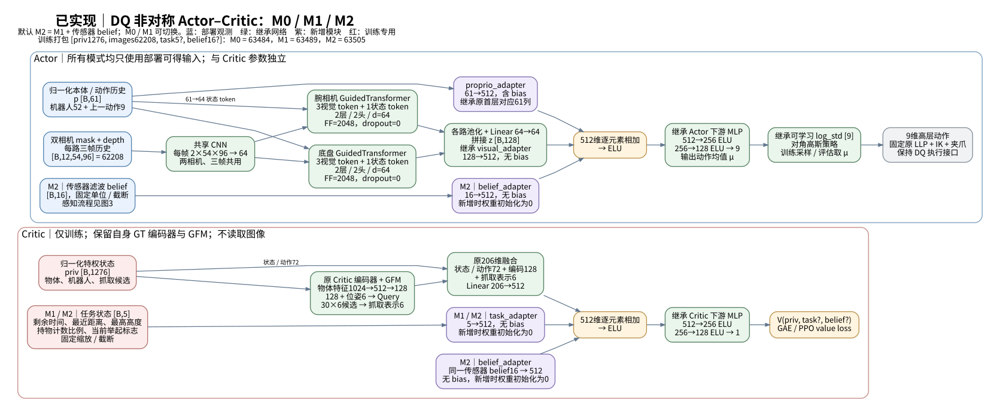
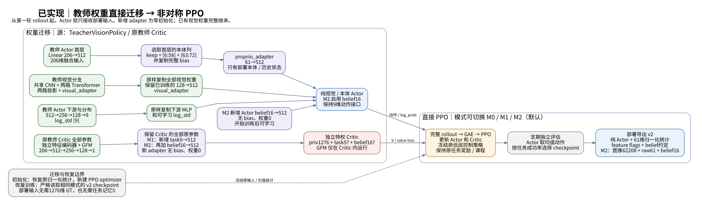
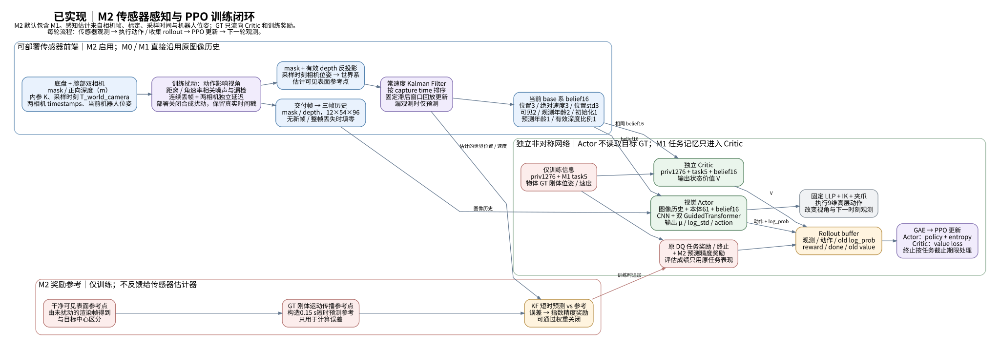

# DQ 非对称 Actor-Critic：M0、M1、M2 实现方案

本版本按照最新要求，**从第一步直接使用可部署 Actor 输入，不使用 α、辅助特权 Actor 分支或退火阶段**。M1 和 M2 已实现；当前默认配置为 M2，可用 `--asymmetric_mode m0|m1|m2` 选择实验。运行命令和接口见 [训练说明](DQ_asymmetric_teacher_training.md)。

这些模块是针对当前 DQ 代码的改造，参考两篇论文的训练与感知思路，并不是论文算法的逐项复现。实现通过功能验证不等于已经证明抓取性能提升。

## 架构图







[三页 PDF](assets/dq_asymmetric_teacher/dq_asymmetric_teacher_figures.pdf) · [绘图源文件](assets/dq_asymmetric_teacher/render_diagrams.py)

图中的教师权重迁移、适配器零初始化及冻结教师统计描述的是可选迁移路径。当前也支持不指定 checkpoint 从零训练：高层网络和适配器随机初始化，奖励课程从0开始，状态统计只在完整 PPO 更新后更新。网络结构及部署信息边界相同；低层运动控制器仍使用原预训练模型。下文权重迁移章节描述迁移路径的初始化方式。

## 三个版本的区别

| 版本 | Actor 输入 | Critic 输入 | 新增机制 |
|---|---|---|---|
| M0 | 双相机三帧 mask/depth + 机器人状态61维 | 原教师特权观测1276维 | 直接非对称 PPO |
| M1 | 同 M0 | 原观测 + 任务状态5维 | 零初始化任务适配器 |
| M2 | 扰动后图像 + 机器人状态61维 + 感知 belief16维 | 原观测 + 任务状态5维 + 同一 belief16维 | 持续滤波、异步延迟、运动相关噪声、连续失视、预测奖励 |

低层策略、IK、九维高层动作及原任务奖励路径保留。M2 仅在训练奖励中增加小权重的感知项。Actor 与 Critic 不共享特权编码器；PPO buffer 的打包观测包含特权信息，但 Actor 只切片读取被允许的字段。

## Actor 与权重迁移

图像为 `[B,12,54,96]`，对应两路相机、三帧历史、mask/depth 两种模态。每个时刻顺序为 `[base_mask,wrist_mask,base_depth,wrist_depth]`，历史由旧到新。深度进入视觉网络时除以3，保持原视觉教师量纲。

61维机器人状态来自原1276维观测的 `[1030:1082]` 与 `[1267:1276]`：

| 状态 | 维度 | 部署来源 |
|---|---:|---|
| 当前末端位置和 RPY | 6 | 机器人运动学与机身姿态估计 |
| 关节位置（含夹爪） | 19 | 编码器 |
| 关节速度（不含夹爪） | 18 | 编码器/速度估计，保留原乘0.05预缩放 |
| 当前底座命令 | 3 | 控制器状态 |
| 当前末端目标位置和 RPY | 6 | 控制器状态 |
| 上一步高层动作 | 9 | 策略缓存 |

部署只需构造这61维，不需要完整教师观测。控制目标由部署控制器维护，不由物体真值生成。

沿用原共享 CNN、两套机器人状态引导 Transformer、两路投影和128维视觉融合。每帧 CNN 输出64维；每路 Transformer 接收三个视觉 token 和一个机器人状态 token，维度64、两层两头、dropout=0。融合为：

```text
z128 = concat(wrist_visual64, base_visual64)
h512 = ELU(Wp·normalized_proprio61 + b + Wv·z128 [+ Wb·belief16])
mean9 = MLP(512 → 256 → 128 → 9)(h512)
```

`Wb` 仅 M2 存在，零初始化。复用视觉教师融合首层的61个机器人状态对应列及 bias、视觉权重、后续控制层和 `log_std_parameter`，直接舍弃其余145列。原物体编码器与 GFM 从 Actor 移除，Critic 中保留。直接移除特权输入后，初始输出一般不再等于原教师；这是当前选择的迁移方式，需要 PPO 适应，不能声称无损继承教师表现。

训练使用 Gaussian 采样；评估、导出推理使用均值。九维动作依次为末端平移3、旋转3、夹爪1、底座前进/yaw2，执行尺度与限制仍由现有控制路径处理。

## M1：补齐 Critic 任务状态

Critic 保留原教师的物体编码、GFM 与价值后层，在512维首层激活之前加上零初始化的 `Linear(5,512,bias=False)`：

| 新增字段 | 处理 | 原因 |
|---|---|---|
| 剩余回合比例 | `clamp(1-progress/maxEpisodeLength,0,1)` | 价值依赖任务剩余时间 |
| 历史最近距离 | reset 哨兵值用当前距离替代；`clamp(d,0,10)/2` | 接近奖励具有历史依赖 |
| 历史最高高度 | reset 哨兵值用当前高度替代；裁剪至 `[0,2]` | 抬升奖励具有历史依赖 |
| 持握进度 | `clamp(pick_counter/hold_steps,0,1)` | 持握和终止条件依赖计数 |
| 当前举起标志 | `lifted_object` 转浮点 | 当前阶段信息；不是历史锁存标志 |

这些字段只提供给 Critic。零初始化使新增输入在迁移起点不改变原价值输出，之后参与 PPO 价值训练。原1276维标准化统计冻结，新5维使用上述固定量纲，不进入运行统计。

## M2：可部署感知状态与训练闭环

### 感知数据通路

```text
capture时刻：两路 mask + 正光学深度(米) + K + T_world_camera + 时间戳
    → 合成深度噪声、像素/整帧丢失、连续失视、各相机独立延迟
    → 同一实际交付图像分两路：三帧视觉历史 / 几何测量
    → 相机系可见表面点 → 世界系恒速 KF → 传播到当前控制时刻
    → 当前机器人基座系 belief16 → Actor 与 Critic 各自的零初始化适配器
```

相机光学坐标约定为 x向右、y向下、z向前。测量是有效 mask 内深度反投影点的均值，**不是物体中心或完整6D位姿**。第一版采用位置3维、速度3维的恒速 Kalman filter；共享视角误差、目标转动和表面切换会产生模型偏差。

相机外参在原 `obtain_imgs()` 采集图像时立即记录，不用控制步末尾姿态反投影旧图。Isaac 的相机矩阵还需减去对应环境原点，才能与该环境的机器人和物体状态处于同一世界系。部署端用标定、机器人位姿估计和机械臂 FK 提供相同含义的变换。

双路合成延迟默认1帧、3帧。测量按**采集时间**进入有限历史重放，再预测到 `now`；迟到数据不会被当成当前测量。超过重放窗口的测量明确丢弃并计数。时间戳用 float64 保存，时间差进入滤波数值运算时转为 float32。

缺测只预测，重新看见再更新；不重复融合旧帧。首次缺测时 belief 的位置、速度、不确定度字段为零，`initialized=0`。episode reset 只清除指定环境的滤波、图像、延迟和奖励参考，不推进其他环境缓存。M2 不因普通相机失视直接终止回合。

### belief16 协议

| 切片 | 内容 | 单位/含义 |
|---|---|---|
| 0:3 | 当前基座系目标表面参考位置 | 米 |
| 3:6 | 世界绝对速度转到当前基座坐标轴 | 米/秒；没有减去机器人速度 |
| 6:9 | 基座系位置标准差 | 米 |
| 9:11 | 本次两路有效观测标志 | 0/1 |
| 11:13 | 两路最近有效观测年龄 | 秒 |
| 13 | 是否初始化 | 0/1 |
| 14 | 当前时刻减去最新被接受观测的采集时间 | 秒；迟到观测执行校正后仍可能非零 |
| 15 | 当前交付帧有效深度占比 | 比例 |

采用固定裁剪，不用教师运行标准化统计。Actor 和 Critic 分别增加 `Linear(16,512,bias=False)`；零初始化后允许学习。滤波计算在环境包装层完成，PPO 缓存所得 belief 和图像，更新时不重新采样噪声或重跑滤波。

### 运动相关扰动

深度噪声随距离、相机角速度变化；整帧丢失概率还考虑目标像素稀少程度，触发后连续失视2至5帧。相机角速度从相邻采集姿态差计算，不依赖物体真值。所有系数均可配置，默认值是待真实传感器标定的初始假设。

仿真原始目标深度在3米截断，因此等于3米的饱和值不作为几何测量，仿真配置禁止 `max_depth_m>3`。异常深度也从交付给 CNN 的帧中清除。

### 训练专用感知奖励

```text
prediction = estimated_world_position + τ · estimated_world_velocity
reference  = current_surface_proxy + τ · proxy_world_velocity
bonus      = weight · exp(-0.5 · (||prediction-reference|| / sigma)^2)
```

默认 `τ=0.15秒`、`sigma=0.10米`、`weight=0.02`。只有 filter 已初始化且参考有效时给奖励。参考从本次额外扰动前的可见表面点构造，转成物体局部坐标后由仿真物体位姿携带；速度包括刚体平移和角速度贡献。失视时保持最近参考，不用 GT 补进滤波器。

该参考与异步滤波测量在视角、时间和权重上可能不同。因此日志记录的是**可见表面代理的短时预测误差**，不是无偏的物体中心误差，也不是实际未来仿真的轨迹误差。该固定滤波器无可训练参数，奖励通过 PPO 鼓励策略选择有利于观测的行为，并不反向传播训练 KF。

物体 GT 只进入 Critic/环境/奖励路径，部署 runtime 不接受物体状态。评估记录感知诊断，但返回原任务奖励；最佳模型仍按任务 GSR 选取。`weight: 0` 可关闭感知奖励并保留诊断。

## PPO、保存与部署

训练打包顺序为 `[privileged1276, images62208, task5?, belief16?]`，M0/M1/M2总维度分别为63484、63489、63505。部署仅保存 Actor、61维归一化统计、动作方差元数据和输入协议，不导出 Critic、物体编码器或 GFM。

使用现有 SKRL PPO，超时按原任务截止语义处理。教师迁移继续使用原冻结统计；从零训练的观测统计在每个完整 PPO 更新之后更新一次，value使用不截断returns的恒等变换。同一 rollout 的采样与更新期间统计不变。新实验新建优化器；同版本断点恢复包含优化器、学习率调度器、归一化模式/统计、训练预算、奖励课程位置及评估记录。旧版本1文件可用于权重初始化，不能完整续训。

单卡继续使用原SKRL PPO。多卡入口通过torchrun启动每卡一个仿真/策略进程，使用继承该PPO的同步更新实现：全局advantage、梯度平均、统一KL/学习率和全局归一化统计；只由rank0保存全局评估选出的模型。网络架构、Actor信息边界与部署格式不变；命令和每卡预算定义见[多卡训练说明](DQ_asymmetric_teacher_training.md#多-gpu-同步训练)。

默认预算120000个向量步、rollout24、minibatch128、5 epochs、学习率1e-4。每2400训练步运行确定性策略评估，评估结束完整重置仿真与感知状态。训练预算、原奖励课程及评估步数分开计数，不含任何特权输入退火安排。

部署提供 `M2DeploymentRuntime`：直接从实时 mask/depth、相机标定/位姿/时间戳、当前机身位姿及61维状态生成动作。部署不注入合成噪声/延迟，实际延迟由采集时间戳表达。真实 mask 检测器、相机标定、机器人状态估计和执行安全限制仍由系统集成提供。

## 两篇论文的借鉴与验证边界

| 参考 | 本实现采用的思路 | 没有直接搬用的部分 |
|---|---|---|
| [羽毛球论文](badminton_sr_read.pdf)，Methods、Fig.6/7、补充式S6 | 可部署含噪 Actor、增强 Critic；将运动相关感知误差与预测奖励放入训练闭环 | 羽毛球气动力学、原任务奖励尺度 |
| [KARL](/home/hehui/karl-main/doc/KARL.pdf)，IV B/IV C | 失视时保持目标状态，重新可见后恢复校正 | 其完整位姿估计代码和任务专用时限；这里重新实现位置/速度 KF |
| [DQ-NET](DQ-NET.pdf)与[当前视觉教师](DQ_teacher_vision_training.md) | 复用机器人控制接口、视觉编码器、教师 Critic 及权重 | Actor 的物体真值/候选抓取特征 |

建议先用相同源 checkpoint、物体集合、任务等级、训练预算和多个种子比较 M0/M1/M2，再在 M2 中分别关闭扰动或将感知奖励权重设为0。主要指标仍是 GSR、OSSR、TSC；感知误差、可见率、状态初始化率和观测年龄用于诊断。当前 OSSR 沿用仓库距离启发式口径，不能解释为新定义的真实抓取尝试次数。

已执行的测试与真实仿真短测见[训练说明](DQ_asymmetric_teacher_training.md)。长程收敛、实机鲁棒性和相对原教师的成功率收益，需要正式训练实验确认。
