**DQ_high-level 教师策略与学生策略：网络结构、张量流与训练关系**

本文基于当前仓库的实际代码，沿着 README 的高层训练入口梳理网络。教师使用 **物体特征编码器＋抓取候选注意力＋Actor/Critic MLP**；学生使用 **共享视觉 CNN＋双分支状态引导时序 Transformer＋主动作头＋残差动作头**。两者输出相同的 9 维高层动作，并调用已经训练好的底层控制器。

本文包含 **17 张可缩放 SVG 结构图**。图中蓝色表示输入，绿色表示含可学习参数的网络，紫色表示张量运算，橙色表示输出，灰色表示数据、非学习运算或当前路径不使用的模块，红色表示训练损失。绿色表示模块具有参数，并不表示这些参数在每个训练阶段都被更新；具体更新范围见训练关系说明。

| 阅读内容 | 对应图 |
|---|---|
| [范围、入口与总体关系](#scope) | 图 1 |
| [教师观测的精确组成](#teacher-input) | 观测维度与切片表 |
| [教师 Actor、物体编码器与抓取注意力](#teacher-actor) | 图 2—4 |
| [教师 Critic 与高斯动作分布](#teacher-critic) | 图 5—6 |
| [学生输入与整体结构](#student-input) | 图 7 |
| [共享 CNN、状态引导 Transformer 及注意力内部](#student-vision) | 图 8—11 |
| [学生主动作头与残差动作头](#student-heads) | 图 12 |
| [教师到学生的监督与分阶段训练](#training) | 图 13 |
| [高层调用的底层网络与执行路径](#low-level) | 图 14—17 |
| [参数量、实现边界与验证](#verification) | 参数表、覆盖清单 |

<a id="scope"></a>

**本文采用 README 主路径对应的配置。** 教师入口是 [`train_multistate_DQ_teacher.py`](../DQ_high-level/train_multistate_DQ_teacher.py)，学生入口是 [`train_multi_bc_deter_DQ_stu.py`](../DQ_high-level/train_multi_bc_deter_DQ_stu.py)。两个 `play` 脚本复用这些训练脚本中的模型定义。

| 条件 | 本文取值 |
|---|---|
| 任务 | `B1Z1PickMulti` |
| 机器人状态 | 启用 `--roboinfo` |
| 底层步态观测 | 启用 `--observe_gait_commands` |
| 底座与动作 | 非 `floating_base`，不启用 `--pitch_control`，9 维高层动作 |
| 物体特征 | 启用，1024 维；不启用 `--no_feature` |
| 教师动作分布 | 默认 `use_tanh=False` |
| 学生相机模式 | `full`，前向与腕部两路相机 |
| 学生图像 | 高 54、宽 96；每个视角 3 帧、每帧 2 通道 |
| 学生训练器 | 默认 `DAgger_RNN`，不启用 `--mlp_stu` |
| 学生额外输出 | 不启用 `--pred_success` |
| 观测尾部 | 上一步动作，不启用 `--last_commands` |

维度记号：`B` 为批量大小；学生视觉序列长度 `T=3`；抓取候选数 `N=30`；学生 token 特征维度 `D=64`。图像张量按 `[批量, 通道, 高, 宽]` 表示。所有 `Linear` 和卷积默认包含 bias，除非另行说明。

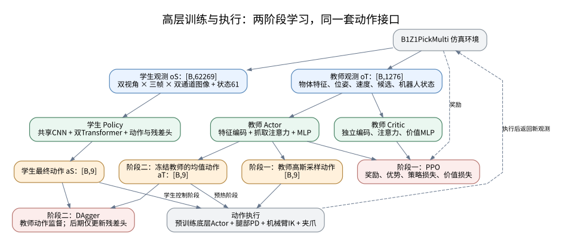

*图 1：教师先通过 PPO 学习；学生随后通过教师动作监督学习。底层控制器和解析控制连接高层动作与仿真。图中回环表示环境交互，不表示对仿真动力学反向传播。*

教师训练时同时使用 Actor 和 Critic；学生训练时，教师提供动作标签，学生自身没有 Critic。学生脚本仍然构造教师 PPO 对象及其 Value 网络以加载相应模型，但 DAgger 生成动作标签实际调用的是教师 Actor。

高层运行还涉及一套预训练底层 `ActorCritic`。为了完整覆盖实际涉及的网络，本文将其历史编码器、特权编码器、Actor 双头和 Critic 双头一并绘出，并标记哪些分支在高层实际被使用。没有把仓库中仅导入、未实例化的旧网络当成当前策略的一部分。

---

<a id="teacher-input"></a>

**教师网络的原始输入是 1276 维。** 环境把物体特征、状态、抓取候选和上一动作写入 `obs_buf`。下表中的切片均采用 Python 左闭右开区间。

| `obs_buf` 切片 | 内容 | 维度 | 学生数值状态是否保留 |
|---|---|---:|---|
| `[0:1024]` | 从物体 `features.npy` 读取的特征 | 1024 | 否 |
| `[1024:1030]` | 物体位置与 RPY 姿态 | 6 | 否 |
| `[1030:1036]` | 当前末端位置与 RPY 姿态 | 6 | 是 |
| `[1036:1055]` | 全部关节位置，包含夹爪 | 19 | 是 |
| `[1055:1073]` | 不含夹爪的关节速度，乘 `0.05` | 18 | 是 |
| `[1073:1076]` | 当前底盘命令 `commands` | 3 | 是 |
| `[1076:1082]` | 当前末端目标位置与目标 RPY | 6 | 是 |
| `[1082:1085]` | 机器人局部线速度 | 3 | 否 |
| `[1085:1087]` | 物体相对机器人的平面速度 | 2 | 否 |
| `[1087:1177]` | 30 个抓取候选的位置，先整体展开 | 90 | 否 |
| `[1177:1267]` | 30 个抓取候选的 RPY，再整体展开 | 90 | 否 |
| `[1267:1276]` | 上一步高层动作 | 9 | 是 |
| **合计** | | **1276** | **保留 61 维** |

来源：[`B1Z1PickMulti._compute_observations`](../DQ_high-level/envs/b1z1_pickmulti.py#L534)、[`compute_robot_observations`](../DQ_high-level/envs/b1z1_pickmulti.py#L783)、[`_setup_obs_and_action_info`](../DQ_high-level/envs/b1z1_base.py#L209)。

这个维度也可以从环境的配置计算式得到：

```text
num_obs = 38 + 30×6 + 2 + 1024 - 1
最终观测 = num_obs + 高层动作9 + roboinfo扩展24
         = 1276
```

有三个数据来源细节直接影响网络解释。

第一，`features.npy` 是预计算资源，每个物体的文件形状为 `(1,1024)`。环境按物体类别读取这份特征，并在不同物体实例中使用。当前高层代码没有在线运行的 PointNet 或其他点云编码网络，也不能仅根据特征维度反推出离线生成器的结构。代码中真正参与高层学习的是后面的 `1024→512→128` 编码器。

第二，候选抓取由 `contact_grasp_info_mul/predictions_image_*.json` 加载。资源中有 30 份物体抓取文件，每份包含 `(30,4,4)` 的候选变换。**物体类别数 30 与每个物体的候选抓取数 30 是两个概念**。每个环境中的目标物体使用自己的 30 个候选；教师注意力的候选轴为 `[B,30,6]`。

第三，`PredictPoint` 根据物体当前位姿更新候选变换，环境再将候选转换为机器人相关坐标中的位置和姿态。这个模块执行坐标变换，没有可训练神经网络。`compute_robot_observations` 临时返回的最后 6 维物体世界位姿用于该变换，随后被候选数据替换，不能把这 6 维再次加到最终 1276 维中。物体观测本身也有坐标约定：位置的水平分量在机器人 yaw 相关坐标中表达，z 分量保留物体世界高度；候选位置则相对机械臂基座并使用机身旋转转换。见 [`PredictPoint.get_grasp_world`](../DQ_high-level/PredictPiontTransform/predictpoint_mul.py#L167)。

**送入教师网络前，全部 1276 维观测先经过 `RunningStandardScaler`。** 这包含预计算物体特征与抓取候选，并不只是机器人状态。该预处理器维护运行均值和方差，默认将标准化值裁剪到 `[-5,5]`；它不是可学习的神经网络。后面的教师网络图均以这个实际预处理顺序为准。来源：[`PPO 配置`](../DQ_high-level/train_multistate_DQ_teacher.py#L313)、[`PPO.act`](../third_party/skrl/skrl/agents/torch/ppo/ppo.py#L199)、[`RunningStandardScaler`](../third_party/skrl/skrl/resources/preprocessors/torch/running_standard_scaler.py)。

---

<a id="teacher-actor"></a>

**教师 Actor 由一个物体编码器、一个抓取候选注意力模块和一个动作均值 MLP 组成。** 类定义为 `Policy(GaussianMixin, Model, PredictAttentionSelector)`，见 [`教师 Policy`](../DQ_high-level/train_multistate_DQ_teacher.py#L58)。

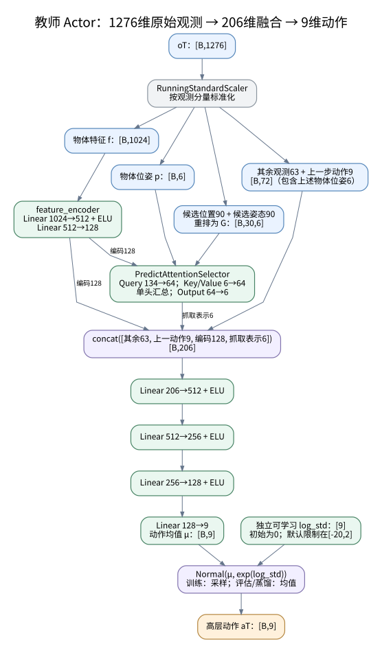

*图 2：教师 Actor 的全部可学习模块。物体位姿 6 维既参与注意力 Query，也保留在通向主 MLP 的 72 维状态中。*

进入主 MLP 的维度为：

$$
d_{\mathrm{teacher\ fusion}}=(1276-1024-180)+128+6=206.
$$

其中其余状态 72 维由当前状态 63 维和上一动作 9 维组成。代码中的拼接顺序是：

```python
concat([
    states[..., 1024:1087],  # 63维状态
    states[..., -9:],        # 上一动作9
    features_encode,        # 物体编码128
    right_predict_point     # 抓取表示6
], dim=-1)                  # 206维
```

**物体编码器把 1024 维输入压缩到 128 维。** Actor 和 Critic 分别拥有一份结构相同、参数独立的编码器。

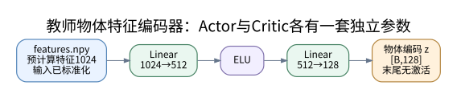

*图 3：`feature_encoder`。第二个 Linear 后没有 ELU 或 Tanh。*

| 顺序 | 层 | 输入形状 | 输出形状 | 参数数 |
|---:|---|---|---|---:|
| 1 | `Linear(1024,512)` | `[B,1024]` | `[B,512]` | 524,800 |
| 2 | `ELU()` | `[B,512]` | `[B,512]` | 0 |
| 3 | `Linear(512,128)` | `[B,512]` | `[B,128]` | 65,664 |
| **合计** | | | | **590,464** |

该编码 $z\in\mathbb{R}^{128}$ 一路直接进入动作 MLP，另一路与物体位姿拼接以生成注意力 Query。因此物体特征同时影响“如何汇总抓取候选”和“最终如何行动”。

**抓取注意力根据物体特征和物体位姿，对 30 个抓取候选做连续汇总。** 实现位于 [`PredictAttentionSelector`](../DQ_high-level/modules/predictattention.py#L6)。

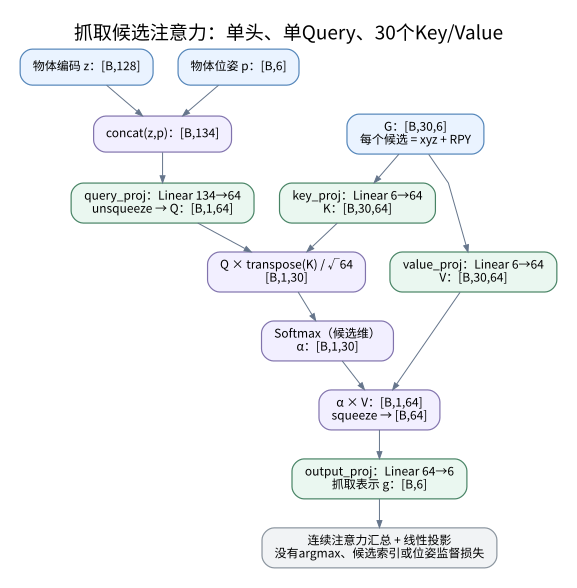

*图 4：单头、单 Query 的缩放点积注意力。四个线性投影均为可学习参数，没有额外 FFN、LayerNorm 或位置编码。*

设标准化后的物体位姿为 $p\in\mathbb{R}^{B\times6}$，候选集合为 $G\in\mathbb{R}^{B\times30\times6}$，则：

$$
c=[z,p]\in\mathbb{R}^{B\times134},
\quad Q=\operatorname{unsqueeze}(W_qc+b_q)\in\mathbb{R}^{B\times1\times64},
$$

$$
K=W_kG+b_k,\quad V=W_vG+b_v,
\quad K,V\in\mathbb{R}^{B\times30\times64},
$$

$$
\alpha=\operatorname{softmax}\left(\frac{QK^\top}{\sqrt{64}}\right),
\qquad g=W_o\operatorname{squeeze}(\alpha V)+b_o\in\mathbb{R}^{B\times6}.
$$

| 投影 | 输入→输出 | 参数数 |
|---|---|---:|
| `query_proj` | `134→64` | 8,640 |
| `key_proj` | `6→64` | 448 |
| `value_proj` | `6→64` | 448 |
| `output_proj` | `64→6` | 390 |
| **注意力模块合计** | | **9,926** |

虽然变量名为 `selected_grasp` 或 `right_predict_point`，实际计算没有 `argmax`，没有返回某个候选的索引，也没有直接抓取位姿真值损失。输出应解释为 **6 维可学习抓取表示**：它由标准化候选经注意力和线性投影得到，不保证恰好等于某个候选，也不保证自身就是合法物理位姿。这个表示与其他状态一起服务于动作决策。

**Actor 主 MLP 把融合后的 206 维信息映射成 9 维动作均值。** 它的层次为：

| 顺序 | 层 | 输出形状 |
|---:|---|---|
| 1 | `Linear(206,512) → ELU` | `[B,512]` |
| 2 | `Linear(512,256) → ELU` | `[B,256]` |
| 3 | `Linear(256,128) → ELU` | `[B,128]` |
| 4 | `Linear(128,9)` | `[B,9]` |

这里没有 RNN 或图像历史。教师的动态信息直接包含机器人速度、物体相对平面速度和上一动作。MLP 输出层不带激活，后续由动作分布与环境动作处理决定采样和限制方式。

---

<a id="teacher-critic"></a>

**教师 Critic 具有独立的同构特征处理分支，最终输出一个标量价值。** `Value(DeterministicMixin, Model, PredictAttentionSelector)` 与 Actor 分别实例化，因此物体编码器、注意力四个投影和主 MLP 都不共享参数。见 [`教师 Value`](../DQ_high-level/train_multistate_DQ_teacher.py#L106) 和 [`模型实例化`](../DQ_high-level/train_multistate_DQ_teacher.py#L291)。

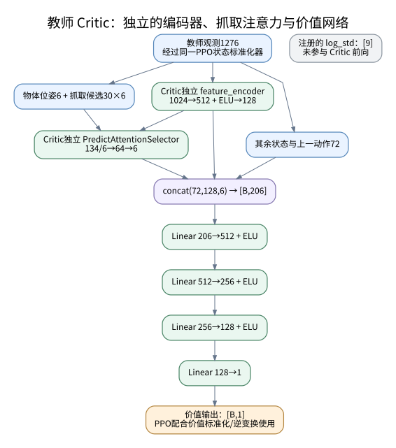

*图 5：Critic 使用和 Actor 相同的教师观测，但在自己的参数下重新计算物体编码和抓取表示。*

Critic 的主 MLP 为：

```text
206 → Linear(206,512) → ELU
    → Linear(512,256) → ELU
    → Linear(256,128) → ELU
    → Linear(128,1)
```

输出形状为 `[B,1]`，没有 Sigmoid 或 Tanh。PPO 还配置了单独的价值标准化器，训练和价值使用时配合标准化/逆变换处理。虽然 Critic 类也注册了 `log_std_parameter[9]`，但其 `compute` 没有使用它；它不表示 Critic 在输出一个动作分布。

**教师的探索来自高斯输出分布，而不是另一个预测标准差的 MLP。** `log_std_parameter` 是长度为 9 的独立参数向量，初值全为 0，各动作维度的标准差对所有输入状态共享。

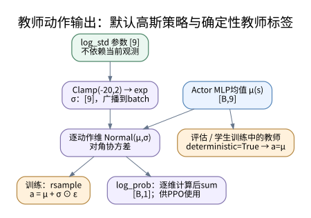

*图 6：默认 `use_tanh=False` 的动作分布路径。分布中的均值依赖观测，标准差是可学习但不依赖观测的向量。*

$$
\sigma=\exp\big(\operatorname{clip}(\log\sigma,-20,2)\big),
\qquad
\pi_T(a\mid o_T)=\mathcal{N}\big(\mu_T(o_T),\operatorname{diag}(\sigma^2)\big).
$$

PPO 训练采用重参数化采样；评估以及给学生产生监督标签时设置 `deterministic=True`，返回均值动作。逐动作维度的 `log_prob` 相加得到 `[B,1]`，用于 PPO 策略更新。标准差参数在教师高斯训练中参与学习。

可选 `--use_tanh` 会进入仓库 `GaussianMixin` 的 `TanhNormal` 分支并启用相应动作裁剪，不能直接把它理解为给上述 MLP 添加一个 `nn.Tanh` 层。本文所有默认图以 README 未启用该选项的路径为准。实现见 [`GaussianMixin.act`](../third_party/skrl/skrl/models/torch/gaussian.py#L188)。

---

<a id="student-input"></a>

**学生实际消费的输入是 62269 维，由图像历史和机器人状态组成。** 类定义为 `Policy(DeterministicMixin, Model)`，没有实例化学生 Value 网络。见 [`学生 Policy`](../DQ_high-level/train_multi_bc_deter_DQ_stu.py#L30)。

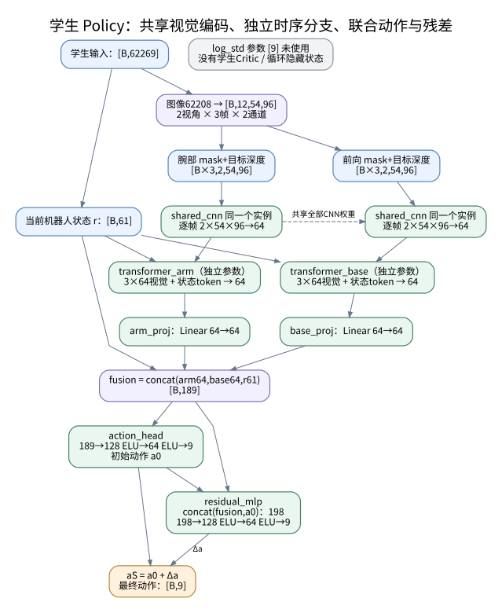

*图 7：图中两个 CNN 框表示同一个 `shared_cnn` 的两次调用，虚线表示权重共享，不是额外的数据流。两个 Transformer 和两个投影层均各有独立参数。*

学生图像元素总数为：

$$
d_{\mathrm{image}}=2\ \text{视角}\times3\ \text{帧}\times2\ \text{通道}\times54\times96=62208.
$$

学生状态不是额外估计器的输出，而是从环境教师观测中保留机器人可用的部分：

```python
robot_state = concat([
    obs_buf[:, 1030:1082],  # 末端6 + 关节位置19 + 关节速度18 + 命令3 + 目标6
    obs_buf[:, -9:]         # 上一高层动作9
], dim=-1)                 # 52 + 9 = 61
```

因此实际输入为：

$$
o_S=[\operatorname{flatten}(I_{t-2:t}),r_t]\in\mathbb{R}^{B\times(62208+61)}
=\mathbb{R}^{B\times62269}.
$$

学生不直接接收物体特征、物体位姿、机器人线速度、物体相对速度或抓取候选。它得到的机器人状态 token 是**当前 61 维状态**，并不是三帧机器人状态；三帧历史只在视觉输入中显式保存。

有一处模型元数据容易误导阅读：训练脚本将 `env.observation_space` 赋给 `student_obs_space`，因此传入学生 `Model` 构造器的名义观测维度仍是 1276。但是 `compute` 实际接收训练器传来的 `states["states"]`，内存也按 `env.state_space` 保存学生输入，所以真实前向输入是 62269。应以 `compute` 和环境拼接为准。见 [`学生实例化`](../DQ_high-level/train_multi_bc_deter_DQ_stu.py#L304)、[`训练器观测分流`](../DQ_high-level/learning/dagger_trainer.py#L117)、[`学生状态拼接`](../DQ_high-level/envs/b1z1_base.py#L2134)。

**图像两个通道分别是目标掩码和掩码后的深度。** 环境先根据目标 segmentation id 构造 0/1 mask，再将深度裁剪、转为正值并归一化，最后计算 `normalized_depth * mask`。RGB 虽被环境读取，但没有进入这里的学生网络。默认学生也没有额外 `RunningStandardScaler`；图像归一化和关节速度缩放由环境完成。

每个时间点先构造四个通道，再按旧帧到新帧放入历史：

| 时间 | 展开通道索引 | 内容顺序 |
|---|---|---|
| `t-2` | `0,1,2,3` | 前向 mask、腕部 mask、前向目标深度、腕部目标深度 |
| `t-1` | `4,5,6,7` | 同上 |
| `t` | `8,9,10,11` | 同上 |

输入 reshape 后为 `[B,12,54,96]`。前向分支取 `[0,2,4,6,8,10]`，腕部分支取 `[1,3,5,7,9,11]`，分别得到 `[B,6,54,96]`；每个分支再 reshape 成 `[B×3,2,54,96]`，让同一帧的 mask 和深度成为两个输入通道。episode 开始时，环境用当前图像重复填充历史，之后移位更新。

来源：[`相机观测处理`](../DQ_high-level/envs/b1z1_base.py#L1352)、[`图像历史构造`](../DQ_high-level/envs/b1z1_base.py#L2154)、[`学生图像拆分`](../DQ_high-level/train_multi_bc_deter_DQ_stu.py#L80)。学生创建环境时会强制开启相机，不能只依据 YAML 中的 `enableCamera: false` 判断学生没有视觉输入。

---

<a id="student-vision"></a>

**共享 CNN 为每帧生成一个 64 维视觉 token。** 两个视角和三个时间点全部复用 `SharedCNNBackbone` 的同一套参数。它是二维空间图像编码器，时间建模发生在后续 Transformer 中。

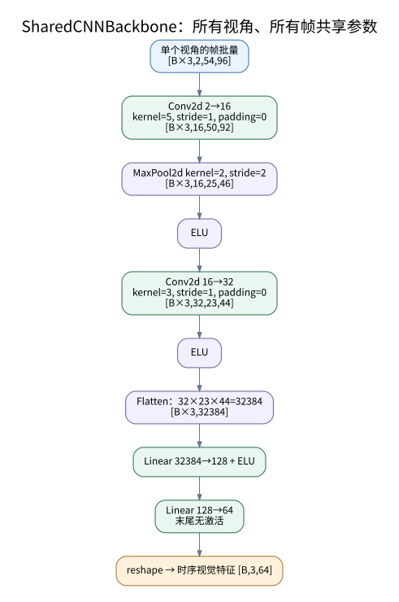

*图 8：`SharedCNNBackbone` 的所有层，包含卷积核大小、步长、池化和展平维度。*

| 顺序 | 层与配置 | 单帧输出形状 |
|---:|---|---|
| 0 | mask＋目标深度 | `2×54×96` |
| 1 | `Conv2d(2,16,kernel_size=5,stride=1,padding=0)` | `16×50×92` |
| 2 | `MaxPool2d(2,2)` | `16×25×46` |
| 3 | `ELU` | `16×25×46` |
| 4 | `Conv2d(16,32,kernel_size=3,stride=1,padding=0)` | `32×23×44` |
| 5 | `ELU` | `32×23×44` |
| 6 | `Flatten` | `32384` |
| 7 | `Linear(32384,128) → ELU` | `128` |
| 8 | `Linear(128,64)` | `64` |

注意第一层卷积之后先做 MaxPool，再做 ELU；这里没有 BatchNorm 或 Dropout，最终 64 维输出也没有激活。源码中的部分卷积输出注释沿用了旧通道数，本文按实际 `in_channels/out_channels` 与前向结果绘图。见 [`SharedCNNBackbone`](../DQ_high-level/modules/feature_extractor.py#L188)。

编码完成后恢复时间维，得到：

```text
arm_seq   : [B,3,64]  # 腕部
base_seq  : [B,3,64]  # 机身前向
```

CNN 的 `32384→128` 全连接层包含 4,145,280 个参数，是整个学生模型最大的单层。共享 CNN 总参数为 4,158,992；虽然被两个视角多次调用，参数只计算一份。

**每个视角随后进入独立的状态引导 Transformer。** `transformer_arm` 与 `transformer_base` 都是 `GuidedTransformerBlock(feature_dim=64)`，二者结构相同而参数不共享。见 [`GuidedTransformerBlock`](../DQ_high-level/modules/feature_extractor.py#L234)。

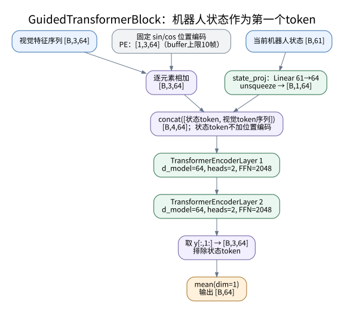

*图 9：每个分支包含位置编码、状态投影、两个 Encoder 层和视觉 token 平均池化。*

先对三帧视觉 token 添加固定的正弦位置编码：

$$
\operatorname{PE}(t,2i)=\sin\left(t/10000^{2i/64}\right),
\qquad
\operatorname{PE}(t,2i+1)=\cos\left(t/10000^{2i/64}\right).
$$

位置编码通过 `register_buffer` 保存，不是可训练参数，预生成长度为 10。当前只取其中三帧。每个分支自己的 `state_proj: Linear(61,64)` 把机器人状态变成一个 token，然后构造：

$$
X=[\operatorname{Linear}_{61\to64}(r_t),\ f_{t-2}+\operatorname{PE}(0),\ f_{t-1}+\operatorname{PE}(1),\ f_t+\operatorname{PE}(2)]
\in\mathbb{R}^{B\times4\times64}.
$$

**位置编码只加在视觉 token 上，状态 token 不加位置编码。** 状态引导通过四个 token 的自注意力交互实现，没有额外单独的 cross-attention 子层，也没有门控网络。

两个 Encoder 层处理后，代码执行 `y[:,1:].mean(dim=1)`，只平均三个视觉 token，输出 `[B,64]`。状态 token 虽不直接进入平均，其信息已经能够通过自注意力影响视觉 token。之后原始机器人状态还会再次直连到动作融合向量。

| Transformer 配置 | 实际值 |
|---|---|
| 每个分支 Encoder 层数 | 2 |
| token 维度 `d_model` | 64 |
| 多头数 `nhead` | 2 |
| 每头维度 | 32 |
| 前馈隐藏维度 `dim_feedforward` | 2048 |
| 前馈激活 | ReLU |
| Dropout | 0.1 |
| `batch_first` | True |
| `norm_first` | False，Post-LN |
| LayerNorm epsilon | `1e-5` |
| Linear/MHA bias | True |
| 外层额外 Encoder norm | 未配置 |
| 因果遮罩、padding mask | 未传入 |

`2048`、ReLU 和 Post-LN 等没有在仓库构造调用中显式覆盖，来自所用 PyTorch `TransformerEncoderLayer` 默认值；已核对本地 PyTorch `2.4.1+cu121` 的签名。没有因果遮罩意味着四个已经可用的 token 相互可见；输入只包含当前及历史图像，不包含未来图像。

**单层 Transformer 内部包含多头注意力、前馈网络、两次残差连接和两次 LayerNorm。** 两个视角各有两层，因此学生共有四个这样的 Encoder 层。

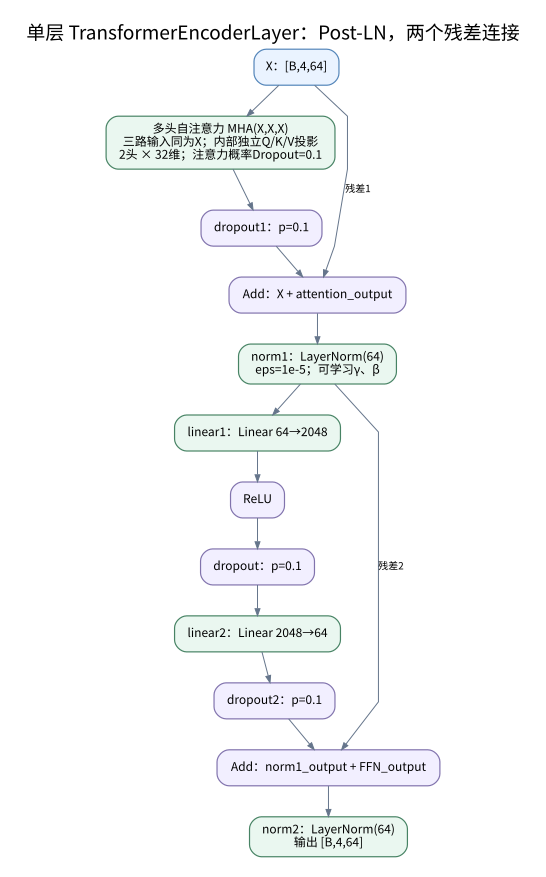

*图 10：Post-LN 的准确顺序。注意力内部还有对注意力概率的 Dropout；该 Dropout 与后面的 `dropout1` 不同。*

用 $X\in\mathbb{R}^{B\times4\times64}$ 表示输入，计算可以写成：

$$
H=\operatorname{LN}_1\left(X+\operatorname{Dropout}_1(\operatorname{MHA}(X,X,X))\right),
$$

$$
\operatorname{FFN}(H)=W_2\operatorname{Dropout}\left(\operatorname{ReLU}(W_1H+b_1)\right)+b_2,
$$

$$
Y=\operatorname{LN}_2\left(H+\operatorname{Dropout}_2(\operatorname{FFN}(H))\right).
$$

前馈子网络为 `64→2048→64`，不能误写成和外层动作 MLP 一样的 `64→128→64`。LayerNorm 的缩放和平移参数可学习；每层在注意力路径与 FFN 路径各有一条残差连接。

**多头注意力内部也包含可学习的线性投影。** 为完整展示网络，下面把它进一步展开。

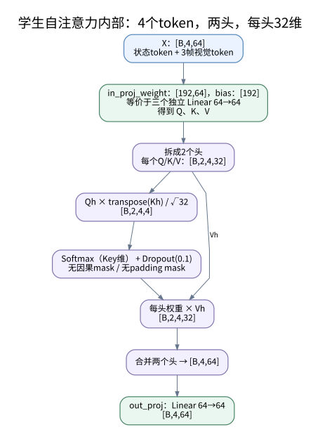

*图 11：每层使用两头自注意力，每头 32 维；每个头的注意力矩阵为 `4×4`。*

PyTorch 在当前配置下用形状 `[192,64]` 的 `in_proj_weight` 和 `[192]` 的 bias 保存 Q/K/V 投影，等价于三个 `Linear(64,64)`。拆成两头后，Q/K/V 都为 `[B,2,4,32]`：

$$
\operatorname{head}_h=
\operatorname{Dropout}\left(\operatorname{softmax}\left(Q_hK_h^\top/\sqrt{32}\right)\right)V_h,
$$

$$
\operatorname{MHA}(X)=\operatorname{Linear}_{64\to64}\big([\operatorname{head}_1,\operatorname{head}_2]\big).
$$

Q/K/V 投影与最后的 `out_proj` 共 16,640 个参数；一整层 Encoder 为 281,152 个参数。每个状态引导分支包含两层 Encoder 的 562,304 个参数，加上 `state_proj` 的 3,968 个参数，共 **566,272**。

学生视觉时间建模的作用是利用连续帧中的目标位置、形状和深度变化来学习控制。代码没有显式速度预测头，也没有用物体速度标签监督 Transformer；不能把其 64 维输出直接等同于估计速度。

---

<a id="student-heads"></a>

**两路 Transformer 特征经过各自线性投影后，与机器人状态融合，联合预测全部动作。** `arm_proj` 和 `base_proj` 均为 `Linear(64,64)`，后面没有激活；分支名称表示视觉来源，不表示它们分别输出机械臂动作或底盘动作。

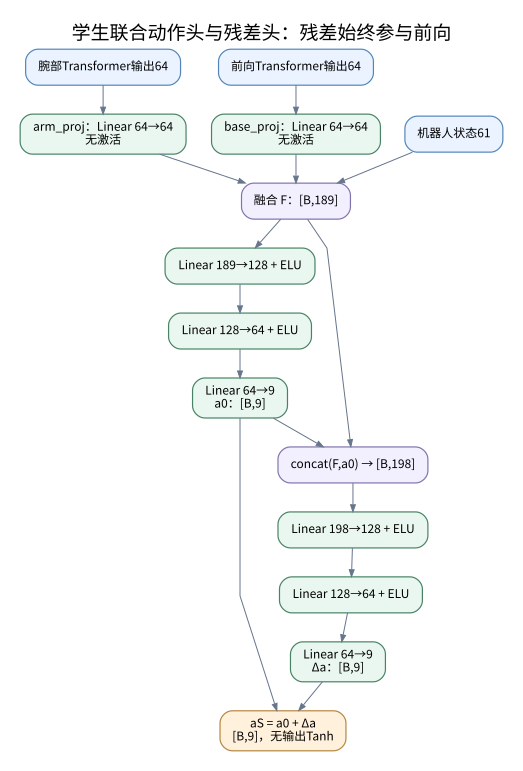

*图 12：残差头同时读取融合特征和主动作输出；最终动作是两者逐元素相加。两个动作 MLP 的所有层均已画出。*

$$
F=[\operatorname{arm\_proj}(h_{arm}),\operatorname{base\_proj}(h_{base}),r_t]
\in\mathbb{R}^{B\times(64+64+61)}=\mathbb{R}^{B\times189},
$$

$$
a_0=\operatorname{action\_head}(F),\qquad
\Delta a=\operatorname{residual\_mlp}([F,a_0]),\qquad
a_S=a_0+\Delta a.
$$

| 模块 | 层序列 | 输入维度 | 输出维度 | 参数数 |
|---|---|---:|---:|---:|
| `arm_proj` | `Linear(64,64)` | 64 | 64 | 4,160 |
| `base_proj` | `Linear(64,64)` | 64 | 64 | 4,160 |
| `action_head` | `Linear(189,128)→ELU→Linear(128,64)→ELU→Linear(64,9)` | 189 | 9 | 33,161 |
| `residual_mlp` | `Linear(198,128)→ELU→Linear(128,64)→ELU→Linear(64,9)` | 198 | 9 | 34,313 |

当前学生网络输出没有 Tanh，`DeterministicMixin(clip_actions=False)` 也不在策略层裁剪动作；环境继续按动作语义进行裁剪或缩放。模型的 `compute` 返回 `(actions, residual_actions, {})`，仓库修改过的 `DeterministicMixin` 会原样保留第二项。因此这里第二项是残差，不是 `log_prob`。见 [`动作头及前向`](../DQ_high-level/train_multi_bc_deter_DQ_stu.py#L60)、[`自定义 DeterministicMixin`](../third_party/skrl/skrl/models/torch/deterministic.py#L87)。

学生类虽然注册了 `log_std_parameter[9]`，但没有使用它，也不生成高斯动作分布。“确定性”指没有动作分布采样；训练模式的 Transformer 仍然有 Dropout。环境采样和评估时模型设为 eval，Dropout 关闭。

**教师和学生输出的 9 维动作具有相同语义。** 它们操作的是高层目标和命令，不是直接输出 19 个电机的目标。

| 动作索引 | 含义 | 后续处理 |
|---|---|---|
| `[0:3]` | 末端目标位置增量 | 裁剪/缩放后累加到当前目标位置 |
| `[3:6]` | 末端目标 RPY 增量 | 裁剪/缩放后累加到当前目标姿态 |
| `[6]` | 夹爪命令 | 转换为夹爪关节目标 |
| `[7]` | 底盘前进速度命令 | 写入 `commands[:,0]` |
| `[8]` | 底盘偏航角速度命令 | 写入 `commands[:,2]` |

不启用 pitch/floating 控制时，`commands[:,1]` 置零；观测仍保留完整 3 维命令。默认非 Tanh 路径中，末端位置增量限制为每轴 `±0.02`，姿态增量为每轴 `±0.06`。这里增量是相对于已有的末端目标累加，不应改写为每步直接相加到实际末端测量位置。来源：[`pre_physics_step`](../DQ_high-level/envs/b1z1_base.py#L1993)。

---

<a id="training"></a>

**教师网络通过 PPO 学习，学生通过教师动作标签学习，两者不共享参数。** 教师损失会更新 Actor 的物体编码器、注意力、动作 MLP 和 log_std，也会更新 Critic 的独立编码器、注意力和价值 MLP。学生的模仿损失不直接对齐教师特征或注意力权重；没有单独的特征蒸馏、抓取表示重建或 Transformer 速度预测损失。

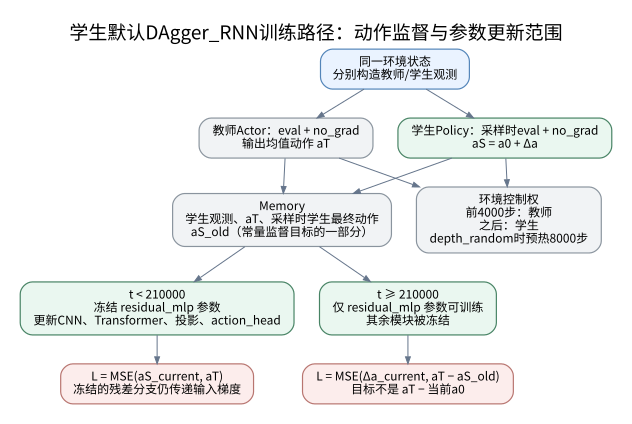

*图 13：采集数据时两个策略都在 `no_grad` 下计算；训练学生时再对保存的观测重新前向。教师仅提供监督标签。*

训练器在同一状态下分别执行：

```python
teacher_obs = states["obs"]       # 1276维
student_obs = states["states"]    # 62269维
teacher_actions = teacher.act(teacher_obs)[0]
student_actions, residual_actions, _ = student.act(student_obs)
```

前 4000 个训练器 timestep 执行教师动作，之后执行学生动作；启用 `depth_random` 时预热为 8000 步。接管以后，教师仍对学生访问到的状态提供标签，这正是该 DAgger 训练路径的重要作用。这里 timestep 是并行环境的交互步，不是所有环境样本数的累加。

**动作控制权切换和残差参数训练切换是两个不同的时间点。** 默认训练器每收集 24 步执行一次更新，更新调用根据当前 timestep 判断阶段：

| 阶段条件 | 可训练参数 | 实际反向传播的目标 |
|---|---|---|
| `timestep < 210000` | 除 `residual_mlp` 外的学生参数；闲置 log_std 即使允许梯度也无使用路径 | `MSE(student_actions, teacher_actions)` |
| `timestep >= 210000` | 仅 `residual_mlp` | `MSE(residual_actions, teacher_actions - sampled_actions)` |

第一阶段为：

$$
L_{\mathrm{imitation}}=\operatorname{MSE}(a_0+\Delta a,a_T).
$$

冻结 `residual_mlp` 是冻结其参数，没有把残差输出 `detach`，也没有将残差置零。它始终参与前向，且固定残差函数仍可将损失梯度传回融合特征与主动作头。默认初始化也没有把最后一层置零，因此不能假设前期残差天然为零。源码虽然计算了一个 `residual_loss`，但这一阶段用于反向传播的是模仿损失。

第二阶段为：

$$
L_{\mathrm{residual}}=
\operatorname{MSE}\big(\Delta a_{\mathrm{current}},\ a_T-a_{S,\mathrm{collected}}\big).
$$

其中 `sampled_actions` 是数据采集时保存的完整学生动作 $a_{S,\mathrm{collected}}$，包含当时残差。它不是当前重新计算的主动作 $a_0$。因此该实现不能简化描述成“残差拟合教师动作减主动作”，也不能说第二阶段仍反向优化最终动作 MSE。第二阶段算出的 `imitation_loss` 只用于相关记录，实际调用的是 `residual_loss.backward()`。

第二阶段冻结的是上游参数，更新前训练器仍对学生调用 `set_mode("train")`，因此上游 Transformer 的 Dropout 仍开启；冻结参数不等于将这些模块切换为 eval。采集环境数据时则恢复 eval。

默认学生总训练时长为 README 中的 240000 步，因此会进入 210000 之后的残差训练阶段。教师基础学习率为 `4.2e-4`，学生为 `5e-5`；二者配置均为 24 rollout 步、5 epochs、6 mini-batches。学生默认使用 Adam 更新，未配置状态 RunningStandardScaler。这些是当前主路径配置，不是网络结构本身的硬性要求。

来源：[`学生训练配置及教师加载`](../DQ_high-level/train_multi_bc_deter_DQ_stu.py#L313)、[`DAgger 交互流程`](../DQ_high-level/learning/dagger_trainer.py#L114)、[`参数阶段切换`](../DQ_high-level/learning/dagger_rnn.py#L268)、[`模仿损失`](../DQ_high-level/learning/dagger_rnn.py#L343)、[`残差损失`](../DQ_high-level/learning/dagger_rnn.py#L432)。

名字 `DAgger_RNN` 不能证明这里有循环神经网络。当前 Policy 没有 GRU、LSTM，也没有声明 RNN hidden-state specification，训练器的 `_rnn` 为 False。时序结构就是显式堆叠的三帧视觉＋Transformer。`--mlp_stu` 目前只切换训练器，没有改动 Policy 的实例化，不能将它介绍为已经接好的纯 MLP 学生变体。

---

<a id="low-level"></a>

**高层控制还调用一套预训练底层网络，本文将它作为执行依赖单独展示。** 来源是 [`utils/low_level_model.py`](../DQ_high-level/utils/low_level_model.py)，高层通过 [`_load_low_level_model`](../DQ_high-level/envs/b1z1_base.py#L942) 构造并加载 checkpoint。这套模型不是前面高层 PPO 的 Actor/Critic，也不是视觉学生。

高层将底层模型设为 eval，通过 `torch.no_grad()` 和 `hist_encoding=True` 调用 `act_inference`。它不加入高层 PPO 或 DAgger 优化器；这里所谓“固定的底层策略”指不参与高层更新，代码并没有逐个把底层参数的 `requires_grad` 设置为 False。

启用 `--observe_gait_commands` 时，当前底层本体观测是 71 维：

| 内容 | 维度 |
|---|---:|
| 机身 roll、pitch | 2 |
| 机身局部角速度 | 3 |
| 不含夹爪的关节位置偏差 | 18 |
| 不含夹爪的关节速度，乘 `0.05` | 18 |
| 上一步底层腿部动作 | 12 |
| 足端接触 | 4 |
| 当前命令 `commands` | 3 |
| 当前末端目标位置 | 3 |
| `0 * curr_ee_goal_cart` 占位 | 3 |
| gait index＋4 个 clock inputs | 5 |
| **合计** | **71** |

实际部署输入为当前 71 维＋10 步历史 `10×71`，共 **781 维**，不含额外的 18 维特权状态。环境先拼接当前状态和已有历史，再把当前状态加入历史；新 episode 用当前状态重复初始化历史。来源：[`底层观测构造`](../DQ_high-level/envs/b1z1_base.py#L1129)。

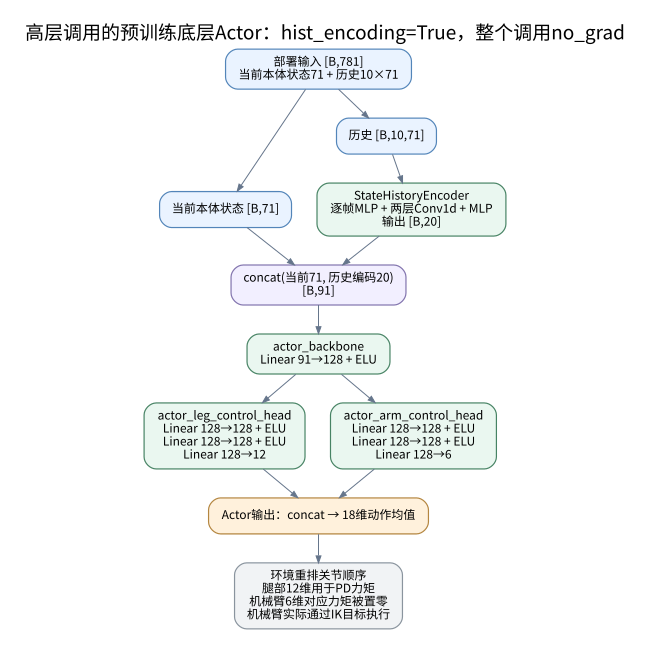

*图 14：底层历史编码得到 20 维 latent，与当前 71 维状态拼接后，通过共享 Actor 骨干和腿、臂两个动作头。*

底层 Actor 的实际结构是：

```text
当前本体状态71 + 历史编码20 = 91
    → actor_backbone：Linear(91,128) + ELU
    ├→ 腿头：Linear(128,128)+ELU → Linear(128,128)+ELU → Linear(128,12)
    └→ 臂头：Linear(128,128)+ELU → Linear(128,128)+ELU → Linear(128,6)
拼接两个动作头 → 18维动作
```

这里腿头和臂头是实际分离的动作头，与视觉学生的 `arm/base` 特征分支含义不同。高层加载配置中 `output_tanh=False`、`adaptive_arm_gains=False`，因此末端无 Tanh，也没有额外的自适应增益输出。

**底层 `StateHistoryEncoder` 用一维卷积编码十步本体历史。** 它既不是学生视觉 CNN，也不是 RNN。

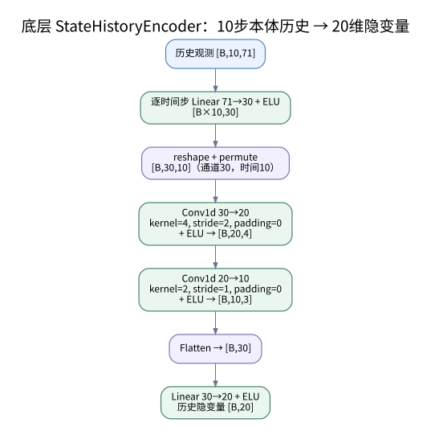

*图 15：Conv1d 沿时间轴卷积。通道维为特征，时间长度由 10 变为 4，再变为 3。*

| 顺序 | 层/运算 | 输出形状 |
|---:|---|---|
| 0 | 历史输入 | `[B,10,71]` |
| 1 | 合并 batch 与时间，逐帧 `Linear(71,30)→ELU` | `[B×10,30]` |
| 2 | reshape＋permute | `[B,30,10]` |
| 3 | `Conv1d(30,20,kernel=4,stride=2)→ELU` | `[B,20,4]` |
| 4 | `Conv1d(20,10,kernel=2,stride=1)→ELU` | `[B,10,3]` |
| 5 | Flatten | `[B,30]` |
| 6 | `Linear(30,20)→ELU` | `[B,20]` |

两层卷积均为零 padding；最后一个输出 Linear 后仍有 ELU。模型也有 20/50 步历史对应的其他卷积配置，但高层实际实例化的是 10 步分支。来源：[`StateHistoryEncoder`](../DQ_high-level/utils/low_level_model.py#L39)。

**底层 checkpoint 容器还包含特权编码器和独立 Critic。** 它们会被实例化并加载权重，但高层实际 `hist_encoding=True` 的控制路径不调用它们，下面绘出以区分“模型中存在”和“当前执行使用”。

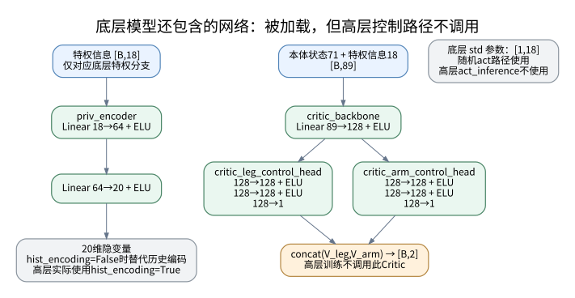

*图 16：左侧特权编码器是 Actor 历史分支的替代分支；右侧为底层双价值头 Critic。它们不接收高层视觉输入。*

特权编码器为：

```text
privileged state 18
    → Linear(18,64) → ELU
    → Linear(64,20) → ELU
```

Actor 的 `hist_encoding=False` 使用这个 20 维 latent，`hist_encoding=True` 使用历史编码器的 20 维 latent。二者是**二选一**，不是同时拼接。高层实际只提供当前状态＋历史的 781 维布局，不应把部署输入中的第 71 维以后误当作特权状态。

底层 Critic 直接读取当前状态 71＋特权信息 18＝89 维，结构为：

```text
Linear(89,128) + ELU
    ├→ 腿价值头：128→128 + ELU →128 + ELU →1
    └→ 臂价值头：128→128 + ELU →128 + ELU →1
拼接 → [B,2]
```

Critic 不通过 Actor 的历史编码器或特权编码器；自己的两个价值头共用 Critic 骨干，但不与 Actor 共享权重。其 `[B,2]` 输出也不同于高层教师 Critic 的 `[B,1]`。底层模型另有 `[1,18]` 的标准差参数供随机 `act` 路径使用，高层采用的 `act_inference` 不使用它。来源：[`底层 Actor 分支`](../DQ_high-level/utils/low_level_model.py#L206)、[`底层 Critic`](../DQ_high-level/utils/low_level_model.py#L235)、[`底层推理接口`](../DQ_high-level/utils/low_level_model.py#L349)。

**底层网络虽然计算 18 维动作，当前高层环境中机械臂仍通过解析 IK 位置目标执行。** 这是理解整个控制结构时不可省略的连接。

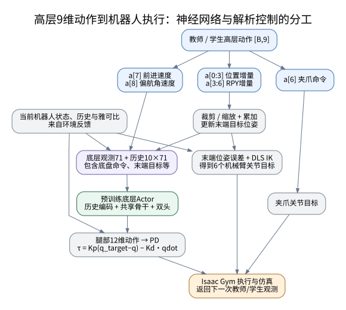

*图 17：绿色底层 Actor 是预训练神经网络；PD、目标累加、IK 和夹爪转换为解析控制，不包含需要训练的网络。*

腿部 12 维输出经关节重排、缩放和 PD 转成力矩。`_compute_torques` 显式将最后 6 个机械臂力矩置零，因此底层臂头虽然参与前向计算，其动作不会经这条力矩路径直接驱动机械臂。机械臂由目标位姿误差经阻尼最小二乘 IK 得到关节增量：

$$
\Delta q=J^\top(JJ^\top+0.05^2I)^{-1}\Delta x,
\qquad q_{\mathrm{target}}=q_{\mathrm{current}}+\Delta q.
$$

夹爪单独设置关节目标。环境分别下发腿部力矩和机械臂、夹爪位置目标。来源：[`力矩与 IK`](../DQ_high-level/envs/b1z1_base.py#L1193)、[`关节位置目标`](../DQ_high-level/envs/b1z1_base.py#L1702)、[`底层查询与仿真执行`](../DQ_high-level/envs/b1z1_base.py#L1927)。

---

<a id="verification"></a>

**参数量与维度已经根据实际类定义核对。** 高层模型使用源码原类独立实例化，避免触发 Isaac Gym 环境创建；底层模型按高层加载配置直接实例化。验证环境为本地 `dqwbc` Python、PyTorch `2.4.1+cu121`，随机输入批量 `B=2`。没有运行完整仿真训练或把随机前向当成策略性能验证。

| 网络 | 实际输入 | 核心融合维度 | 输出 | 注册参数总数 |
|---|---|---|---|---:|
| 高层教师 Actor | `[B,1276]` | 206 | 动作均值 `[B,9]`，log_std `[9]` | **871,768** |
| 高层教师 Critic | `[B,1276]` | 206 | `[B,1]` | **870,736** |
| 高层学生 Policy | `[B,62269]` | 189；残差输入 198 | 最终动作 `[B,9]`，残差 `[B,9]` | **5,367,339** |
| 底层 ActorCritic 整体 | 历史推理为 `[B,781]` | Actor 91；Critic 输入 89 | Actor 18；Critic 2 | **166,116** |

教师 Actor＋Critic 总参数为 **1,742,504**。Critic 和学生各自有 9 个未使用的 `log_std_parameter`，统计中保留它们；教师 Actor 的 9 个 log_std 是实际高斯策略参数，不应扣为闲置。

| 高层模块 | 教师 Actor | 教师 Critic | 学生 Policy |
|---|---:|---:|---:|
| 物体特征编码器 | 590,464 | 590,464 | — |
| 抓取注意力四个投影 | 9,926 | 9,926 | — |
| 主 MLP | 271,369 | 270,337 | — |
| 共享 CNN | — | — | 4,158,992 |
| 腕部 GuidedTransformerBlock | — | — | 566,272 |
| 前向 GuidedTransformerBlock | — | — | 566,272 |
| 腕部分支投影 | — | — | 4,160 |
| 前向分支投影 | — | — | 4,160 |
| 主动作头 | — | — | 33,161 |
| 残差动作头 | — | — | 34,313 |
| 声明的 log_std | 9 | 9，未用 | 9，未用 |

学生参数量大于教师 Actor，主要因为需要直接处理图像且包含两个 Transformer；这里“教师/学生”指监督关系和可用信息，不能理解为必然进行模型大小压缩。

| 底层模块 | 参数数 |
|---|---:|
| Actor 特权编码器 | 2,516 |
| Actor 历史编码器 | 5,610 |
| Actor 共享骨干 | 11,776 |
| Actor 腿头 | 34,572 |
| Actor 臂头 | 33,798 |
| Actor 合计 | **88,272** |
| Critic 骨干 | 11,520 |
| Critic 腿价值头 | 33,153 |
| Critic 臂价值头 | 33,153 |
| Critic 合计 | **77,826** |
| 标准差参数 | 18 |

独立验证确认：教师 Actor、Critic、学生的前向维度与反向传播通过；底层历史分支 `781→18`、特权分支 `89→18`、历史编码 `10×71→20` 和 Critic `89→2` 的前向维度符合本文。Actor/Critic 独立参数、学生 CNN 共享实例和两个 Transformer 独立参数均与实际构造一致。

**使用本图理解或修改代码时，应保留以下实现边界。** 教师固定假设候选数为 30，Query 输入为 134，观测尾部动作为 9；学生固定使用 61 维状态、54×96 图像的 CNN 展平尺寸，以及残差输入中的 `+9`。更改机器人、动作数、物体特征维度、相机模式或分辨率时，需要同步核对观测切片和网络层，不能认为命令行选项会自动适配全部结构。

| 容易误读的对象 | 当前代码的实际含义 |
|---|---|
| `PredictPoint` | 抓取候选坐标变换，不是神经网络 |
| `features.npy` 与抓取 JSON | 离线预计算输入；当前路径没有在线点云编码器或抓取提议网络 |
| `PredictAttentionSelector` | 单头注意力与线性投影，不是完整 Transformer，也不做 argmax |
| 教师 Actor/Critic | 同结构但不共享参数，使用同一类教师观测 |
| 学生 `arm/base` | 两个视觉特征分支，共同服务于完整 9 维动作输出 |
| 学生 `DAgger_RNN` | 支持循环网络的训练器名称，当前 Policy 没有循环状态 |
| 学生 `log_std_parameter` | 注册但未使用，不代表高斯学生 |
| `DepthFeatureExtractor`、`DepthOnlyFCBackbone*`、`CNNFeatureExtractor`、`Conv2dHeadModel` | 当前学生文件中的旧导入，不在默认 Policy 实例化路径中 |
| `--mlp_stu` | 当前只切换训练器；不是已实现的纯 MLP 网络开关 |
| 第一阶段残差头冻结 | 仅冻结参数；残差仍参与前向并传递输入梯度 |
| 底层臂动作头 | 模型中存在并前向计算，但高层执行用 IK 位置目标 |

为便于检查“涉及网络是否都画全”，各实际模块与图对应如下：

| 模块 | 覆盖位置 |
|---|---|
| 高层教师 Actor 全图 | 图 2 |
| 教师 Actor/Critic 各自的物体编码器 | 图 3；独立关系见图 2、5 |
| 抓取 Query/Key/Value/Output 四个投影 | 图 4 |
| 教师 Critic 与价值 MLP | 图 5 |
| 教师动作分布参数与输出 | 图 6 |
| 学生共享 CNN 的卷积、池化、全连接 | 图 8 |
| 两个 GuidedTransformerBlock、状态投影、位置编码 | 图 7、9 |
| Transformer FFN、LayerNorm、残差、Dropout | 图 10 |
| MultiheadAttention Q/K/V/Output 投影 | 图 11 |
| 学生两路投影、主动作头、残差头 | 图 12 |
| 底层 Actor 骨干及腿/臂双头 | 图 14 |
| 底层历史编码器逐帧 MLP、时间卷积、输出 MLP | 图 15 |
| 底层特权编码器、Critic 骨干及双价值头 | 图 16 |
| 模型与环境、解析执行模块之间的连接 | 图 1、13、17 |

**所有图都作为相对路径 SVG 嵌入本文件。** 在支持 SVG 的 Markdown 阅读器中可以直接查看，并打开原图放大；移动文档时应同时保留 `assets/dq_high_level_networks` 文件夹。图源集中保存在 [`render_diagrams.py`](assets/dq_high_level_networks/render_diagrams.py)，可用本地 Graphviz 重新生成：

```bash
python doc/assets/dq_high_level_networks/render_diagrams.py
```

脚本只依赖 Python 标准库和系统 `dot` 命令。本文的架构与解释以仓库可执行定义为依据，代码中沿用的旧维度注释没有作为结构判断依据。
