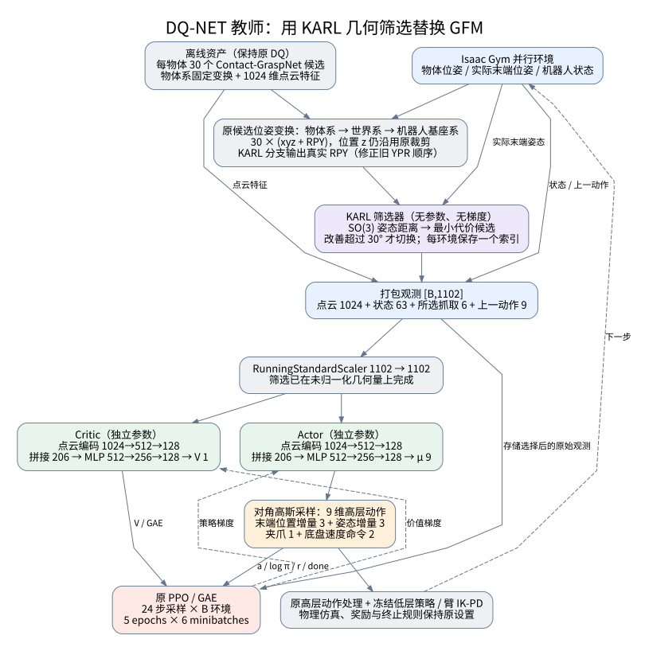
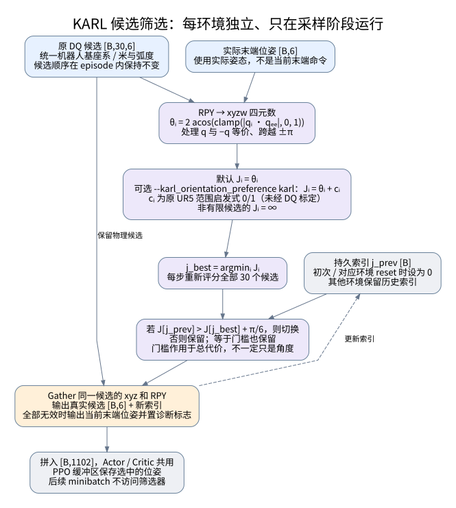
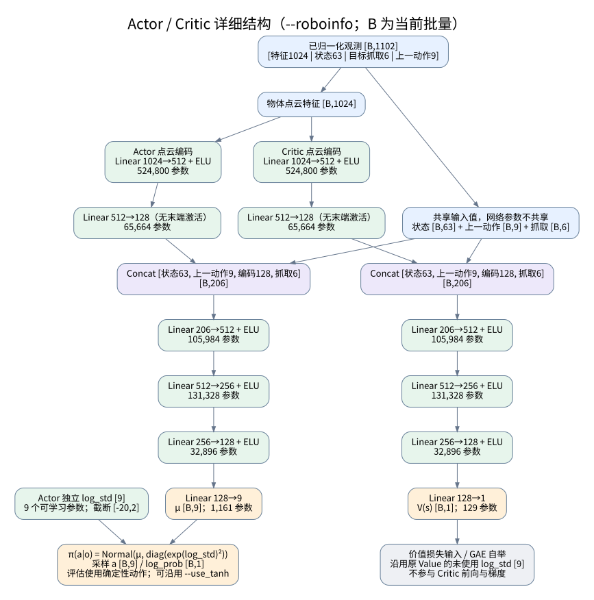
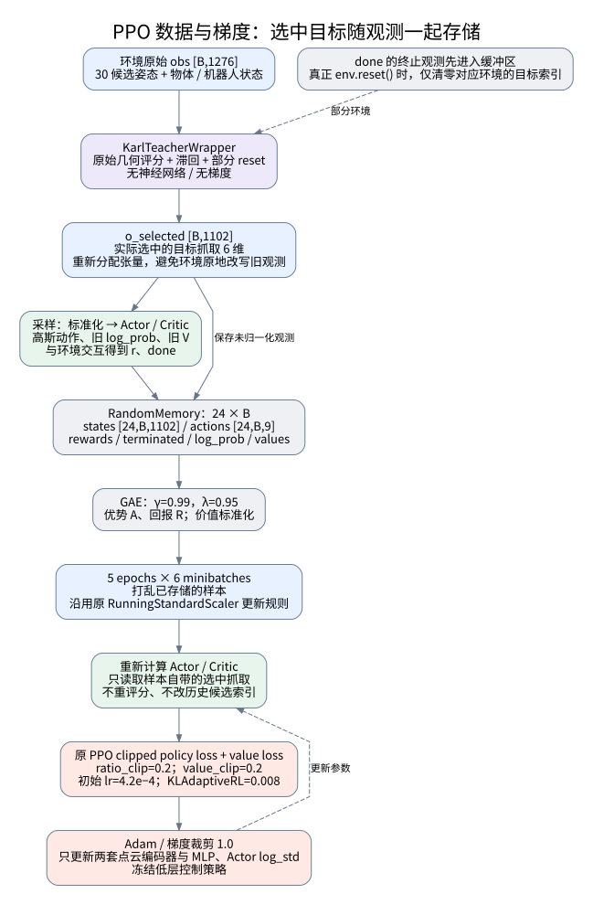
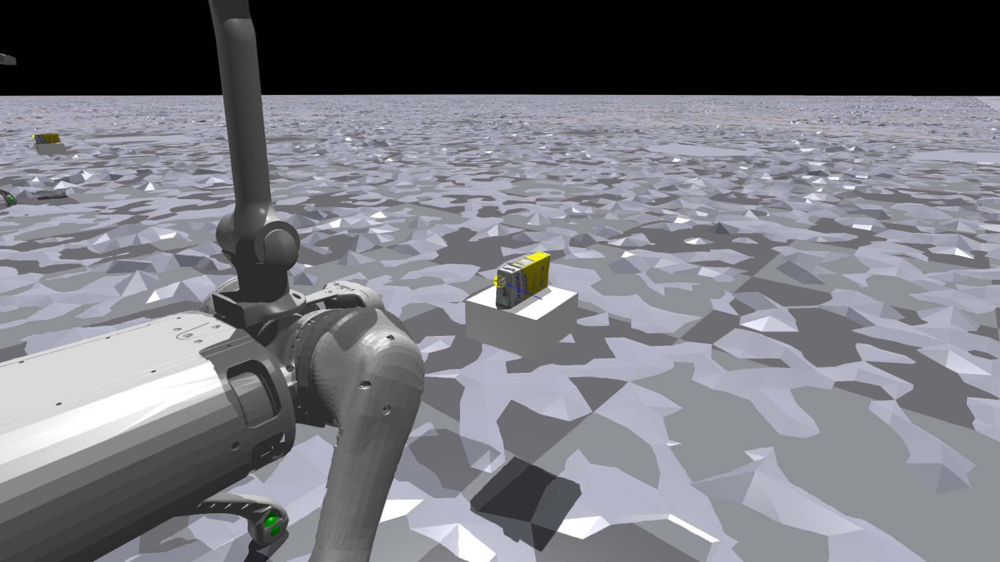
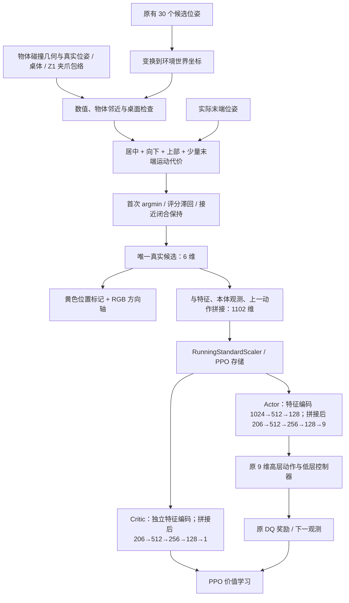
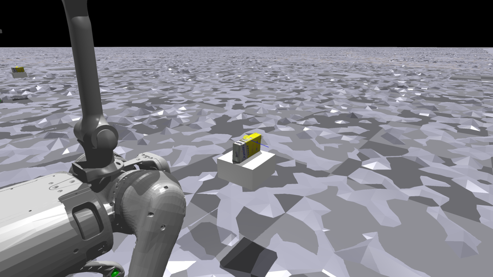

# DQ-NET 教师：KARL 式候选抓取筛选的实现与训练网络

本文对应已经实现的代码，入口为 [train_multistate_DQ_teacher.py](../DQ_high-level/train_multistate_DQ_teacher.py)。修改对象是 **DQ-NET 原始特权观测教师**，通过 `--grasp_selector gfm|karl|geometric` 进行对照实验。第 1–10 节说明原 KARL 适配；第 11 节说明新增的“居中、上部、向下接近”几何筛选模式及运行命令。

**主要变化：原来由 Actor、Critic 各自通过 GFM 生成一个 6 维抓取表征；现在由环境包装器依据实际末端姿态，从原有 30 个候选中选择一个 6 维抓取位姿，两套网络共同使用。** 点云编码、策略主干、价值主干、9 维高层动作、奖励、低层控制器和 PPO 超参数延续原教师设置。

默认 KARL 适配采用“最小姿态距离＋30° 切换滞回”。原 KARL 针对 UR5 使用的姿态范围惩罚作为可选消融项保留，默认关闭。这是对 KARL **抓取筛选机制**的移植，并非其视觉跟踪与 UR5 控制系统的整体复现。

## 1. 从论文与源码中移植什么

DQ-NET 论文的 GFM 使用点云特征与物体位姿构造 Query，将候选转换为 Key/Value，注意力融合得到供教师使用的抓取表征。源码对应 [predictattention.py](../DQ_high-level/modules/predictattention.py)：`134→64` 的 Query 投影、两套 `6→64` 的 Key/Value 投影、单 Query 的注意力，以及 `64→6` 的输出投影。Actor 和 Critic 各有一套独立 GFM。

KARL 论文介绍了抓取池与目标跟踪；**具体评分式、姿态范围和切换门槛以实际代码为依据**，见 [real_robot_demo_ur5e.py](../../karl-main/vsg_tracking/real_robot_demo_ur5e.py) 的 `pose_callback()`。该实现依据当前夹爪姿态为候选评分，保留当前候选，只有更优候选的总代价改善超过门槛时才切换。此前的[抓取筛选分析](../../karl-main/doc/KARL_论文方法与网络架构详解.md)第 12 节给出了完整溯源。

| 环节 | 本次实现 | 比较含义 |
|---|---|---|
| 候选来源 | 继续使用 DQ 离线 JSON 中每物体 30 个候选 | 不额外引入抓取生成网络的差异 |
| 候选坐标变换 | 保留 DQ 的相机、物体、机器人变换链 | 不加入 UR5 的工具偏移和轴旋转 |
| 动态评分 | 候选与**实际末端**之间的 SO(3) 姿态距离 | 不使用策略当前输出的末端目标来评分 |
| 切换条件 | 最优候选的代价改善严格超过门槛 | 默认 30°；不满足时保留旧索引 |
| UR5 姿态范围惩罚 | `--karl_orientation_preference karl` 开启 | 未对 B1+Z1 标定，单独报告结果 |
| 初始目标 | 候选索引 0，然后立即执行同样的滞回判断 | 第一帧也不是无条件 argmin |
| 位置平滑、视觉异常门控 | 不加入 | 教师使用仿真真值；本次只比较筛选方式 |
| 距离、IK、碰撞、Critic 评分 | 不加入 | 原 KARL 这段评分代码不包含这些指标 |

DQ 当前 JSON 的 `transform` 含 30 个变换，但 `score` 是单个标量，**无法据此确认每一个候选的置信度或排序**。因此本实现保留原文件顺序；索引 0 仅表示“原 DQ 的第一个候选”，不宣称它一定是最高置信度候选。也没有移植 KARL 前端的 top-50、置信度阈值或位置去重，以免同时改变候选池。

## 2. 教师训练总体架构



[查看 PNG](assets/dq_teacher_karl/01_training_overview.png)

从环境看，原始教师观测仍含 30 个候选。新包装器在返回给 PPO 前完成筛选，将候选的 `180=30×6` 维替换为选中候选的 6 维，故策略观测由 **1276 维减至 1102 维**。Actor 和 Critic 的主干输入仍为 **206 维**：少掉的候选维度原本就由 GFM 压成 6 维。

两者共同读取选中的目标，但有独立的点云编码器和独立 MLP。新方案仍是原始教师的 PPO Actor-Critic；没有改成先前视觉实验中的非对称 Actor-Critic。

离线点云 `features.npy` 的 1024 维特征仍作为输入，不在每个控制周期在线运行 PointNet 或 Contact-GraspNet。候选变换、物理仿真及低层控制仍有原来的开销。

## 3. 候选筛选算法与坐标约定



### 3.1 先统一坐标与欧拉角顺序

候选局部变换随物体更新到世界系，再用机器人完整基座姿态转换到基座系。位置以机械臂基座为原点：

\[
p_i^B = R_B^\top(p_i^W-p_{\mathrm{arm}}^W),\qquad
q_i^B=(q_B^W)^{-1}\otimes q_i^W.
\]

实际末端的姿态同样使用这个完整基座旋转，因而可以直接比较。沿用原 DQ 的候选位置处理，包括局部 `z∈[-0.6,0.6]` 裁剪。

本次查到一个会影响几何筛选的源码细节：原环境将 `quat_to_euler_zyx()` 的返回值命名为 `grasp_predict_local_rpy`，但该函数实际输出 **[yaw, pitch, roll]**；实际末端观测则是 **[roll, pitch, yaw]**。此外，旧函数的奇异位形分支不适合作为严格旋转距离的输入。

因此 [b1z1_pickmulti.py](../DQ_high-level/envs/b1z1_pickmulti.py) 仅在 KARL 分支调用新的 `quaternion_to_rpy()`，将候选统一为真实 RPY，并处理俯仰角 ±90° 的奇异位形。GFM 分支继续调用原函数，保持对照网络的输入语义。KARL 和原 GFM 在此处的差别属于新几何接口的必要适配，不能把旧候选后三项直接当作 RPY 评分。

### 3.2 评分函数

用 RPY 恢复 xyzw 四元数，计算候选与当前末端的最短旋转角：

\[
\theta_i=2\arccos\left(\operatorname{clamp}(|q_i^B\cdot q_{ee}^B|,0,1)\right),
\qquad\theta_i\in[0,\pi].
\]

四元数内积取绝对值，处理 `q` 与 `−q` 表示相同旋转的问题，也避免直接相减欧拉角在 ±π 附近失效。

默认：

\[
J_i=\theta_i.
\]

可选 `--karl_orientation_preference karl` 时：

\[
J_i=\theta_i+c_i,\qquad
c_i=\begin{cases}
0,&-\pi/4\le r_i\le\pi/4,\ -\pi/8\le p_i\le\pi/2,\ |y_i|>\pi/2,\\
1,&\text{其他情况}.
\end{cases}
\]

这里使用与 KARL 源码相同的范围与代价，但在 DQ 的机器人基座系、DQ 的工具姿态约定下计算。它不是 B1+Z1 可达性保证，也不是一次 IK 求解。由于机器人和工具轴定义不同，不建议将其结果直接解释为“复现了 UR5 的工作空间偏好”。

### 3.3 滞回与初始化

每个环境保存一个历史索引 `j_prev`。当

\[
J_{j_{prev}}>\min_i J_i+\delta,\qquad
\delta=\operatorname{deg2rad}(30)
\]

时改用最优索引，否则保留。改善等于门槛时不切换；存在并列最优时 `argmin` 取最前的索引，但只有满足切换条件才会替换当前索引。

例如，当前候选误差 20°、另一个候选误差 0°，默认仍保留当前候选；若误差变成 60°，则切换到 0° 候选。启用姿态偏好后，门槛比较的是**包含 0/1 惩罚的总代价**，不能再把它简单解释为“必须少旋转 30°”。

初始索引为 0，第一帧同样执行该判断。环境结束时先返回并存储终止观测；真正执行 `env.reset()` 时，只清零那些被重置环境的索引，其余环境保留。索引不参与反向传播，也不会随 PPO 小批量顺序变化。

### 3.4 输出与异常候选

最终将同一个索引的 `xyz` 与 `RPY` 一起取出，得到 `[B,6]`。它对应原候选池中的一个物理候选，经 DQ 原有坐标变换和位置裁剪后使用；不同于原 GFM 投影产生的学习表征。

非有限候选的代价设为无穷大。如果当前候选无效而存在有效候选，则切换到有效候选；全部无效时，防御性地输出当前末端位姿，避免 NaN 进入 PPO，并在 `info` 中设置 `karl_no_valid_grasp`。DQ 的原离线加载器本身已经拒绝含 NaN/Inf 的输入，因此此处主要用于异常诊断。

包装器还提供逐环境 `karl_grasp_index` 与 `karl_grasp_switched` 张量。这些是诊断值，未增加到策略观测中，原 SKRL 日志不会自动将它们绘成训练曲线。

## 4. 观测、编码器与 Actor-Critic 详细结构



[查看 PNG](assets/dq_teacher_karl/02_actor_critic.png)

### 4.1 原始观测与压缩后的观测

以下下标均为 Python 半开区间，针对 `--roboinfo`、9 维动作配置。

| 原始 1276 维切片 | 维数 | 内容 |
|---|---:|---|
| `[0:1024]` | 1024 | 离线点云全局特征 |
| `[1024:1030]` | 6 | 原 DQ 定义下的物体位置与姿态 |
| `[1030:1036]` | 6 | 当前实际末端位置与 RPY，机器人基座系 |
| `[1036:1055]` | 19 | 关节位置，含夹爪 |
| `[1055:1073]` | 18 | 不含夹爪的关节速度，沿用原 `×0.05` 缩放 |
| `[1073:1076]` | 3 | 底盘命令 |
| `[1076:1082]` | 6 | 当前末端目标位置与姿态 |
| `[1082:1085]` | 3 | 底盘局部线速度 |
| `[1085:1087]` | 2 | 物体相对底盘的平面速度 |
| `[1087:1177]` | 90 | 30 个候选位置 |
| `[1177:1267]` | 90 | 30 个候选姿态；KARL 分支为 RPY |
| `[1267:1276]` | 9 | 上一高层动作 |

筛选后打包：

| 新观测切片 | 维数 | 内容 |
|---|---:|---|
| `[0:1024]` | 1024 | 点云特征 |
| `[1024:1087]` | 63 | 上表中物体、末端、关节、命令、速度等状态 |
| `[1087:1093]` | 6 | 当前选中的抓取 `xyz + RPY` |
| `[1093:1102]` | 9 | 上一高层动作 |

**选择发生在 RunningStandardScaler 之前。** 因而距离计算和 30° 门槛使用真实弧度，不受训练中观测均值、方差的变化影响。打包后，整个 1102 维向量按原 PPO 方式标准化。

### 4.2 两套独立的点云编码器

Actor 与 Critic 各自执行：

```text
[B,1024] → Linear(1024,512) → ELU → Linear(512,128) → [B,128]
```

最后一个 Linear 后没有 ELU。每套编码器 590,464 个参数，两套不共享权重。

### 4.3 Actor

按原主干顺序拼接：

```text
[状态63, 上一动作9, 点云编码128, 所选抓取6] → [B,206]
 → Linear(206,512) → ELU
 → Linear(512,256) → ELU
 → Linear(256,128) → ELU
 → Linear(128,9) → 均值 μ
```

另有独立于状态的可学习 `log_std[9]`，沿用 `[-20,2]` 截断范围。训练按对角高斯采样，计算 9 个动作分量合并后的 log probability。可继续使用原 `--use_tanh` 配置，但 GFM 与 KARL 对照应保持一致。

9 维动作依次为：末端位置目标增量 3、末端姿态目标增量 3、夹爪命令 1、底盘前向速度及偏航角速度命令 2。后续累积、限幅、夹爪开关、机械臂 IK/PD 和冻结低层策略均沿用原环境代码。**选中抓取是策略输入，不会被直接赋值成末端控制命令。**

### 4.4 Critic

Critic 使用另一套点云编码器及相同的 206 维拼接方式，主干为 `206→512→256→128→1`，三个隐藏层后均为 ELU，输出标量价值。

为使变化严格集中在移除 GFM，新 Value 类保留了原实现中的 `log_std_parameter[9]`。该参数没有用于 Critic 前向，因此没有价值梯度；下文参数量包含它。

## 5. PPO 训练流程与历史目标的一致性



本实现**不在 `Policy.compute()` 或 `Value.compute()` 内维护抓取索引**。否则 PPO 打乱 rollout 后，目标选择会取决于小批量遍历顺序，可能导致同一观测在采样和更新时使用不同目标。

现在每个控制步依次执行：环境生成原始观测 → 包装器评分并选中候选 → 新建 1102 维观测张量 → 标准化 → Actor/Critic → 环境执行动作。缓冲区存储的是含选中目标的原始 1102 维观测。更新阶段直接读取该目标，不再次评分、不访问当前环境的索引。

这里保留原教师 RunningStandardScaler 的统计更新规则；“选中目标在 replay 中一致”不表示标准化统计被冻结。包装器重新分配输出张量，避免 Isaac Gym 在下一步复用观测缓冲区时改写已采样的状态。

| PPO 项目 | 设置 |
|---|---:|
| Rollout | 24 个向量环境步 |
| 每轮学习 | 5 epochs，6 个 minibatches |
| 折扣 / GAE | 0.99 / 0.95 |
| 初始学习率 | `4.2e-4` |
| 调度 | 原 `KLAdaptiveRL`，阈值 0.008 |
| 策略比例裁剪 / 价值裁剪 | 0.2 / 0.2 |
| 梯度范数裁剪 | 1.0 |
| 价值损失系数 | 1.0 |
| 熵损失系数 | 沿用仓库 PPO 默认 0.0 |
| 低层策略 | 冻结，不由本轮 PPO 更新 |

检查点增加 `grasp_selection_state`，记录筛选模式、门槛、姿态偏好、环境配置、观测相关参数、随机种子和训练环境计数，并保存学习率调度器状态。新检查点恢复时自动重建模式；与保存设置冲突的筛选参数会被拒绝。物理状态、半个 rollout 及历史索引不序列化，恢复后从新 episode 的候选 0 开始。

## 6. 代码修改位置

| 文件 | 责任 |
|---|---|
| [modules/karl_grasp_selector.py](../DQ_high-level/modules/karl_grasp_selector.py) | 四元数/RPY 转换、SO(3) 距离、可选惩罚、批量滞回与异常候选处理 |
| [utils/karl_teacher_wrapper.py](../DQ_high-level/utils/karl_teacher_wrapper.py) | 原始观测筛选、压缩为 1102 维、终止与部分重置处理 |
| [modules/karl_teacher.py](../DQ_high-level/modules/karl_teacher.py) | 去掉注意力后的 Actor 与 Critic，保留原主干 |
| [utils/teacher_grasp_training.py](../DQ_high-level/utils/teacher_grasp_training.py) | 参数检查、模式恢复、检查点元数据 |
| [train_multistate_DQ_teacher.py](../DQ_high-level/train_multistate_DQ_teacher.py) | 按模式创建包装器及网络，原 `Policy`/`Value` 类保持原样 |
| [utils/config.py](../DQ_high-level/utils/config.py) | 三个新增参数；环境内部重新解析命令行时也能识别 |
| [envs/b1z1_pickmulti.py](../DQ_high-level/envs/b1z1_pickmulti.py) | 仅在 KARL 分支生成正确的候选 RPY |
| [SKRL trainers/torch/base.py](../third_party/skrl/skrl/trainers/torch/base.py) | 增加可选 `evaluation_steps`，本次教师入口用它执行指定长度的评估；其他入口默认长度保持原样 |
| [tests/test_karl_teacher.py](../tests/test_karl_teacher.py) | 几何、滞回、重置、模型、真实 PPO 与检查点测试 |

评估仍使用 [play_multistate_DQ_teacher.py](../DQ_high-level/play_multistate_DQ_teacher.py)，它通过同一个 `get_trainer(is_eval=True)` 构建模型。原学生、视觉教师和 M0/M1/M2 训练架构没有在此实验中改造。现有学生蒸馏器也尚未增加 1102 维教师适配，不能直接把新权重当作旧 GFM 教师权重读取。

## 7. 对比实验命令

先激活原 `dqwbc` 环境并进入 `DQ_high-level`。以下两组命令都从头训练，不要求初始权重；保持同样的物体、环境数、种子、训练步数、动作配置与基准等级。

### 7.1 GFM 对照组

```bash
cd /home/hehui/DQ_WBC/DQ_high-level

python train_multistate_DQ_teacher.py \
  --task B1Z1PickMulti --grasp_selector gfm \
  --num_envs 512 --object_name green_bowl \
  --roboinfo --observe_gait_commands \
  --headless --sim_device cuda:0 --rl_device cuda:0 \
  --timesteps 80000 --seed 43 \
  --experiment_dir DQ_teacher/grasp_gfm --wandb_name seed43
```

省略 `--grasp_selector` 且不加载检查点时，仍默认为 GFM。

### 7.2 KARL 主实验：姿态距离＋滞回

```bash
python train_multistate_DQ_teacher.py \
  --task B1Z1PickMulti --grasp_selector karl \
  --karl_switch_margin_deg 30 --karl_orientation_preference none \
  --num_envs 4096 --object_name sugar_box \
  --roboinfo --observe_gait_commands \
  --headless --sim_device cuda:0 --rl_device cuda:0 \
  --timesteps 80000 --seed 43 \
  --experiment_dir DQ_teacher/grasp_karl --wandb_name seed43
```
优化后的karl筛选：

```bash
python train_multistate_DQ_teacher.py \
  --task B1Z1PickMulti --grasp_selector geometric \
  --num_envs 4096 --object_name sugar_box \
  --roboinfo --observe_gait_commands \
  --headless --sim_device cuda:0 --rl_device cuda:0 \
  --timesteps 80000 --seed 43 \
  --experiment_dir DQ_teacher/grasp_geometric_sugar_box --wandb_name seed43
```


若训练全部物体，两组都去掉 `--object_name green_bowl`。若更换任务运动等级，两组使用相同的 `data/cfg/DQ_teacher.yaml` 中 `env.D1_bench_task_level`；原配置默认是 `Level00`。训练进度影响原环境的命令课程，因此比较时 `--timesteps` 也要相同。

### 7.3 可选消融

| 实验 | 在 KARL 命令上修改 | 单独使用的实验目录示例 |
|---|---|---|
| 无切换余量 | `--karl_switch_margin_deg 0` | `DQ_teacher/grasp_karl_no_margin` |
| 加原 UR5 启发式 | `--karl_orientation_preference karl` | `DQ_teacher/grasp_karl_ur5_preference` |

余量为 0 时，每步选择严格更优者，并列时仍保留原候选。各方案应使用独立目录；建议至少对相同的 3 个种子重复训练。修改后 `--seed` 会在创建环境和网络前实际执行，两组均默认 43。

当前入口是原教师的**单进程、单训练设备入口**，不因为增加此选项就支持 `torchrun` 分布式训练。此前非对称教师的多卡实现不属于此入口。

### 7.4 恢复与评估

恢复新 KARL 检查点时，筛选设置和观测参数从检查点自动恢复；`--num_envs` 与设备仍可指定。下例中的检查点路径需替换为实际存在的文件。

```bash
python train_multistate_DQ_teacher.py \
  --checkpoint DQ_teacher/grasp_karl/seed43/checkpoints/agent_40000.pt \
  --num_envs 512 --headless --sim_device cuda:0 --rl_device cuda:0 \
  --timesteps 80000 \
  --experiment_dir DQ_teacher/grasp_karl --wandb_name seed43

python play_multistate_DQ_teacher.py \
  --checkpoint DQ_teacher/grasp_karl/seed43/checkpoints/agent_40000.pt \
  --num_envs 128 --headless --sim_device cuda:0 --rl_device cuda:0 \
  --timesteps 2000
```

恢复训练的 `--timesteps` 表示原训练入口中的结束步数，而不是额外增加的步数。正式对比时，恢复后应保持原计划总步数。新检查点带训练计数，因此也支持有元数据的 `best_agent.pt`；不带元数据的旧 GFM 检查点仍通过 `agent_<step>.pt` 文件名推断进度，且需要用户提供原观测参数。

评估命令的 `--timesteps 2000` 指本次评估的 2000 个向量环境步。原 SKRL 修改版曾在单策略评估中写死 50000 步；现在此教师入口会显式传入评估长度。两组仍使用同一原始评估环境，初始底盘位置沿用训练时 `x=-2.00`、评估时 `x=-0.85` 的差别，因此训练曲线与评估成功率也应分别报告。

**两种权重不能相互直接恢复。** 即使主干形状一致，原 GFM 的 6 维输出是学习表征，新 6 维输入是经过标准化的真实候选位姿，其含义不同，观测归一化维数也不同。加载 GFM 权重同时指定 KARL 模式会提前报清晰错误。此对照应分别从头训练。

KARL 模式要求 `--roboinfo`、`B1Z1PickMulti`、1024 维物体特征、9 维动作和 `sensor.enableCamera: false`；不与 `--no_feature`、`--last_commands` 或 `--pitch_control` 混用。默认教师无需相机，因此该比较不涉及此前相机训练的 CUDA/Vulkan 互操作问题。

## 8. 计算量变化与实测

### 8.1 参数与观测存储

| 项目 | GFM 原教师 | KARL 教师 | 变化 |
|---|---:|---:|---:|
| Actor 参数 | 871,768 | 861,842 | −9,926 |
| Critic 参数 | 870,736 | 860,810 | −9,926 |
| 合计 | 1,742,504 | 1,722,652 | −19,852，约 1.14% |
| 策略原始输入 | 1276 | 1102 | −174，约 13.64% |
| 主干输入 | 206 | 206 | 相同 |
| 在线学习的抓取筛选参数 | 两套注意力 | 0 | 删除 |

两套点云编码器合计仍有 1,180,928 个参数。原 GFM 并不是整网参数量最大的模块，因此本次不能被描述为“整网参数量大幅下降”。

若只计线性层与注意力矩阵乘法的 MACs，每样本 Actor+Critic 从约 1,791,232 降到 1,719,552，移除的乘加量约 4%；此估算不含非线性函数、几何筛选、反向传播、归一化和仿真。实际速度还受张量大小、中间激活和 GPU kernel 调用次数影响。

PPO `states` 缓冲区每样本减少 174 个 float32。以 5000 环境、24 步 rollout 计算，仅这一个张量约节省 **79.65 MiB**；内存中不再反复构造 GFM 的候选 Key/Value 梯度图。环境内部仍保留原候选观测及变换数据，不能把该节省量乘算到所有环境状态上。

### 8.2 本机微基准

测试设备：NVIDIA GeForce RTX 4090，PyTorch `2.4.1+cu121`，float32；10 次预热，每组 40 次调用、重复 5 组，报告同步后的墙钟耗时中位数。结果与复现实现在 [benchmark_results.json](assets/dq_teacher_karl/benchmark_results.json) 和 [benchmark.py](assets/dq_teacher_karl/benchmark.py)。

| Batch | GFM：Actor+Critic 前向 / ms | KARL：筛选、打包、两网前向 / ms | GFM：两网前向+反向 / ms | KARL：两网前向+反向 / ms |
|---:|---:|---:|---:|---:|
| 1 | 0.3172 | 0.5352 | 1.4470 | 0.7259 |
| 128 | 0.3319 | 0.5694 | 1.4294 | 0.7005 |
| 4096 | 1.6487 | 0.7898 | 3.2927 | 1.3911 |

训练反向测试只读取已经存储的目标，因此 KARL 列不包含再次筛选；这与实现的数据流一致。反向测试使用简单标量损失考察网络执行成本，不是完整 PPO 损失计时。

大批量下，减少候选注意力及其中间张量明显有益；小批量下，当前 PyTorch 几何实现的多个算子调用会占据较大比例，**采样前向可能更慢**。本测试不包含仿真、候选坐标变换、标准化和优化器步进，也没有计入新 RPY 转换的环境侧开销，因此不能把该倍数当作完整训练吞吐提升或服务器 A100 的结果。正式实验应另外测相同训练步数的总耗时、显存峰值和最终成功率。

复现微基准：

```bash
cd /home/hehui/DQ_WBC
python doc/assets/dq_teacher_karl/benchmark.py --device cuda:0
```

## 9. 已验证范围与效果评估边界

已完成：

- 15 项新增 CPU 测试：三维旋转与 SciPy 对照、±π 跨越、四元数符号等价、±90° 奇异位形、真实候选取出、总代价滞回、严格门槛、无效候选、部分重置、终止观测、缓冲区独立存储、replay log probability、原主干形状一致、实际 PPO 更新与检查点恢复。
- 30 项已有视觉教师测试、105 项已有非对称教师测试通过。
- 本机 Isaac Gym / GPU：KARL 模式 4 个并行环境、green_bowl、24 步 rollout，完成一次原设置下的 PPO 更新；Actor/Critic 权重变化，参数及优势数值有限，观测空间为 1102。
- 原 GFM 模式同配置完成 24 步训练，继续使用 1276 维观测。
- 从 KARL 的第 24 步检查点自动恢复模式、观测参数及环境计数，继续完成 24 步 GPU 训练。
- 使用原 `play_multistate_DQ_teacher.py` 加载同一检查点，完成指定的 4 步 GPU 评估，确认不再运行固定的 50000 步。

这些检查确认实现路径、几何约定和训练更新可运行，**没有证明新方法的抓取成功率更高**。目前仍需分别完成足够训练，再在相同物体、运动等级和评估协议下比较：成功率、首次成功时间、目标切换次数、每秒环境步数、训练总耗时与显存峰值。

KARL 评分只偏好末端姿态接近，并不评价平移距离、碰撞或动力学可达性；单个目标也可能比 GFM 的融合表征更敏感。若新方法效果下降，应先区分“候选本身质量不足”“滞回导致目标保留过久”“丢失学习型融合能力”三类原因，再分别做候选质量、0°/15°/30° 门槛等消融。

运行相关测试：

```bash
python -m unittest discover -s tests -p 'test_karl_teacher.py' -v
python -m unittest discover -s tests -p 'test_teacher_vision*.py'
python -m unittest discover -s tests -p 'test_asymmetric*.py'
```

四幅图均提供 SVG、PNG 和 DOT 源码，重绘命令为：

```bash
python doc/assets/dq_teacher_karl/render_diagrams.py
```

论文依据：[DQ-NET.pdf](DQ-NET.pdf) 的高层教师/GFM 部分；[KARL.pdf](../../karl-main/doc/KARL.pdf) 的方法部分。数值门槛和具体候选评分以 KARL 本地实现为准。

## 10. 在仿真窗口查看最终选中的抓取位姿

新增 `--vis_selected_grasp` 开关，绘制**经过滞回判断、实际打包进 Actor/Critic 观测的那个抓取目标**。不是重新求一次最小代价候选，也不是网络输出的末端控制目标；原有筛选、奖励、观测维数和 PPO 流程不变。

从 `DQ_high-level` 目录运行：

```bash
python train_multistate_DQ_teacher.py \
  --task B1Z1PickMulti --grasp_selector karl \
  --karl_switch_margin_deg 30 --karl_orientation_preference none \
  --vis_selected_grasp \
  --num_envs 5 --object_name sugar_box \
  --roboinfo --observe_gait_commands \
  --sim_device cuda:0 --rl_device cuda:0 \
  --timesteps 80000 --seed 43 \
  --experiment_dir DQ_teacher/grasp_karl --wandb_name seed43
```

窗口中的标记含义：

| 标记 | 含义 |
|---|---|
| 黄色线框小球 | 最终选中的抓取位置，球半径 1.5 cm |
| 红色轴 | 该抓取坐标系的 +X 方向 |
| 绿色轴 | 该抓取坐标系的 +Y 方向 |
| 蓝色轴 | 该抓取坐标系的 +Z 方向 |

三个轴长均为 12 cm。颜色表示所选候选自身的坐标轴，不能将它们当成固定世界方向。标记受到场景遮挡时，可以旋转窗口视角观察。

默认显示前 8 个环境，本命令只有 5 个，因此全部绘制。可用 `--grasp_vis_envs 1` 只显示环境 0；该参数只限制标记数量，不改变实际并行环境数。第一次取得有效目标时，窗口自动看向环境 0 的目标附近，之后保留用户调整的视角。此功能需要窗口，不与 `--headless` 同用；不必开启 `--debugvis` 或相机图像观测。

初始化、候选编号改变或环境重置后，终端会输出类似：

```text
[KARL grasp view] env 0 -> candidate 12; env 1 -> candidate 12
```

编号范围为 **0–29**，与离线候选顺序一致。没有编号变化时，标记仍会随每次新的高层观测更新位置和姿态；“保持候选编号”不意味着世界中的目标位姿固定。两次高层观测之间显示上一条实际送入策略的目标快照，绘图不会在低层物理子步中额外执行筛选。

若某环境全部候选无效，该环境不画候选标记，并明确输出 `no valid candidate (EE fallback, marker hidden)`；策略原有的末端位姿回退逻辑保持不变。部分环境重置前先隐藏对应旧标记，拿到新观测后再更新，其他环境的目标不会因此清空。

坐标处理先反变换选中的、未标准化的基座系观测：

\[
p^{E}=R_Bp^B+p_{\mathrm{arm}}^{E},\qquad
q^{E}=q_B\otimes q^B.
\]

这里 \(E\) 表示本任务中每个环境自己的世界坐标系，与 `arm_base`、物体和末端状态一致。随后将位姿连同该环境的 handle 传给 Isaac Gym 绘图接口，由 viewer 处理多个环境的排列偏移。特别是，**不能再次减去 `get_env_origin()`**，否则其他环境的标记会错位到环境 0 附近。位置沿用观测已有的局部 z 裁剪，方向包含基座的 roll、pitch、yaw。

实现位置：

- [karl_teacher_wrapper.py](../DQ_high-level/utils/karl_teacher_wrapper.py)：在 `selector.select()` 完成后把同一目标交给绘图器，重置前清理对应缓存。
- [karl_grasp_visualization.py](../DQ_high-level/utils/karl_grasp_visualization.py)：坐标反变换、目标标记、候选编号输出与初始视角。
- [b1z1_pickmulti.py](../DQ_high-level/envs/b1z1_pickmulti.py)：每次 viewer 绘制前刷新标记，并与原相机调试标记共存。

2026-10-07 验证：18 项 KARL 相关 CPU 测试通过；用实际 Isaac Gym GPU 环境运行 `sugar_box`、5 个环境、4 个高层步，检查窗口绘制、多个环境的位置、部分标记重置与 `--debugvis` 共存。以下是环境 1 的实际窗口截图；仅展示筛选结果，不表示策略已训练成功。



## 11. 几何改进：居中优先、上部偏好与稳定目标（geometric）

### 11.1 改动范围与坐标约定

新增独立模式 `--grasp_selector geometric`。它沿用 KARL 适配的“每个环境只选一个真实候选、同一目标供 Actor/Critic 使用”的方式，将评分改为物体几何与末端运动的组合。**这是针对 DQ/Z1 的工程改进，不是 KARL 论文原有的评分公式。** 原 `gfm`、`karl` 仍可运行，原奖励函数不变。

- 物体中心取实际加载的 **URDF 碰撞几何包围盒中心**，随物体的真实位姿变换；不把物体根节点直接当作几何中心或质心。
- 世界向下为 `−Z`；候选夹爪的接近方向为其自身 `+X`。机器人基座倾斜不会改变“向下”的定义。
- 候选位置继续使用 DQ 当前工具坐标约定。Z1 的 `ee_gripper_link` 相对 `gripperStator` 在 `+X` 方向偏移 0.135 m；这里不另加 Contact-GraspNet 的工具长度，也不把候选平移到物体中心。
- 几何模式取消原有候选基座系 z 的 `[-0.6, 0.6]` 裁剪，避免把候选移动到另一个物理位置后再判断碰撞。评分、送入网络和可视化使用同一位姿；原 `gfm/karl` 保持已有裁剪行为。
- 物体尺寸遵循 URDF 中的 mesh scale 和 collision origin。当前环境虽然读取 `asset_multi.scale`，但未调用它来缩放仿真物体，因此筛选器也不额外乘这个配置值。

“居中”是候选 TCP 在水平面的居中偏好，不能据此认定两指接触中点或受力中心已被标定。对碗口、把手等非凸形状，中心偏好仅参与评分，仍从已有候选中选择。

### 11.2 先做几何有效性检查

每个候选需要通过以下检查：

1. 位姿数值有限，场景坐标变换有效。
2. TCP 位于物体局部碰撞包围盒及其外扩 **2.5 cm** 范围内，用于排除明显远离物体的候选。
3. 夹爪近似包络与外扩 **2 mm** 的桌子盒体不重叠。桌子使用真实 `_table_root_states` 和 `table_dims`，当前尺寸为 `0.2 × 0.2 × 0.1 m`。

夹爪包络由机器人 URDF 的固定指、活动指碰撞几何及活动关节全行程推导。启动时采样关节角并增加覆盖采样间运动的解析余量；当前资产得到的 TCP 系包络约为：

```text
下界 [-0.14472, -0.04172, -0.03972] m
上界 [+0.01672, +0.04172, +0.10012] m
```

运行时将包络的八个角点变换到桌子坐标系，再检查包围盒重叠。因此不只检查 TCP 是否高于桌面；位于桌子侧方的候选也按有限桌体处理。这个检查比较保守，可能排除部分实际上不碰撞的姿态；它不是全机械臂碰撞检测。

没有加入“当前机械臂够不到就剔除”的硬约束，因为移动底盘需要先接近物体。本版也没有做逐候选 IK、关节限位、精确双指接触或开口宽度验证。当前离线 JSON 的 `width/depth/score` 是整个候选集的标量，不能作为 30 个候选各自的质量或所需开口宽度。

### 11.3 有效候选的评分

设物体几何中心为 \(c\)，世界坐标包围盒半尺寸为 \(h\)，候选位置为 \(p_i\)，接近方向为 \(a_i=R_i(1,0,0)^T\)，实际末端为 \((p_e,R_e)\)。代价越小越好：

\[
J_i=3d_{c,i}+1d_{\downarrow,i}+0.5d_{h,i}+0.1d_{p,i}+0.1d_{R,i}.
\]

\[
\begin{aligned}
d_{c,i}&=\frac{\|p_{i,xy}-c_{xy}\|_2}{\max(\|h_{xy}\|_2,0.01)},\\
d_{\downarrow,i}&=\frac{\arccos(a_i\cdot(0,0,-1))}{\pi},\\
\eta_i&=\frac{p_{i,z}-(c_z-h_z)}{\max(2h_z,0.01)},\\
d_{h,i}&=\max(0,0.75-\eta_i),\\
d_{p,i}&=\|p_i-p_e\|_2/(1\,\mathrm m),\\
d_{R,i}&=\operatorname{angle}(R_e^TR_i)/\pi.
\end{aligned}
\]

中心项占主要权重；下向接近和上部位置是软偏好。上部项只惩罚低于物体高度 75% 区域的候选，不会凭空生成物体上方的点。水平距离按物体尺寸归一化，末端平移、旋转的权重较小，防止最近的边缘候选压过居中的候选。上述权重是可调的工程初值，未通过抓取成功率搜索优化。

| 参数键 | 默认值 | 含义 / CLI |
|---|---:|---|
| `center_weight` | 3.0 | `--geometric_center_weight` |
| `topdown_weight` | 1.0 | `--geometric_topdown_weight` |
| `height_weight` | 0.5 | `--geometric_height_weight` |
| `distance_weight` | 0.1 | 末端平移代价权重 |
| `rotation_weight` | 0.1 | 末端 SO(3) 旋转代价权重 |
| `height_fraction` | 0.75 | 上部区域起点 |
| `distance_scale` | 1.0 m | 末端距离归一化尺度 |
| `object_padding` | 0.025 m | TCP 与物体包围盒的容差 |
| `table_clearance` | 0.002 m | `--geometric_table_clearance` |
| `switch_margin` | 0.10 | `--geometric_switch_margin`，无量纲评分差 |
| `lock_distance` | 0.08 m | `--geometric_lock_distance` |

没有独立 CLI 的参数可以在 `DQ_teacher.yaml` 的 `grasp_selection.geometric` 字典中设置；其余字段自动使用默认值。所有实际使用的参数都写入实验配置及检查点。使用其他权重比较时应建立新实验。

例如在配置文件顶层添加以下内容可调整高度偏好（不要放入 `env` 字典内）：

```yaml
grasp_selection:
  mode: geometric
  geometric:
    height_fraction: 0.75
```

### 11.4 初始化、切换与闭合保持

- **第一次有效观测：**直接选择有效候选的最小代价项，不从索引 0 开始套用滞回门槛。
- **普通跟踪：**当 `当前代价 > 最优代价 + 0.10` 时切换。这里的 `0.10` 是综合评分门槛，不是 30°。
- **接近并闭合：**实际末端距当前目标不超过 8 cm，且 `actions[:, 6] < 0`（闭合指令）时，保持候选编号；之后即使距离变化，只要仍闭合且候选有效，就继续保持。收到张开指令或环境重置时解除保持。
- **当前候选失效：**立即解除保持并选择其他有效候选，不受切换门槛限制。
- **全部候选无效：**观测中的目标回退为当前末端位姿，输出索引 `−1` 和 `geometric_no_valid_grasp=True`，可视化隐藏目标。此回退仅防止无效目标污染网络输入，不代表已找到可抓取姿态，也不会自动阻止策略动作。

环境终止时先保留终止观测对应的选择，实际执行部分重置时才清空该环境的索引、初始化状态和闭合保持状态。未重置环境不受影响。

### 11.5 接入网络、可视化与日志



与原 KARL 适配使用同一网络结构、1102 维观测、PPO 参数和奖励。几何真值只用于该特权教师的筛选，不额外拼进观测。PPO 回放使用采样时保存的目标，不在优化阶段重新筛选。

运行时 `info` 包含候选编号、有效数量、切换标志、闭合保持标志、中心距离、下向角、各分项与总代价。每 24 个高层步将汇总量交给原日志系统，标签为 `Grasp geometric / ...`，包括 `no_valid_grasp`、`valid_count`、`grasp_switched`、`locked`、`horizontal_distance`、`topdown_angle_deg`、`score`、`object_rejected_count`、`table_rejected_count`。全无效时连续评分指标置零，解读均值必须同时查看 `no_valid_grasp`，不能把回退的零当作高质量抓取。

实现文件：

- [geometric_grasp_selector.py](../DQ_high-level/modules/geometric_grasp_selector.py)：批量有效性检查、评分和有状态切换。
- [grasp_geometry.py](../DQ_high-level/utils/grasp_geometry.py)：一次性加载真实资产几何，读取最新物体、桌子、基座位姿与闭合指令。
- [geometric_teacher_wrapper.py](../DQ_high-level/utils/geometric_teacher_wrapper.py)：复用单目标观测打包、部分重置与可视化，汇总诊断日志。
- [test_geometric_teacher.py](../tests/test_geometric_teacher.py)：几何、状态、配置、检查点和 PPO 回放回归测试。

### 11.6 运行命令与已验证结果

先用 5 个环境观察目标：

```bash
cd /home/hehui/DQ_WBC/DQ_high-level
python train_multistate_DQ_teacher.py \
  --task B1Z1PickMulti --grasp_selector geometric \
  --vis_selected_grasp \
  --num_envs 5 --object_name sugar_box \
  --roboinfo --observe_gait_commands \
  --sim_device cuda:0 --rl_device cuda:0 \
  --timesteps 80000 --seed 43 \
  --experiment_dir DQ_teacher/grasp_geometric --wandb_name seed43
```

正式训练时删除 `--vis_selected_grasp`，增加 `--headless`，将 `--num_envs 5` 改为 `--num_envs 512`。几何模式不要携带 `--karl_switch_margin_deg` 或 `--karl_orientation_preference`；模式专用参数混用会明确报错。

新的几何实验从头训练；恢复自己的检查点时模式和几何参数自动恢复。已有 GFM/KARL 检查点不能直接当作几何实验继续训练，避免把改变输入语义误认为同一实验续训。

2026-10-07，真实 Isaac Gym / GPU 验证：

- `sugar_box`、5 个环境、4 个高层步，可视化、部分标记重置与原调试绘制正常；5 个环境均选中 **候选 13**。
- 最后一帧水平中心距离约 **4.45–5.98 mm**，接近方向与世界向下夹角约 **9.8–11.1°**；候选位置处于物体上部。此前同类 KARL 可视化检查选中候选 12，靠近盒子边缘。这是特定初始场景的检查，不表示所有状态均选择同一编号。
- 同物体、5 环境、24 步 rollout 完成一次原配置 PPO 更新，Actor/Critic 权重均变化，优势、回报、概率及模型参数有限；几何诊断日志正常，期间没有全无效回退。
- 加载上述检查点，通过原 `play_multistate_DQ_teacher.py` 自动恢复几何模式与配置，完成 4 步 GPU 评估。
- 24 项新增几何筛选测试和 18 项原 KARL 回归测试全部通过，共 42 项；覆盖基座倾斜、URDF 缩放、真实夹爪包络、部分重置、闭合保持、无效输入、日志统计与 PPO 回放一致性。

以下为几何模式环境 1 的实际窗口截图，黄色球位于盒子上部靠近中心处。这里只验证筛选行为与训练通路，尚未进行完整 80000 步训练或抓取成功率对比。



CPU 回归测试命令：

```bash
python -m unittest discover -s tests -p 'test_geometric_teacher.py' -v
python -m unittest discover -s tests -p 'test_karl_teacher.py' -v
```

### 11.7 多物体检查中的已知限制

进一步用配置中的 30 类物体、各自真实候选池和配置静止姿态做离线几何检查，29 类至少有一个有效候选。完整计数见 [geometric_initial_object_check.json](assets/dq_teacher_karl/geometric_initial_object_check.json)。这是配置姿态下的几何检查，不是仿真成功率测试。

| 物体 | 有效候选 | 所选编号 | 说明 |
|---|---:|---:|---|
| `sugar_box` | 30/30 | 13 | 水平中心距离约 7.24 mm，接近方向距向下约 8.71° |
| `green_bowl` | 4/30 | 6 | 候选位于碗口附近，中心距离约 61.31 mm；不能凭空生成空腔中心的可抓取点 |
| `plastic_lemon` | 0/30 | −1 | 当前静止姿态、候选池与 Z1 几何组合未通过桌面检查 |

近似包络会误删一些实际能避开桌面的候选。额外用更细的固定指及活动指全行程几何核对，`green_bowl` 可保留约 21 个候选，螺丝刀可保留约 20 个，而本版包络分别保留 4 个与 2 个。因此本版适合先做盒状物体对照；推广到小物体时，应先检查过滤比例，再考虑分部件包络或对少量候选精查，而不是直接把成功率变化都归因于“居中评分”。

`plastic_lemon` 即使用更细的全行程几何，最好的候选仍有约 8.64 mm 的桌面侵入；它的全无效现象不只是包围盒过大的结果。代码会明确报告并回退，不把未通过检查的候选冒充有效目标。这类物体还需检查候选生成、工具参考点约定或抓取方式。
