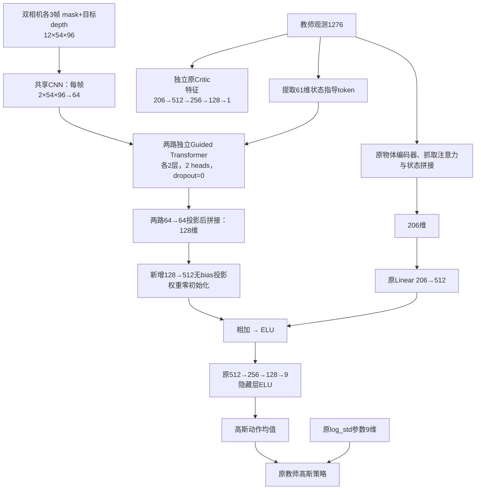

# 教师 Actor 增加双相机视觉输入：实现与实验使用

本实现用于验证：保留原教师全部特权输入后，加入前向与腕部相机的目标掩码、目标深度历史，能否提高成功率。Actor 仍依赖特权信息，因此它是增强教师实验，尚不是可直接部署的纯视觉策略。

## 1. 已实现的网络



融合公式为 `ELU(W_teacher z_teacher + b_teacher + W_visual z_visual)`。原教师全部参数的名称、形状和输入字段顺序保留，新增视觉投影零初始化，因此初始动作均值、标准差与旧教师一致。原 Critic 继续训练，但不读取图像；底层控制器、奖励项和动作处理沿用教师路径。

视觉部分复用现有 `SharedCNNBackbone`、`GuidedTransformerBlock`，不接入学生的动作头或残差动作网络。CNN：`Conv(2,16,5) → MaxPool(2) → ELU → Conv(16,32,3) → ELU → Flatten(32384) → Linear(128) → ELU → Linear(64)`。Transformer 每路接收三个视觉 token 和一个61维状态投影 token，配置 `d_model=64, nhead=2, layers=2, dim_feedforward=2048, dropout=0`，对三个输出视觉 token 求均值。

Wrapper 输出 `[教师观测1276, 图像62208]` 共 **63484维**。只对前1276维使用教师原归一化统计；掩码与目标深度沿用环境已有数值。视觉引导状态从归一化的教师前缀提取 `1030:1082` 与最后9维，不重复存储61维状态。

默认模型参数量：原 Actor 871,768；增强 Actor 6,237,160；Critic 870,736（包括原来注册但未使用的9维参数）。

## 2. 三种实验模式

| `--vision_mode` | Actor | 用途 |
|---|---|---|
| `none` | 原教师网络 | T0：原教师继续训练对照 |
| `images` | 教师＋真实双相机视觉 | TV：检验视觉增量收益 |
| `zero` | 与images同结构，图像置零，保留状态指导 | TZ：控制额外网络结构和容量的影响 |

三种模式都开启相机、使用同样的打包观测与环境配置。`none` 不构建视觉网络。不要拿未经继续训练的旧教师直接与额外训练后的 TV 比较；T0/TV/TZ 应使用同一个旧检查点、相同并行环境数、额外交互步数和 PPO 参数。

## 3. 启动训练

从仓库根目录进入 `DQ_high-level`，激活已经安装本仓库依赖的环境：

```bash
conda activate dqwbc
cd DQ_high-level
```

真实图像增强教师：

```bash
python train_multistate_DQ_teacher_vision.py \
  --teacher_init_checkpoint DQ_teacher/b1-pick-multi-DQteacher_01/isaacgym/checkpoints/agent_120000.pt \
  --vision_mode images \
  --num_envs=128 \
  --timesteps 120000 \
  --roboinfo --observe_gait_commands \
  --small_value_set_zero --rand_control \
  --rl_device cuda:0 --sim_device cuda:0 --graphics_device_id 0 \
  --headless --seed 43 \
  --experiment_dir DQ_teacher/vision_ablation --wandb_name images_seed43
```

运行 T0 时，将上面的 `--vision_mode images` 改成 `--vision_mode none`，并将实验名改成 `none_seed43`；运行 TZ 时改为 `zero` / `zero_seed43`。其他参数保持相同。多种子实验同时修改各组的 `--seed` 与实验名。

默认使用配置中的全部物体。可加 `--object_name sugar_box` 做单物体验证，但三组必须采用同一物体集合。默认任务等级沿用当前教师 YAML 的 **Level01**；使用 `--vision_task_level Level04` 可切换为 Level04。不要把默认 Level01 的结果当成论文 Level04 结果。

默认配置：[DQ_teacher_vision.yaml](../DQ_high-level/data/cfg/DQ_teacher_vision.yaml)。可用 `--vision_config 路径` 为一个新实验提供配置。

| 配置 | 默认值 |
|---|---:|
| 环境数 | 128 |
| rollout | 24 |
| mini-batch 条数 | 128 |
| PPO epochs | 5 |
| 初始学习率 | 1e-4，保留 KL 自适应调度 |
| γ / λ / ratio clip | 0.99 / 0.95 / 0.2 |
| 周期保存间隔 | 2400个向量环境步 |
| 奖励课程总步数 | 120000 |

`num_envs × rollouts` 必须能被 mini-batch 条数整除。可用 `--vision_minibatch_size`、`--vision_learning_epochs` 覆盖对应参数。没有相机的原教师5000环境配置不适用于本实验：128环境的图像 rollout 数据本身约占0.71 GiB，网络激活、仿真和相机纹理还会额外占用显存。

## 4. 初始化、恢复和步数的含义

**`--teacher_init_checkpoint`：从旧教师启动一个新实验。**

- 加载原 Actor、Critic 和观测/价值归一化器。
- 两种归一化器的统计显式冻结，PPO 传入 `train=True` 时也不会更新。
- 新增视觉投影置零；优化器、学习率调度器重新建立。
- `--timesteps 24000` 表示在这个新实验中增加24000个向量环境步；128环境对应3,072,000条环境转换。
- 训练结束额外保存最终检查点，即使还没有到周期保存点。

例如从 `agent_120000.pt` 初始化，新增24000步后的新文件名是 `agent_24000.pt`。其元数据同时记录 `origin_step=120000`、`global_step=144000`、`completed_steps=24000`，不会把原教师训练步数与新增预算混为一谈。

旧检查点名为 `best_agent.pt` 等不含步数的名字时，必须提供实际的 `--teacher_initial_step`，不能靠文件名猜测奖励课程位置。

环境的奖励阶段由 `teacher_vision.reward_schedule_steps` 决定，默认120000，与本次追加训练预算独立。若原教师训练时使用另一课程长度，应先修改新实验 YAML 中的此值。原奖励项、课程分段逻辑仍然保留。

**`--checkpoint`：恢复一个已经保存的视觉教师实验。**

```bash
python train_multistate_DQ_teacher_vision.py \
  --checkpoint DQ_teacher/vision_ablation/images_seed43/checkpoints/agent_24000.pt \
  --timesteps 48000 \
  --headless --rl_device cuda:0 --sim_device cuda:0 \
  --experiment_dir DQ_teacher/vision_ablation --wandb_name images_seed43
```

这会把同一实验的新增步数目标提高到48000，实际再训练24000步。也支持省略 `--checkpoint`，使用 `--resume` 自动寻找指定实验目录中编号最大的检查点。

恢复会加载模型、Adam、学习率调度器、归一化统计、环境课程位置，并从检查点读取实验配置、物体集合和记录的环境选项。训练时不能更换 `vision_mode`；若要改变网络实验模式，应从同一个旧教师检查点重新启动一组实验。

恢复会建立新的仿真回合和 rollout，不保存物理引擎快照或未完成的 rollout，因此不承诺与未中断训练逐步一致。建议总训练步数取24的整数倍。

## 5. 评估

```bash
python play_multistate_DQ_teacher_vision.py \
  --checkpoint DQ_teacher/vision_ablation/images_seed43/checkpoints/agent_24000.pt \
  --num_envs 128 --timesteps 5000 \
  --vision_task_level Level04 \
  --headless --rl_device cuda:0 --sim_device cuda:0
```

评估使用动作均值，严格执行指定的 `--timesteps`，不触发 PPO 更新。环境仍使用现有成功计数和评估奖励/结束判定；各组评估须保持相同配置。去掉 `--headless` 可使用查看器；本入口暂不支持 `--record_video`。

使用真实图像训练得到的检查点，可在评估时加 `--vision_mode zero` 做屏蔽图像的敏感度测试；它会改变输入分布，不能替代 TZ 训练对照。不能用 `none` 模式直接加载 `images` 网络检查点。

比较各难度成功率、物体分项表现和训练耗时。TV高于T0且高于TZ，才更支持真实视觉信息的贡献。短时程序验证不能证明成功率提高；正式结论需要等预算、多随机种子训练评估。

## 6. 环境与接口改动

- 新入口所有模式都使用 `enableCameraSensors=true`、`sensor.enableCamera=true`，保持完整双相机输入。
- 新增 `env.terminateOnCameraConstraint`，本实验设为false，避免仅因打开相机就增加额外结束规则。旧配置未提供此项时仍跟随原 `enable_camera` 行为。
- 新增 `env.refreshCameraOnReset=true`：先重置末端目标，再刷新教师状态并采集新首帧；只重置对应环境的图像历史和视觉观测。其他环境的历史不推进；第一次正常step会保留reset时的历史帧。
- 相机 tensor 访问使用 `try/finally` 释放。
- Wrapper 每次生成新的打包张量，避免环境重用观测字典导致保存了下一时刻状态。
- 本轮沿用原教师 episode/GAE、环境动作裁剪及缩放，不开启 `--use_tanh`，不支持浮动基座、移除物体特征或其他改变观测维度的配置。
- 环境和模型构造后再次设置随机种子，避免视觉网络初始化消耗不同随机数影响首批重置。后续训练轨迹仍会随策略行为而分叉。

| 文件 | 作用 |
|---|---|
| [modules/teacher_vision.py](../DQ_high-level/modules/teacher_vision.py) | 模型、输入布局和旧模型权重兼容加载 |
| [utils/teacher_vision_wrapper.py](../DQ_high-level/utils/teacher_vision_wrapper.py) | 观测打包与形状校验 |
| [utils/teacher_vision_preprocessor.py](../DQ_high-level/utils/teacher_vision_preprocessor.py) | 仅归一化教师前缀、冻结统计 |
| [utils/teacher_vision_training.py](../DQ_high-level/utils/teacher_vision_training.py) | 原PPO组装、初始化/恢复及元数据 |
| [learning/teacher_vision_trainer.py](../DQ_high-level/learning/teacher_vision_trainer.py) | 保留训练流程，限定评估步数 |
| [train_multistate_DQ_teacher_vision.py](../DQ_high-level/train_multistate_DQ_teacher_vision.py) | 独立训练入口 |
| [play_multistate_DQ_teacher_vision.py](../DQ_high-level/play_multistate_DQ_teacher_vision.py) | 独立评估入口 |

## 7. 验证与运行环境

在仓库根目录执行不依赖 Isaac Gym 仿真的自动检查：

```bash
python -m unittest discover -s tests -p 'test_teacher_vision_*.py' -v
```

已通过30项检查：真实旧教师类权重兼容、零初始化输出一致、Critic忽略图像、梯度进入视觉编码器、PPO概率比一致、观测存储时序、冻结归一化、局部重置、真实PPO更新、Adam/调度器恢复和有限步数评估。

此外已在本机 Isaac Gym / CUDA 下，以2个 sugar_box 环境执行24步训练并完成PPO更新，保存检查点后恢复至48步；真实相机的局部reset、其他环境历史保持、reset首帧保留检查通过。恢复后的模型还以1个环境完成了严格5步的 Level04 评估。该验证仅检查实现可运行，未运行完整成功率对照实验。

若直接调用Conda环境中的Python而未激活环境，Isaac Gym可能找不到 `libpython3.8.so.1.0` 或 `ninja`。先激活 `dqwbc`；如果动态库仍缺失，可在当前终端配置：

```bash
export LD_LIBRARY_PATH="$CONDA_PREFIX/lib:${LD_LIBRARY_PATH:-}"
```

这不是新增网络的依赖；使用的是仓库已有的 Isaac Gym、PyTorch 和本地 skrl 环境。
